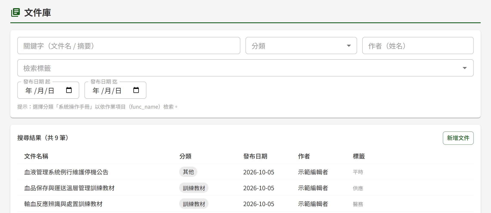
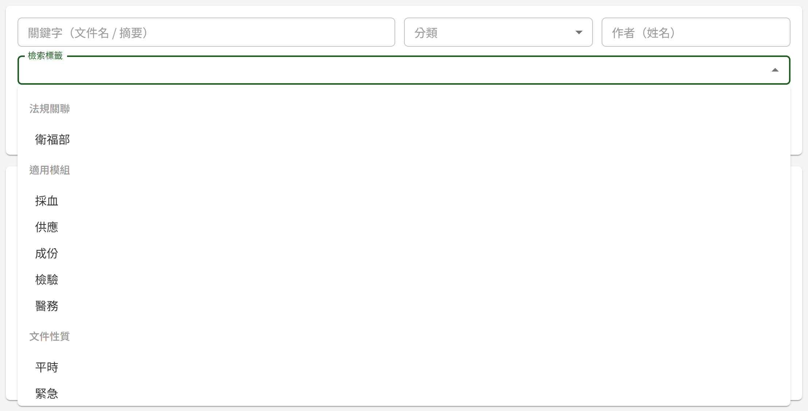
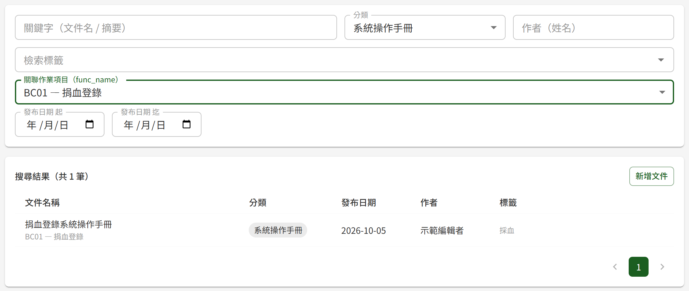

# DM01 文件庫

## 作業說明

### 使用情境

本作業供具任一文件管理角色者查詢已發布的文件，並由此進入文件詳細頁閱讀與下載。依作業項目查找對應的系統操作手冊，也在本作業進行。

各角色於本作業可做的事如下：

| 角色 | 於本作業可做的事 |
|---|---|
| 閱覽者 | 查詢開放給本人的已發布文件 |
| 編輯者 | 查詢全部已發布文件；由本作業進入新增文件 |
| 審核者、管理者 | 查詢全部已發布文件 |

清單只列出**已發布**的文件，且每份文件只呈現目前發布的版本。尚未發布的文件（草稿、送審中、已退回）於 DM04 個人專區或 DM02 簽核中心查看；已廢止的文件由管理者於 DM03 已廢止文件查詢查閱。

**閱覽者看得到哪些文件**

訓練教材以外的文件，於建立時設定「可見對象」，為一組或多組「單位＋職位」的配對。閱覽者看得到的文件為下列兩種：

- 可見對象設為「全單位＋全體」的文件，所有人皆看得到
- 可見對象中有一組配對與本人被授予的單位、職位相符的文件。配對中的「全單位」涵蓋任何單位、「全體」涵蓋任何職位

> 重要：單位與職位須**同一組**相符。文件開放給「國防部軍醫局＋護理師」與「國防醫學院三軍總醫院＋行政人員」兩組時，國防部軍醫局的行政人員與國防醫學院三軍總醫院的護理師都看不到。單位也不含其下的分院與捐血站，需要開放給分院時得逐一列出。

「訓練教材」分類的文件供教育訓練模組的教材引用，不設定可見對象，因此**僅具閱覽者角色者於文件庫查不到訓練教材**；學員於課程中開啟教材即可閱讀。

閱覽者的可見對象由管理者於平台後台授予，見 DP02 權限管理。同時具編輯者、審核者或管理者角色者，看得到全部已發布文件，含訓練教材。

### 進入路徑

側邊選單「文件管理 → 文件庫」。

## 操作說明

### 畫面與前置設定

畫面上半為查詢條件，下半為搜尋結果。進入時未設任何條件，即列出可查看的全部已發布文件，依發布日期由新到舊排列，每頁 20 筆。

查詢條件**一經變更即自動重新查詢**，畫面上沒有「搜尋」按鈕；每次重新查詢都會回到第一頁。

下列選項由管理者於平台後台維護（見 DP03 系統參數與清單維護），清單中缺少需要的選項時，請洽管理者：

| 選項 | 用於 |
|---|---|
| 分類 | 「分類」下拉 |
| 檢索標籤 | 「檢索標籤」下拉，分為適用模組、文件性質、法規關聯三組 |
| 關聯作業項目 | 「關聯作業項目（func_name）」下拉 |

### 設定查詢條件

各條件可單獨使用，也可同時設定；同時設定多個條件時，列出**全部條件都符合**的文件。

| 條件 | 比對方式 |
|---|---|
| 關鍵字（文件名 / 摘要） | 比對文件名稱，以及目前發布版本的首版摘要或變更摘要。輸入其中一段文字即可，不比對檔案內文 |
| 分類 | 選定一個分類 |
| 作者（姓名） | 比對文件建立者的姓名，輸入其中一段文字即可。文件日後由他人上傳新版本，作者仍為建立者 |
| 檢索標籤 | 可選多個標籤，文件掛有**其中任一個**即列出 |
| 發布日期 起、迄 | 依目前發布版本的發布日期篩選，起、迄兩日皆含在內。迄日最晚可選到今天 |

> 注意：檢索標籤只用於查詢，與誰看得到這份文件無關。決定閱覽者看得到哪些文件的是「可見對象」，該設定不在本作業的查詢條件中。

### 依作業項目查找系統操作手冊

1. 於「分類」選「系統操作手冊」，下方隨即出現「關聯作業項目（func_name）」下拉
2. 於該下拉選取作業項目，選項以「代碼 — 作業名稱」呈現（例：BC01 — 捐血登錄）
3. 結果列出該作業項目的系統操作手冊

每個作業項目最多只有一份已發布的系統操作手冊，因此選定作業項目後結果至多一筆。搜尋結果中的系統操作手冊，會在文件名稱下方另行標示所對應的作業項目。

「分類」改選其他分類時，「關聯作業項目（func_name）」下拉隨即隱藏，已選的作業項目一併清除。

### 檢視搜尋結果與進入文件

搜尋結果上方顯示符合條件的總筆數。清單中各欄看不出來的地方如下：

| 欄位 | 看不出來的地方 |
|---|---|
| 發布日期 | 目前發布版本的發布日期。文件發布新版本後，此日期隨之更新為新版本的發布日期 |
| 作者 | 文件建立者 |
| 標籤 | 只列檢索標籤，以頓號分隔；不顯示可見對象 |

點清單中任一列，即進入該文件的文件詳細頁，於該頁閱讀、預覽與下載，見 DM07 文件詳細頁。

**文件於清單中的變化**

| 文件的狀況 | 於清單中 |
|---|---|
| 上傳新版本且仍在送審中 | 清單繼續呈現目前發布的版本；新版本核准發布後才取代 |
| 已提出廢止申請、仍在簽核中 | 照常列出且可正常取用，廢止核准前文件仍然有效 |
| 廢止申請核准 | 自清單移除，改由管理者於 DM03 已廢止文件查詢查閱 |

### 新增文件

具編輯者角色者，搜尋結果右上方會出現「新增文件」。按下後進入新增文件畫面，見 DM08 文件新增與編輯。

## 常見訊息與處置

### 其他情況

| 情況 | 處置 |
|---|---|
| 「查無符合條件之文件。」 | 沒有同時符合全部條件的文件。請減少條件，或改輸入較短的關鍵字、作者姓名 |
| 確定有某份文件，卻查不到 | 依序確認：該文件是否已發布（草稿與送審中不會列出）；是否已廢止；本人若僅具閱覽者角色，該文件是否為訓練教材（閱覽者查不到），以及該文件的可見對象是否開放給本人。可見對象未開放時，請洽撰寫者調整文件的可見對象，或洽管理者授予本人相符的單位與職位 |
| 「分類」下拉找不到需要的分類，或「檢索標籤」下拉找不到需要的標籤 | 該選項已由管理者停用或尚未建立，請洽管理者 |
| 側邊選單沒有「文件管理」 | 本人尚未被授予任何文件管理角色，請洽管理者 |
