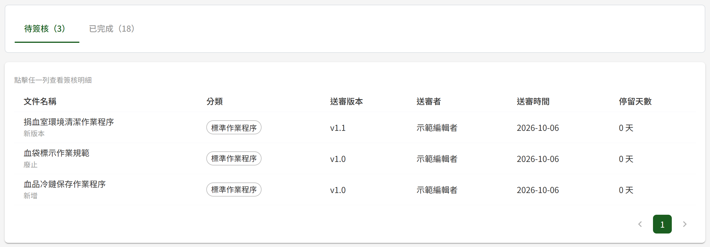
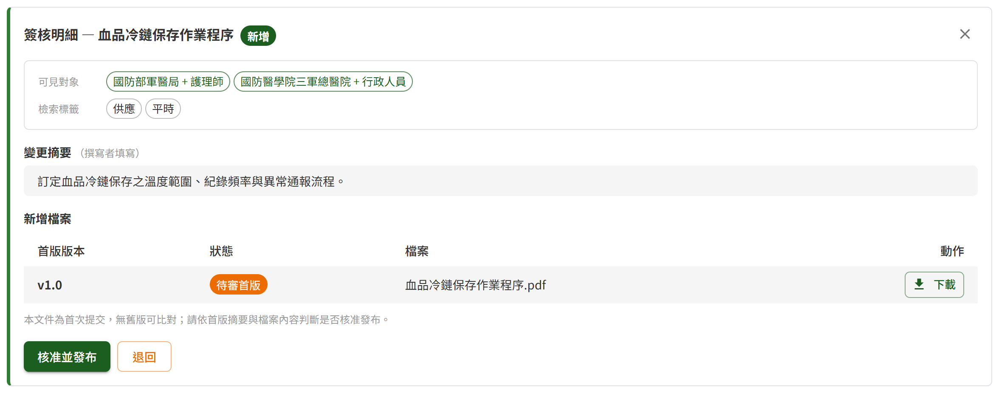
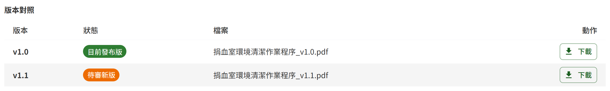
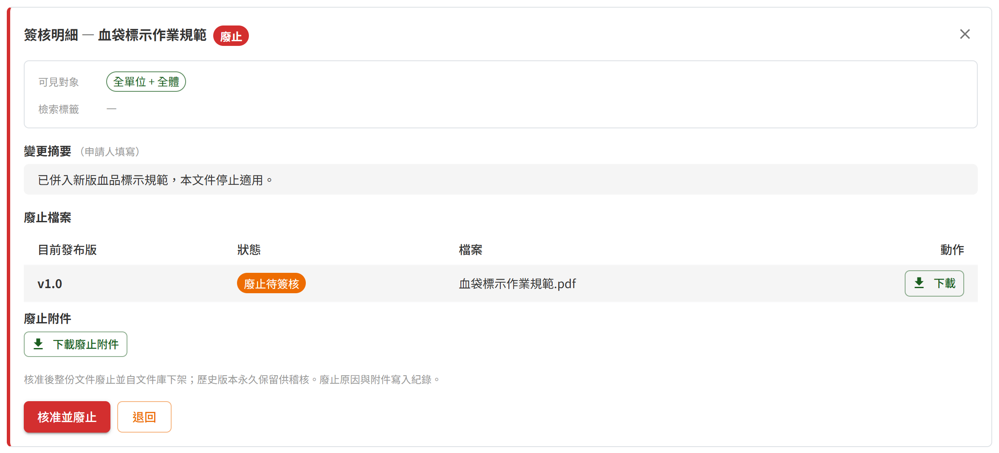
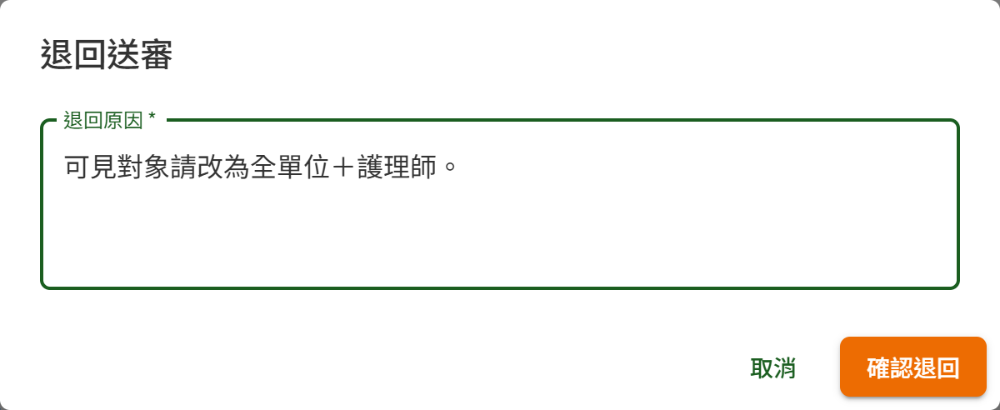
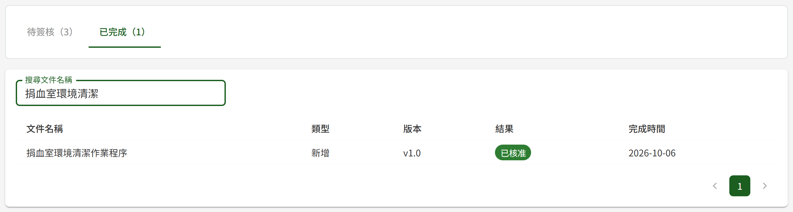

# DM02 簽核中心

## 作業說明

### 使用情境

本作業**僅供具審核者角色者使用**，處理指派給本人的送審項目。清單只列出撰寫者送審時指定由本人審核的項目，其他審核者的項目不會出現。

送審項目分為三類：

| 類型 | 來源 | 核准後 | 退回後 |
|---|---|---|---|
| 新增 | 撰寫者於 DM08 文件新增與編輯建立新文件並送審 | 文件發布，出現於文件庫 | 文件回到撰寫者的草稿，於 DM04 個人專區續編 |
| 新版本 | 撰寫者為已發布文件上傳新版本並送審 | 新版本取代目前發布版 | 新版本回到撰寫者的草稿；文件庫仍為原發布版 |
| 廢止 | 撰寫者於 DM07 文件詳細頁提出廢止申請 | 文件廢止並自文件庫下架 | 文件維持已發布 |

文件一律經本作業核准後才會發布或廢止；送審期間，文件庫照常呈現目前發布的版本。

撰寫者可於 DM04 個人專區撤回送審中的項目（例如指定的審核者請假），撤回的項目隨即自本作業的清單移除。

### 進入路徑

側邊選單「文件管理 → 簽核中心」。

## 操作說明

### 畫面與前置設定

畫面分為「待簽核」與「已完成」兩個分頁，分頁名稱後的括號為各自的筆數。進入時停在「待簽核」，列出待本人處理的項目；每列文件名稱下方標示送審類型（新增、新版本、廢止）。

「停留天數」自送審時間起算，每滿 24 小時計 1 天，未滿 24 小時為 0 天。停留天數**達催辦門檻**時，該欄以紅字加警示符號標示，系統並每日向本人發出催辦通知，直到項目處理完畢或被撤回為止。催辦門檻由管理者於平台後台設定（見 DP03 系統參數與清單維護），預設為 7 天。

### 檢視簽核明細

點清單中任一列，清單下方即展開該項目的簽核明細；按明細右上角的關閉鈕可收合。

| 區塊 | 看不出來的地方 |
|---|---|
| 可見對象 | 本次送審所設定、**核准後即生效**的可見範圍，每個標籤為一組「單位＋職位」配對。閱覽者看得到哪些文件由此決定，核准前請確認是否設錯。訓練教材不設定可見對象 |
| 檢索標籤 | 本次送審所設定的檢索標籤，核准後生效 |
| 變更摘要 | 新增與新版本為撰寫者填寫的摘要；廢止為申請人填寫的廢止原因 |
| 檔案 | 按「下載」取得檔案後檢視 |

依送審類型，檔案區呈現的內容不同：

| 類型 | 檔案區 |
|---|---|
| 新增 | 待審首版的檔案 |
| 新版本 | 目前發布版與待審新版並列，可分別下載比對 |
| 廢止 | 目前發布版的檔案；申請人附有廢止附件時，另有「下載廢止附件」 |

> 注意：廢止申請所顯示的可見對象與檢索標籤，為該文件目前生效的設定。

### 核准並發布

適用於新增與新版本。

1. 於簽核明細按「核准並發布」
2. 確認視窗按「確認核准」

核准當下系統隨即完成下列事項：

- 文件轉為已發布，出現於文件庫；新版本則取代原發布版，原發布版於版本歷程中標示為已被取代
- 本次送審的可見對象與檢索標籤生效
- 以 Email 寄出文件發布通知，收件者為撰寫者，以及發布當下可見對象相符的閱覽者；可見對象為「全單位＋全體」時即為全部閱覽者。收件名單於核准當下決定
- 寫入文件變更歷程，供管理者於 DM05 文件變更歷程查詢

該項目隨即自「待簽核」移至「已完成」。

### 核准並廢止

適用於廢止申請。

1. 於簽核明細按「核准並廢止」
2. 確認視窗按「確認廢止」

文件隨即轉為已廢止並自文件庫下架，系統通知撰寫者並寫入文件變更歷程。廢止後的文件由管理者於 DM03 已廢止文件查詢查閱，歷史版本永久保留。

> 重要：廢止核准後立即生效且不可回復，按「確認廢止」前請再次確認廢止對象。

### 退回

三類送審皆可退回。

1. 於簽核明細按「退回」
2. 於「退回原因」填寫退回的理由，此欄必填
3. 按「確認退回」

系統通知撰寫者，項目移至「已完成」並標示為已退回。退回後文件的去向依送審類型而定，見〈使用情境〉之表。撰寫者修正後可重新送審，屆時為新的一筆送審項目。

### 查看已完成的項目

切換至「已完成」分頁，列出本人處理過的項目及其結果（已核准或已退回）與完成時間。可於「搜尋文件名稱」輸入名稱的一段文字篩選。

已完成的項目僅供回顧。

## 常見訊息與處置

### 被擋下（動作沒有完成）

| 訊息 | 處置 |
|---|---|
| 「請填寫退回原因」 | 退回原因為必填，填寫後再按「確認退回」 |
| 「此項目已被撰寫者撤回，已自清單移除」 | 撰寫者已於本人處理前撤回該送審，不需再處理。撰寫者重新送審時會以新的一筆出現 |
| 「此送審已非待審核狀態，無法處理」 | 該項目已處理過（例如於另一個分頁或視窗已核准或退回），可至「已完成」分頁確認結果 |
| 「此關聯作業項目已有對應之已發布手冊」 | 同一個作業項目只能有一份已發布的系統操作手冊，而另一份對應同一作業項目的手冊已先發布。請將本項退回，由撰寫者改選作業項目；或先廢止已發布的那份手冊後再核准 |

### 送出後的結果訊息

| 訊息 | 代表什麼 |
|---|---|
| 「已核准並發布，已通知撰寫者」 | 文件已發布，發布通知已排入寄送 |
| 「已核准廢止，文件已下架並通知撰寫者」 | 文件已廢止並自文件庫下架 |
| 「已退回並通知撰寫者」 | 項目已退回，撰寫者會收到退回通知 |

### 其他情況

| 情況 | 處置 |
|---|---|
| 「目前沒有待簽核項目。」 | 目前沒有指派給本人的送審。撰寫者表示已送審卻看不到時，請其確認送審時指定的審核者是否為本人 |
| 側邊選單沒有「簽核中心」 | 本人尚未被授予審核者角色，請洽管理者 |
