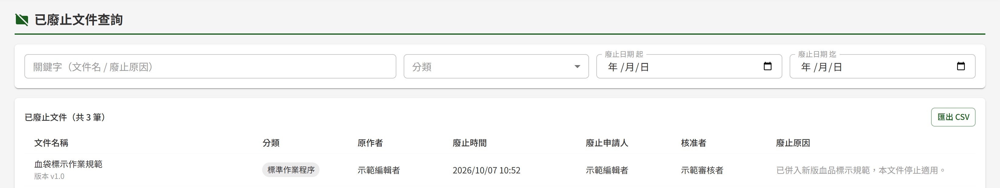
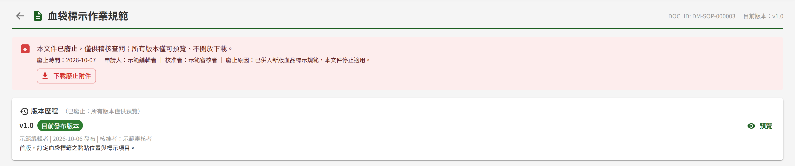

# DM03 已廢止文件查詢

## 作業說明

### 使用情境

本作業**僅供文件管理模組之管理者使用**，用於查閱已廢止的文件，供稽核、醫療糾紛追溯與法規查核。

文件經 DM02 簽核中心核准廢止後，即自文件庫下架，一般使用者無法再查得或開啟；已廢止文件改由管理者於本作業查閱，所有歷史版本永久保留。

點清單中任一筆，可進入該文件的唯讀頁面，檢視廢止資訊與歷來各版本。查詢結果並可匯出為 CSV 檔，供稽核封存。

### 進入路徑

側邊選單「文件管理 → 已廢止文件查詢」。

## 操作說明

### 畫面與前置設定

畫面上半為查詢條件，下半為已廢止文件清單。進入時未設任何條件，即列出全部已廢止文件，依廢止時間由新到舊排列，每頁 20 筆。

查詢條件**一經變更即自動重新查詢**，畫面上沒有「搜尋」按鈕；每次重新查詢都會回到第一頁。

### 設定查詢條件

各條件可單獨使用，也可同時設定；同時設定多個條件時，列出**全部條件都符合**的文件。

| 條件 | 比對方式 |
|---|---|
| 關鍵字（文件名 / 廢止原因） | 比對文件名稱，以及申請廢止時填寫的廢止原因，輸入其中一段文字即可 |
| 分類 | 選定一個分類 |
| 廢止日期 起、迄 | 依廢止核准的日期篩選，起、迄兩日皆含在內，日期以台灣時間計。迄日最晚可選到今天 |

### 檢視查詢結果

清單上方顯示符合條件的總筆數。清單中各欄看不出來的地方如下：

| 欄位 | 看不出來的地方 |
|---|---|
| 文件名稱 | 名稱下方標示廢止當時的版本，即最後一個發布版本 |
| 原作者 | **最後一個發布版本的撰寫者**。文件曾由他人上傳新版本時，此欄為上傳末版的人，與文件庫「作者」欄所列的文件建立者可能不同 |
| 廢止時間 | 審核者核准廢止的時間，非提出申請的時間 |
| 廢止申請人 | 提出廢止申請的人 |
| 核准者 | 核准廢止的審核者 |

### 檢視已廢止文件

點清單中任一列，進入該文件的唯讀頁面：

- 上方以紅色提示列標示本文件已廢止，並列出廢止時間、申請人、核准者與廢止原因
- 申請人提出廢止時附有附件者，提示列內另有「下載廢止附件」
- 版本歷程自動展開，列出文件歷來每一個發布版本；按各版本的「預覽」線上檢視當時的內容
- 頁面僅供檢視，文件內容與版本均維持廢止當時的狀態

無法線上預覽的檔案（如 Word、Excel），該版本另有「下載」，取得原檔後以本機應用程式開啟。

按標題左側的返回箭頭，回到已廢止文件查詢的清單。

### 匯出 CSV

按清單右上方「匯出 CSV」，系統即下載一份 CSV 檔，內容為**目前查詢條件下的全部結果**，不限於畫面上的這一頁。

| 項目 | 說明 |
|---|---|
| 欄位 | 文件編號、文件名稱、末版版號、分類、原作者、廢止時間、廢止申請人、核准者、廢止原因 |
| 時間 | 廢止時間以台灣時間呈現，與畫面一致 |
| 開啟方式 | 可直接以 Excel 開啟，中文不會變成亂碼 |

查詢結果為 0 筆時，「匯出 CSV」無法按下。

## 常見訊息與處置

### 其他情況

| 情況 | 處置 |
|---|---|
| 「查無符合條件之已廢止文件。」 | 沒有同時符合全部條件的已廢止文件。請減少條件，或改輸入較短的關鍵字 |
| 確定某份文件已提出廢止，卻查不到 | 廢止申請須經 DM02 簽核中心核准後才會出現在本作業；簽核中的文件仍列於 DM01 文件庫 |
| 「您無權限存取此頁面」 | 本人未具文件管理的管理者角色，請洽其他管理者於 DP02 權限管理授予 |
