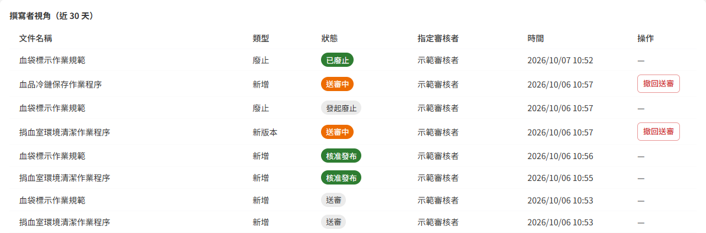
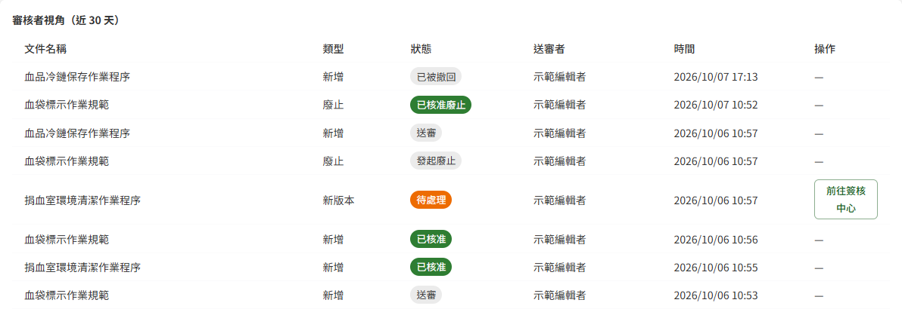
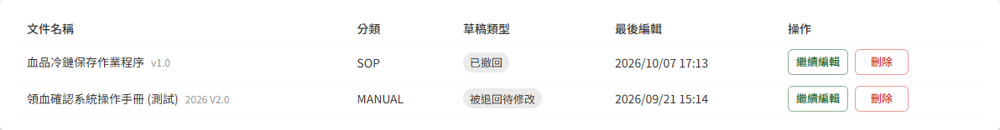

# DM04 個人專區

## 作業說明

### 使用情境

本作業供具**編輯者或審核者**角色者集中處理本人的文件作業，分為「我的文件動態」與「草稿匣」兩個分頁。兩種角色可做的事如下：

| 角色 | 我的文件動態 | 草稿匣 |
|---|---|---|
| 編輯者 | 檢視本人送審的歷程；可撤回送審中的項目 | 續編或刪除本人的草稿 |
| 審核者 | 檢視指派給本人的送審歷程；可前往簽核中心處理 | — |

同時具兩種角色者，兩種歷程都會列出。

本作業銜接的作業如下：草稿的編寫與送審於 DM08 文件新增與編輯；審核者的核准與退回於 DM02 簽核中心。姓名、Email 與密碼等個人資料不在本作業，於畫面右上角的使用者選單維護（見 DP10 個人資料維護）。

### 進入路徑

側邊選單「文件管理 → 個人專區」。

## 操作說明

### 畫面與前置設定

畫面自上而下為標題列、兩個分頁，其下為該分頁的清單。進入時預設停在「我的文件動態」。

### 我的文件動態

依角色分為「撰寫者視角（近 30 天）」與「審核者視角（近 30 天）」兩區。撰寫者視角列出本人送出的送審，「指定審核者」欄為該次指派的審核者；審核者視角列出指派給本人的送審，該欄改為「送審者」。

**一次送審展開為兩列**

一次送審會依狀態變化展開成兩列：送出時的「送審」列，以及結束時的結果列（核准、退回或撤回），「時間」欄分別為送審時間與完成時間，全部依時間由新到舊排列。尚未結束的送審只有一列，狀態即為目前的進度。

**狀態**

| 狀態 | 代表什麼 |
|---|---|
| 送審中、廢止待簽核（撰寫者） 待處理、待處理（廢止）（審核者） | 送審尚未處理 |
| 逾期未審、廢止逾期未審（撰寫者） 催辦中（審核者） | 送審停留天數已達催辦門檻，系統每日向審核者發出催辦通知。催辦門檻由管理者於 DP03 系統參數與清單維護設定，預設為 7 天 |
| 送審、發起廢止 | 已結束的那次送審的起點列，結果見同一份文件時間較新的那一列 |
| 核准發布、已廢止、已退回、已撤回（撰寫者） 已核准、已核准廢止、已退回、已被撤回（審核者） | 該次送審的結果 |

**退回原因**

狀態為「已退回」的列，狀態下方以灰字顯示審核者於 DM02 簽核中心填寫的退回原因。原因較長時僅顯示第一行，按狀態右側的展開箭頭可另起一列看到完整內容，再按一次收合；展開不影響其他列的高度。

同一次送審的「送審」起點列不顯示退回原因，原因只掛在結果列上。

**通知送達何處**

送審、退回、廢止申請送審、廢止核准、廢止退回這幾類通知**僅於系統內呈現、不寄送 Email**：撰寫者於本頁「我的文件動態」、審核者於本頁審核者視角與 DM02 簽核中心即可看到，毋須查收信箱。寄送 Email 的只有文件發布通知（寄給可見對象相符的閱覽者）與未讀催辦、閱讀統計這幾類。

**指定審核者的帳號已停用時**

送審中的項目若指派的審核者帳號已停用，「指定審核者」欄下方會以紅字標示「審核者帳號已停用」。該審核者無法處理這筆送審，請撤回送審後，於草稿改選其他審核者重新送審（見下一節）。

### 撤回送審（編輯者）

送審後需要改選審核者（例如審核者請假、帳號已停用），或要修改送審內容時，撤回該送審：

1. 於撰寫者視角找到狀態為送審中（或逾期未審、廢止待簽核）的那一列
2. 按該列的「撤回送審」
3. 於確認視窗按「確認撤回」

撤回後的去向依送審類型而定：

| 類型 | 撤回後 |
|---|---|
| 新增、新版本 | 回到草稿，出現於「草稿匣」，草稿類型為「已撤回」 |
| 廢止 | 文件回到已發布，於文件庫照常可見 |

原指派的審核者，其簽核中心不再列出這筆送審，「我的文件動態」中則出現一列「已被撤回」。

**改選審核者重新送審**

於「草稿匣」按該草稿的「繼續編輯」，進入 DM08 文件新增與編輯，改選審核者後再次送審即可。重新送審會以新的一筆出現於新審核者的簽核中心。

### 前往簽核中心（審核者）

於審核者視角中，狀態為待處理（或待處理（廢止）、催辦中）的列，按「前往簽核中心」即進入 DM02 簽核中心，並自動展開該筆送審的簽核明細，可直接核准或退回。

### 草稿匣

列出本人尚未送審、或送審後回到草稿的文件版本。「草稿類型」欄說明這份草稿從何而來：

| 草稿類型 | 來源 |
|---|---|
| 未送審 | 存成草稿後尚未送審 |
| 被退回待修改 | 送審後被審核者退回 |
| 已撤回 | 送審後由本人撤回 |

**繼續編輯**

按「繼續編輯」進入 DM08 文件新增與編輯，接續編寫或送審。

**刪除草稿**

1. 按該列的「刪除」
2. 於確認視窗「確定刪除此草稿？刪除後不可復原」按「確認刪除」

刪除只移除這一份草稿版本；該文件已發布的版本不受影響，於文件庫照常可見。

> 重要：刪除後無法復原。

**文件已被廢止的草稿**

草稿所屬的文件若已被廢止，該列的「繼續編輯」呈灰色無法按，滑鼠移上時顯示「此文件已被廢止，無法繼續編輯，請刪除此草稿」。這份草稿已無法送審，按「刪除」移除即可。

## 常見訊息與處置

### 被擋下（動作沒有完成）

| 訊息 | 處置 |
|---|---|
| 「此項目已被撰寫者撤回」 | 該送審已撤回過（例如同時開著兩個分頁、在另一頁已撤回）。重新進入本作業即可看到「已撤回」的結果列 |
| 「此送審已非待審核狀態，無法處理」 | 撤回前審核者已處理完這筆送審。重新進入本作業查看結果列：已核准者文件已發布；已退回者草稿已回到草稿匣 |

### 送出後的結果訊息

| 訊息 | 代表什麼 |
|---|---|
| 「已撤回送審，已通知原指派審核者」 | 撤回完成。原審核者的簽核中心不再列出此項，其「我的文件動態」出現「已被撤回」 |
| 「草稿已刪除」 | 該草稿版本已移除，已發布的版本不受影響 |

### 其他情況

| 情況 | 說明 |
|---|---|
| 「近 30 天無文件動態。」 | 近 30 天內沒有本人送審或指派給本人的送審，且目前沒有送審中的項目 |
| 「目前沒有草稿。」 | 本人沒有任何草稿 |
| 側邊選單看不到「個人專區」 | 不具編輯者或審核者角色。需要時請該模組的管理者於 DP02 權限管理指派 |
| 只看到其中一個視角 | 僅具該角色，屬正常。例如純編輯者只有撰寫者視角 |
