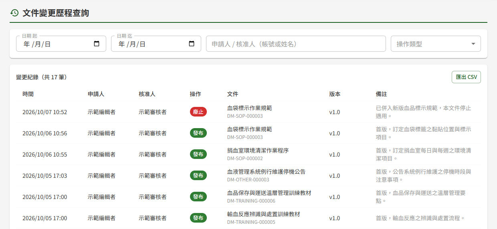
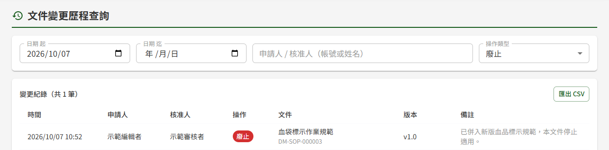

# DM05 文件變更歷程查詢

## 作業說明

### 使用情境

本作業**僅供文件管理模組之管理者使用**，用於跨文件查詢各文件的發布與廢止紀錄，供資安稽核與法規查核。

文件每經 DM02 簽核中心核准一次發布或廢止，即寫入一筆變更紀錄。紀錄永久保留，無法修改或刪除。上傳、編輯、送審、退回、撤回等撰寫過程，以及下載、預覽等閱讀動作，均不列入本作業；撰寫者本人的送審歷程於 DM04 個人專區查看。

查詢結果可匯出為 CSV 檔，供稽核封存。

### 進入路徑

側邊選單「文件管理 → 文件變更歷程查詢」。

## 操作說明

### 畫面與前置設定

畫面上半為查詢條件，下半為變更紀錄清單。進入時未設任何條件，即列出全部變更紀錄，依時間由新到舊排列，每頁 20 筆。

查詢條件**一經變更即自動重新查詢**，畫面上沒有「搜尋」按鈕；每次重新查詢都會回到第一頁。

### 設定查詢條件

各條件可單獨使用，也可同時設定；同時設定多個條件時，列出**全部條件都符合**的紀錄。

| 條件 | 比對方式 |
|---|---|
| 日期 起、迄 | 依核准的日期篩選，起、迄兩日皆含在內，日期以台灣時間計。迄日最晚可選到今天 |
| 申請人 / 核准人（帳號或姓名） | 同時比對申請人與核准人的帳號（Email）及姓名，輸入其中一段文字即可。輸入某人姓名，會列出此人申請的與此人核准的全部紀錄 |
| 操作類型 | 全部、發布或廢止 |

### 檢視查詢結果

清單上方「變更紀錄」旁顯示符合條件的總筆數。清單中各欄看不出來的地方如下：

| 欄位 | 看不出來的地方 |
|---|---|
| 時間 | 審核者**核准**的時間，非提出送審或申請的時間，以台灣時間呈現 |
| 申請人 | 發布為送審的撰寫者；廢止為提出廢止申請的人 |
| 核准人 | 核准該次發布或廢止的審核者 |
| 文件 | 名稱下方為文件編號 |
| 備註 | 發布為該版本的變更摘要；廢止為申請時填寫的廢止原因 |

### 匯出 CSV

按清單右上方「匯出 CSV」，系統即下載一份 CSV 檔，內容為**目前查詢條件下的全部結果**，不限於畫面上的這一頁。

| 項目 | 說明 |
|---|---|
| 欄位 | 時間、申請人、核准人、操作、文件編號、文件名稱、版本號、備註 |
| 時間 | 以台灣時間呈現，與畫面一致 |
| 開啟方式 | 可直接以 Excel 開啟，中文不會變成亂碼 |

查詢結果為 0 筆時，「匯出 CSV」無法按下。

## 常見訊息與處置

### 其他情況

| 情況 | 處置 |
|---|---|
| 「查無符合條件之變更紀錄。」 | 沒有同時符合全部條件的紀錄。請減少條件，或改輸入較短的姓名或帳號 |
| 確定某份文件已送審，卻查不到 | 送審須經 DM02 簽核中心核准後才會寫入紀錄；送審中、被退回或已撤回的送審不列入本作業 |
| 「您無權限存取此頁面」 | 本人未具文件管理的管理者角色，請洽其他管理者於 DP02 權限管理授予 |
