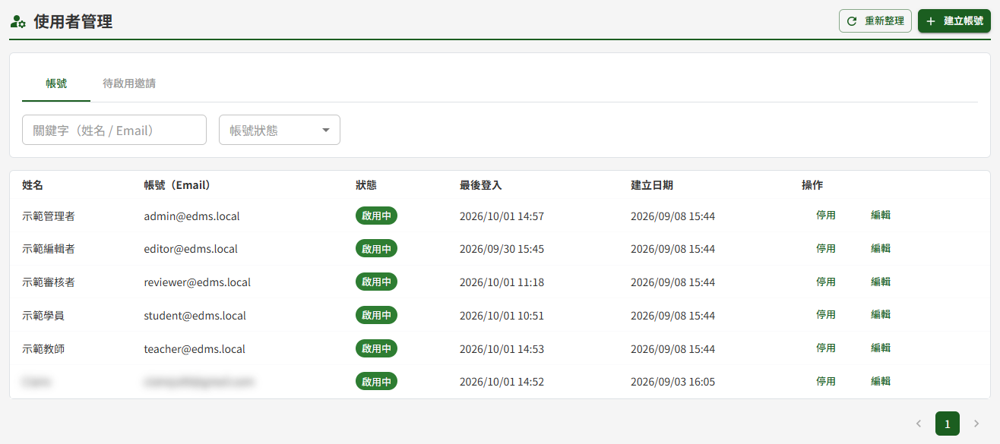
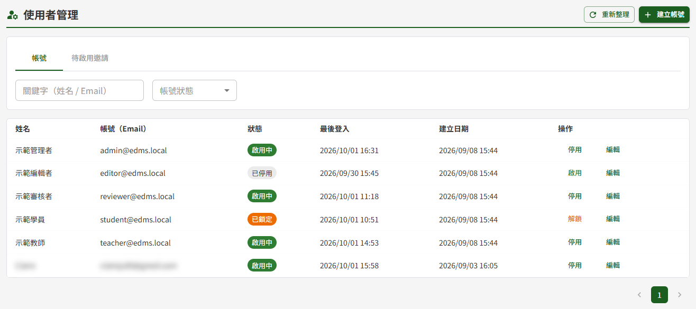
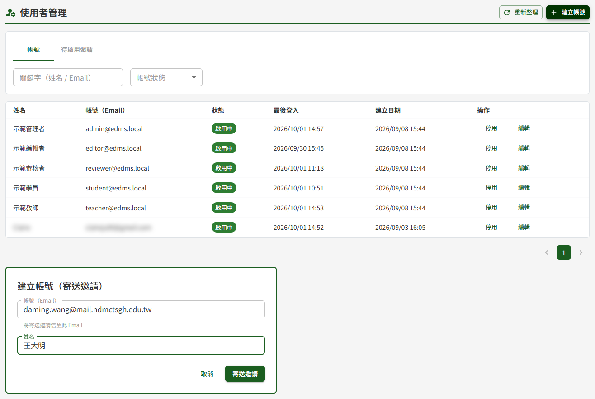
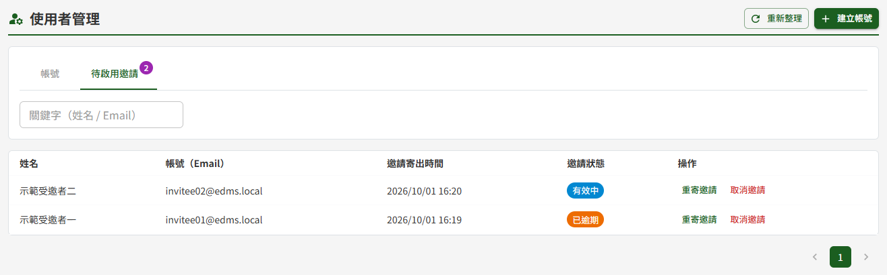
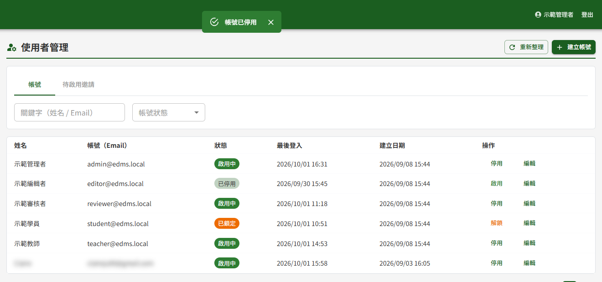
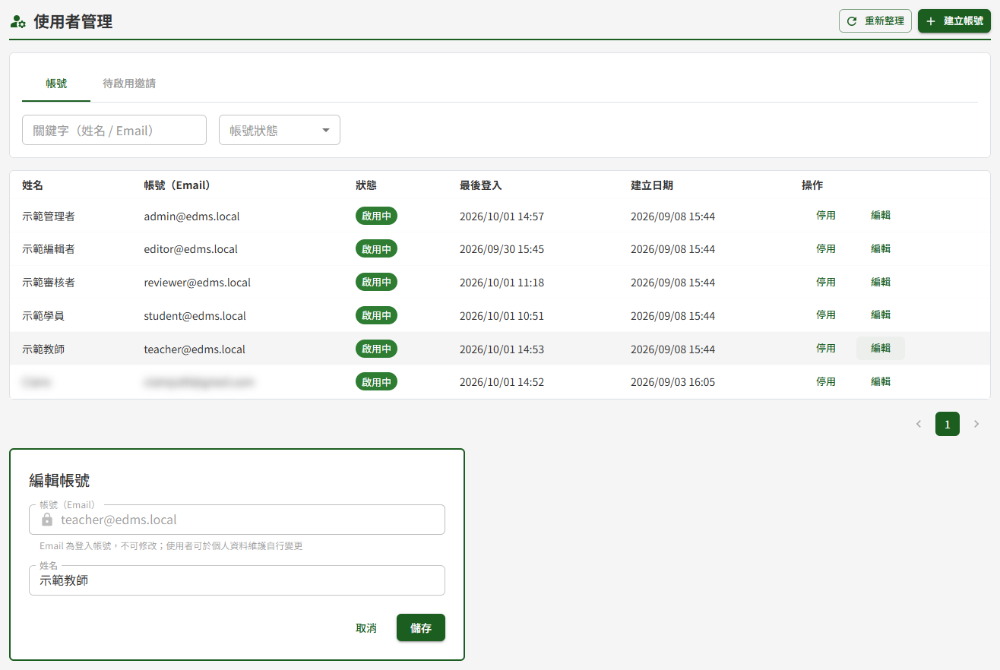

# DP01 使用者管理

## 作業說明

### 使用情境

本作業供**教育訓練文件管理模組或文件管理模組之管理者**使用。

帳號為兩個模組**共用**：同一個帳號可同時在教育訓練與文件管理使用，任一模組的管理者都看得到並可操作全部帳號，兩邊所見內容相同。

本作業涵蓋帳號的建立、查詢、停用與啟用、解鎖，以及姓名的維護；建立帳號採**寄送邀請信**的方式，由使用者自行設定密碼後啟用。

角色與權限的指派不在本作業，於 DP02 權限管理處理。帳號啟用時系統先給予教育訓練的學員角色，其餘角色由管理者另行指派。

### 進入路徑

側邊選單「系統管理者後台 → DP01 使用者管理」。

## 操作說明

### 畫面與前置設定

畫面上方為兩個頁籤，其下為篩選列與清單，右上為操作按鈕：

| 頁籤 | 內容 |
|---|---|
| 帳號 | 已啟用使用的帳號，含已停用與鎖定中者 |
| 待啟用邀請 | 已寄出邀請信、使用者尚未完成設定密碼者；頁籤上的數字為目前筆數，沒有待啟用邀請時不顯示數字 |

「帳號」頁籤的清單逐列顯示姓名、帳號（Email）、狀態、最後登入、建立日期與操作按鈕。

**篩選**

篩選列有「關鍵字（姓名 / Email）」與「帳號狀態」兩項。關鍵字輸入後**自動查詢**，不需另外按查詢鈕；帳號狀態可選全部、啟用中、已停用、已鎖定。

> 注意：切換頁籤或變更篩選條件時，若正開著建立或編輯表單，該表單會一併收起，表單中尚未儲存的內容不會保留。

**三種帳號狀態的差別**

| 狀態 | 代表什麼 | 如何恢復 |
|---|---|---|
| 啟用中 | 可正常登入使用 | — |
| 已停用 | 無法登入，兩個模組同步失效 | 由管理者於本作業按「啟用」 |
| 已鎖定 | 登入失敗次數達上限，由系統自動鎖住 | 鎖定期滿自動解除，或由管理者按「解鎖」立即解除 |

> 重要：**停用與鎖定的來源不同**。鎖定是系統依登入失敗次數自動加的、時間到會自己解開；停用則是管理者的決定（帳號閒置達 90 天時也會由系統排程自動停用），必須有人按「啟用」才會恢復。

### 查詢帳號

於「關鍵字（姓名 / Email）」輸入姓名或 Email 的片段，清單即時更新；需要只看特定狀態時，於「帳號狀態」選取。兩項條件可同時使用。

清單資料量大時於下方分頁瀏覽。

### 建立帳號

1. 按右上「建立帳號」
2. 於表單填寫「帳號（Email）」與「姓名」
3. 按「寄送邀請」
4. 於確認視窗核對 Email 無誤後，按「確定寄送」

> 重要：**建立帳號時不設定密碼**，密碼由使用者自己設。送出後系統寄出一封邀請信，使用者點信中連結、於效期內設定密碼，帳號才正式建立並可登入。邀請信的效期由系統參數設定，於 DP03 系統參數與清單維護調整。

因此，剛送出邀請時**該筆出現在「待啟用邀請」頁籤、而不是「帳號」頁籤**；使用者完成設定密碼後才會轉到「帳號」頁籤、狀態為啟用中。

使用者完成啟用時，系統會給予教育訓練的學員角色；其他角色（例如教師、文件管理的審核者）於 DP02 權限管理指派。

Email 重複時會被擋下，兩種情況的處理方式不同：

| 情況 | 處理 |
|---|---|
| 該 Email 已是現有帳號 | 於「帳號」頁籤查詢該帳號，確認是否只需啟用或解鎖 |
| 該 Email 已有尚未啟用的邀請 | 到「待啟用邀請」頁籤對該筆執行重寄，不需重新建立 |

### 管理待啟用邀請

切到「待啟用邀請」頁籤，清單顯示姓名、帳號（Email）、邀請寄出時間與邀請狀態。邀請狀態分「有效中」與「已逾期」——逾期即表示連結已失效，使用者再點也無法設定密碼。

| 操作 | 做什麼 | 什麼時候用 |
|---|---|---|
| 重寄邀請 | 作廢原本的連結，產生新的連結並重新寄出 | 使用者沒收到信、或邀請已逾期 |
| 取消邀請 | 刪除該筆邀請，該 Email 回復為可重新建立 | 邀請對象有誤、或該人員已不需要帳號 |

> 重要：同一筆邀請**重寄後需間隔約 10 分鐘才能再重寄一次**。冷卻期間按下重寄會被擋下，並顯示還需等待幾分鐘。

取消邀請會跳出確認視窗，內容含該筆的姓名與 Email，核對後再按「確定取消」。

### 停用與啟用帳號

於「帳號」頁籤該列按「停用」，確認視窗核對姓名後按「確定停用」。

> 重要：停用**立即於兩個模組同時生效**。該使用者若正在線上，下一個動作就會被拒絕，不需等待登出。

已停用的帳號，該列的按鈕會變為「啟用」，按下即恢復可登入（不另跳確認視窗）。帳號因閒置 90 天被系統自動停用者，同樣在此啟用。

無法停用自己正在使用的帳號——這是避免管理者把自己鎖在系統外的保護。需要停用自己的帳號時，請其他管理者操作。

> 注意：系統**不檢核「至少保留一名管理者」**。若某模組的管理者全被停用，該模組即無人可做管理作業，須由資訊人員自資料庫恢復。停用管理者帳號前請先確認該模組仍有其他管理者。

### 解鎖帳號

帳號因登入失敗次數達上限被鎖定時，該列狀態顯示「已鎖定」、按鈕為「解鎖」。按下即解除鎖定並將失敗次數歸零，該使用者可立即重新登入。

鎖定本身會在鎖定期滿後自動解除，解鎖是讓使用者不必等待。

### 修改姓名

於該列按「編輯」，表單於清單下方展開。**可修改的只有姓名**；帳號（Email）為登入所用的識別，顯示為唯讀並帶鎖頭標記。

修改後按「儲存」，確認視窗核對無誤後按「確定儲存」。

使用者要變更自己的 Email 時，請本人至 DP10 個人資料維護辦理——該流程需同時驗證新舊兩個信箱，管理者無法代為修改。

## 常見訊息與處置

### 被擋下（動作沒有完成）

| 訊息 | 處置 |
|---|---|
| 「此 Email 已被使用」 | 該 Email 已是現有帳號。於「帳號」頁籤查詢，確認是否只需啟用或解鎖 |
| 「此 Email 已有待啟用邀請，請改用重寄」 | 到「待啟用邀請」頁籤對該筆按「重寄邀請」，不需重新建立 |
| 「無法停用或鎖定自己的帳號」 | 此為保護機制，避免管理者將自身擋在系統外。需停用該帳號時請其他管理者操作 |
| 「此邀請剛重寄過，請於約 N 分鐘後再試」 | 同一筆邀請的重寄間隔約 10 分鐘，依訊息所示時間後再試 |
| 「請輸入 Email」 | 建立帳號時 Email 為必填 |
| 「Email 格式不正確」 | 檢查拼寫，需為完整的 Email 格式 |
| 「請輸入姓名」 | 姓名為必填，長度上限 50 字元 |

### 送出後的結果訊息

| 訊息 | 代表什麼 |
|---|---|
| 「邀請信已寄出，使用者需經連結設定密碼後啟用」 | 邀請已送出，該筆出現在「待啟用邀請」頁籤；使用者設定密碼後才會轉入「帳號」頁籤 |
| 「邀請信已重寄」 | 已作廢原連結並寄出新的連結 |
| 「已取消邀請」 | 該筆邀請已刪除，該 Email 可重新建立 |
| 「帳號已停用」 | 該帳號於兩個模組同步失效 |
| 「帳號已啟用」 | 該帳號恢復可登入 |
| 「帳號已解鎖」 | 登入失敗次數已歸零，該使用者可立即重新登入 |
| 「已更新姓名」 | 姓名已更新；Email 不受影響 |
