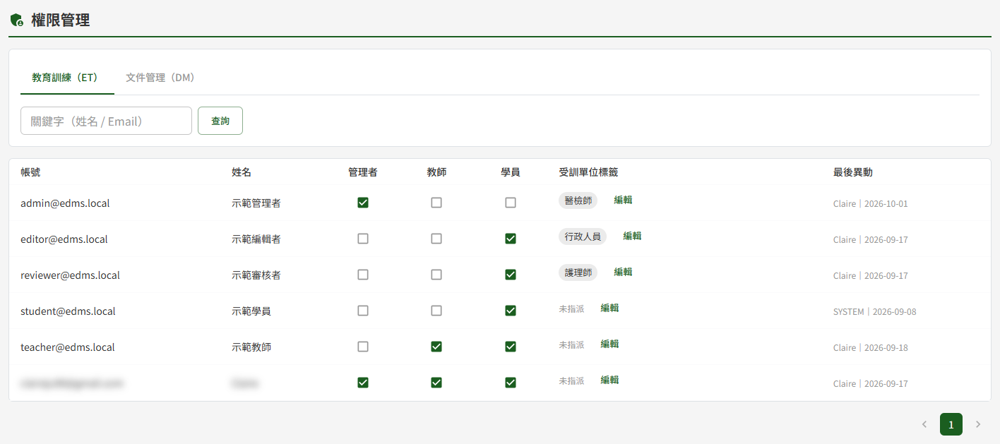
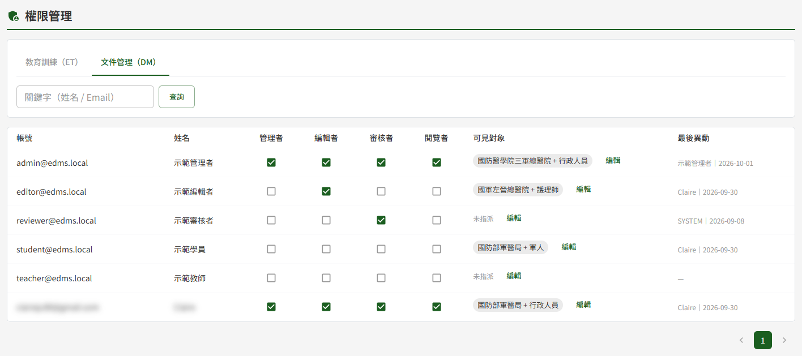
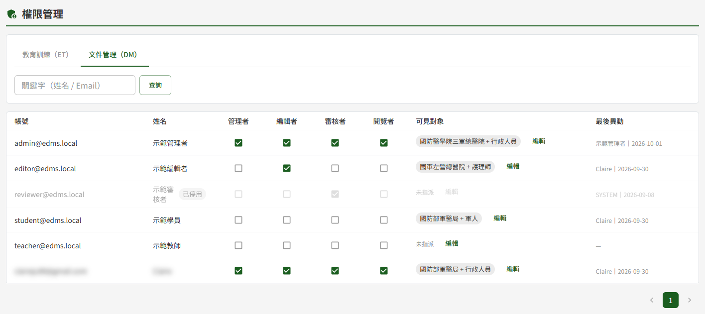
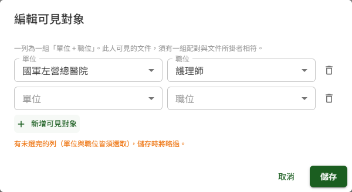
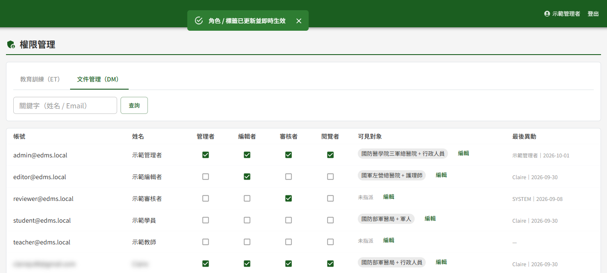

# DP02 權限管理

## 作業說明

### 使用情境

本作業供**各模組的管理者**指派該模組的角色與授權。

畫面上方的分頁即為模組，但**只會出現具管理者身分的模組**——教育訓練的管理者看得到「教育訓練（ET）」分頁、文件管理的管理者看得到「文件管理（DM）」分頁，兩者兼具者兩個分頁都看得到。看不到的那個模組，其角色與授權無從在此檢視或修改。

每個模組可指派的內容如下：

| 模組 | 角色 | 另一個維度 |
|---|---|---|
| 教育訓練 | 管理者、教師、學員 | 受訓單位標籤 |
| 文件管理 | 管理者、編輯者、審核者、閱覽者 | 可見對象 |

角色與另一個維度**彼此獨立**，可以各自設定：只給角色不給標籤、或只調整標籤不動角色，都可以。

> 重要：教育訓練的「學員」角色在**帳號啟用當下由系統自動授予**（見 DP01 使用者管理），不需在此勾選。其餘角色一律由本作業開通——這是教育訓練教師、文件管理四種角色的**唯一開通路徑**。

帳號本身的建立、停用、啟用與解鎖不在本作業，於 DP01 使用者管理處理。本作業只決定「誰配什麼角色、誰配什麼授權」。

### 進入路徑

側邊選單「系統管理者後台 → DP02 權限管理」。

不具任何模組管理者身分者，進入後畫面顯示「您目前無可管理的模組權限。」，沒有分頁與清單。

## 操作說明

### 畫面與前置設定

畫面自上而下為標題列、模組分頁、關鍵字查詢，其下為使用者清單，最下方為分頁列。

清單逐列顯示帳號（Email）、姓名、各角色的核取方塊、該模組的授權欄，以及最後異動。

| 欄位 | 看不出來的地方 |
|---|---|
| 各角色核取方塊 | **勾選或取消即時生效**，沒有儲存按鈕 |
| 可見對象／受訓單位標籤 | 以標籤呈現目前的授權，未設定時顯示「未指派」；按該欄的「編輯」另開視窗設定 |
| 最後異動 | 顯示最近一次異動本列的**人員姓名與日期**；從未異動過者顯示「—」 |

**查詢要按下「查詢」**

於「關鍵字（姓名 / Email）」輸入後，按「查詢」或直接按 Enter 套用篩選，清單隨即更新。

> 注意：DP01 使用者管理是邊打邊查、不需按鈕，本作業則要按下「查詢」。兩頁的操作方式不同。

**停用或鎖定中的帳號整列不可操作**

帳號已停用或鎖定中時，該列會變淡並標示「已停用」或「已鎖定」，角色核取方塊與「編輯」皆為停用狀態。

> 重要：**連「撤除既有角色」也不行**，不是只有加權被擋。需要為這類帳號降權時，順序是：先於 DP01 使用者管理把帳號啟用或解鎖 → 回本作業撤除角色 → 再回 DP01 停用。

### 指派角色

於該使用者所在列，直接勾選或取消角色的核取方塊即可，**勾選的當下就送出、不需另外儲存**，畫面並顯示「角色 / 標籤已更新並即時生效」。

同一個人可以同時具備多個角色，權限取其聯集。角色的種類是固定的，畫面上沒有新增角色種類的功能。

> 重要：**無法取消自己的管理者角色**。這是避免管理者把自己擋在管理功能外的保護；需要撤除時請另一位該模組的管理者操作。

> 注意：系統**不檢核「至少保留一名管理者」**。某模組的管理者若全被撤除，該模組即無人可指派權限，須由資訊人員自資料庫恢復。撤除管理者角色前請先確認該模組仍有其他管理者。

### 設定可見對象（文件管理）

於「可見對象」欄按「編輯」，開啟設定視窗。

一列為一組「**單位 + 職位**」的配對，兩欄都以下拉選取。此人看得到的文件，必須有一組配對與該文件所掛的單位、職位相符。

1. 按「新增可見對象」加一列
2. 於該列選「單位」與「職位」
3. 不需要的列按右側的移除鈕刪掉
4. 按「儲存」

> 重要：**兩欄都要選**。只選了其中一欄的新列，儲存時會被略過，視窗內會先顯示「有未選完的列（單位與職位皆須選取），儲存時將略過。」。

可選的單位與職位清單來自系統參數，於 DP03 系統參數與清單維護管理；本作業只做「誰配哪一組」的指派。該模組尚未設定任何可選項目時，視窗內顯示「尚無可選群組。」。

### 指派受訓單位標籤（教育訓練）

於「受訓單位標籤」欄按「編輯」，開啟設定視窗，勾選該使用者所屬的受訓單位後按「儲存」。

與文件管理的可見對象不同，受訓單位標籤**沒有配對關係**，是一層的清單，可複選。

標籤決定課程發布時要自動邀請哪些人：課程掛了某個標籤，發布時該標籤對應的學員就會被自動加入（見 ET05 課程建立與編輯）。

可選的標籤清單同樣於 DP03 系統參數與清單維護管理。

## 常見訊息與處置

### 被擋下（動作沒有完成）

| 訊息 | 處置 |
|---|---|
| 「無法取消自己的管理者角色」 | 此為保護機制，避免管理者將自身擋在管理功能外。需撤除時請另一位該模組的管理者操作 |
| 「此帳號已停用或鎖定，無法指派權限」 | 先於 DP01 使用者管理啟用或解鎖該帳號，再回本作業調整 |
| 「無權限維護此模組之角色指派」 | 不具該模組的管理者身分。該模組的分頁本就不會出現，出現此訊息通常是權限剛被調整過，重新登入即可 |

### 送出後的結果訊息

| 訊息 | 代表什麼 |
|---|---|
| 「角色 / 標籤已更新並即時生效」 | 角色或授權已寫入並立即生效，該使用者下一個動作即適用新權限，不需重新登入 |

### 其他情況

| 情況 | 說明 |
|---|---|
| 進入後顯示「您目前無可管理的模組權限。」 | 目前不具任何模組的管理者身分。需要此權限時，請另一位該模組的管理者於本作業指派 |
| 只看得到一個分頁 | 僅具該模組的管理者身分，屬正常。另一個模組的角色需由該模組的管理者指派 |
| 調整自己的角色後側邊選單隨即改變 | 角色即時生效，功能選單會跟著重新計算，不需重新登入 |
