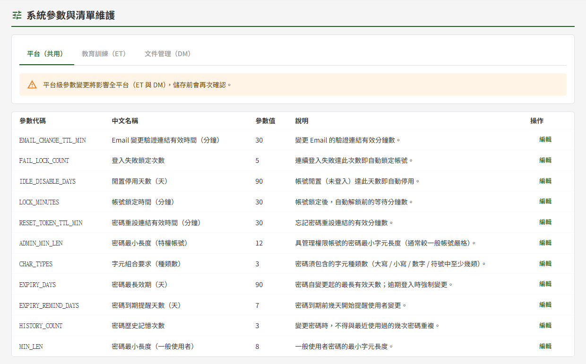
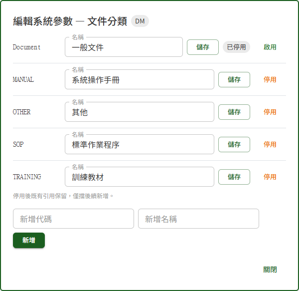

# DP03 系統參數與清單維護

## 作業說明

### 使用情境

本作業供**各模組的管理者**維護系統參數與各模組的選項清單。畫面上方的分頁依身分出現：

| 分頁 | 誰看得到 | 內容 |
|---|---|---|
| 平台（共用） | 教育訓練或文件管理的管理者 | 密碼規則、登入鎖定、各類連結效期等全平台共用的參數 |
| 教育訓練（ET） | 教育訓練的管理者 | 加急提醒天數；受訓對象的單位與職位清單 |
| 文件管理（DM） | 文件管理的管理者 | 催辦門檻天數；文件分類、關聯作業項目、可見對象的單位與職位、檢索標籤 |

各分頁的變更**儲存後即時生效**，並記入操作記錄（見 DP05 操作記錄查詢）。

教育訓練與文件管理的單位、職位清單**各自獨立**，於一邊增修不會帶到另一邊。誰配哪一組單位與職位，於 DP02 權限管理指派；本作業只維護可選的項目。

### 進入路徑

側邊選單「系統管理者後台 → DP03 系統參數與清單維護」。

## 操作說明

### 畫面與前置設定

畫面自上而下為標題列、分頁，其下為參數清單。清單每列為一個參數或一份選項清單：參數於「參數值」欄顯示目前的值，選項清單則顯示共有幾項。按該列的「編輯」，於清單下方展開編輯區。

### 修改參數值

1. 按該參數的「編輯」
2. 於編輯區修改參數值，需要時一併修改「說明」
3. 按「儲存」

「說明」供維護者辨識用途，內容會記入操作記錄，請勿填入密碼、金鑰等機密。

**平台級參數儲存前會再確認一次**

平台（共用）分頁的參數同時影響教育訓練與文件管理兩個模組，按「儲存」後會先跳出確認視窗，按「確定儲存」才寫入；按「取消」則還原為修改前的值。

**各參數可設定的範圍**

超出範圍的值無法儲存，會提示「參數值不合法，請確認格式與值域」。

| 參數 | 可設定範圍 |
|---|---|
| 密碼最小長度（一般使用者） | 8 以上，且不超過特權帳號的最小長度 |
| 密碼最小長度（特權帳號） | 不小於一般使用者的最小長度，最大 72 |
| 字元組合要求（種類數） | 1～4 |
| 密碼歷史記憶次數 | 0～24 |
| 密碼最長效期（天） | 1～90 |
| 密碼到期提醒天數（天） | 1 以上，且須小於密碼最長效期 |
| 登入失敗鎖定次數 | 1 以上 |
| 帳號鎖定時間（分鐘） | 1～1440 |
| 密碼重設連結有效時間（分鐘） | 1～120 |
| Email 變更驗證連結有效時間（分鐘） | 1～120 |
| 閒置停用天數（天） | 1～365 |
| 加急提醒天數（教育訓練） | 0～30，填 0 即不寄加急提醒 |
| 催辦門檻天數（文件管理） | 1～30 |

> 重要：「密碼重設連結有效時間」**同時是**註冊啟用信、驗證信與管理者邀請信中連結的有效時間。調短時，下班前發出的邀請可能在隔日即已失效。

兩組密碼長度互相牽制：要把一般使用者的最小長度調到比特權帳號更長時，須先調高特權帳號的值。密碼最長效期與到期提醒天數亦同。

### 維護選項清單

選項清單（如文件分類、單位、職位、檢索標籤）於「參數值」欄顯示共有幾項。按「編輯」後，編輯區逐列列出各項目。

**改名**

於該項目的「名稱」修改後，按同一列的「儲存」。

**新增**

於編輯區下方填入「新增名稱」後按「新增」。文件分類與關聯作業項目另需填「新增代碼」，代碼限英文與數字，同一份清單內不可重複。

> 重要：**代碼建立後無法修改**，畫面上也沒有修改的欄位。代碼填錯時，請停用該項目後重新新增。

**停用與啟用**

項目無法刪除，不再使用時以停用淘汰：

1. 按該項目的「停用」
2. 於確認視窗按「確定停用」

停用後該項目標示「已停用」，各作業的下拉選單不再列出，無法用於新資料；已使用該項目的既有資料維持不變。按「啟用」即恢復可選。

**停用單位或職位時顯示受影響人數**

停用文件管理的單位或職位時，結果訊息會列出「已停用，至少影響 N 份文件、M 位使用者」；停用教育訓練的單位或職位時則只列使用者數。數字為**至少**的下限，尚在編寫中的草稿未計入。

**「全單位」與「全體」**

單位清單中的「全單位」與職位清單中的「全體」代表不限單位、不限職位，**無法改名**；教育訓練的這兩項另**無法停用**。

## 常見訊息與處置

### 被擋下（動作沒有完成）

| 訊息 | 處置 |
|---|---|
| 「參數值不合法，請確認格式與值域」 | 輸入的值超出該參數的可設定範圍，或與相關參數互相牴觸（如到期提醒天數不小於最長效期）。依〈各參數可設定的範圍〉修正後再儲存 |
| 「此分類碼已存在，請使用其他分類碼」、「受控項目代碼已存在」 | 代碼與清單內既有項目重複。改用其他代碼 |
| 「代碼格式不合法，僅允許英文與數字」 | 代碼含中文、空白或符號。改為英文與數字 |
| 「受訓對象標籤名稱已存在」、「此標籤名稱在該組已存在」 | 名稱與同一份清單內既有項目重複。改用其他名稱 |
| 「「全體」「全單位」為系統內建通用值，不可停用或改名」、「可見性通用值標籤不可改名」 | 不限單位、不限職位的通用值受保護，維持原狀即可 |
| 「無權限維護此模組之參數」 | 不具該模組的管理者身分。該模組的分頁本就不會出現，出現此訊息通常是權限剛被調整過，重新登入即可 |

### 送出後的結果訊息

| 訊息 | 代表什麼 |
|---|---|
| 「已儲存並即時生效」 | 變更已寫入並立即生效，不需重新登入 |
| 「已停用，至少影響 N 份文件、M 位使用者」 | 單位或職位已停用；數字為下限，見〈停用單位或職位時顯示受影響人數〉 |

### 其他情況

| 情況 | 說明 |
|---|---|
| 只看得到「平台（共用）」與其中一個模組的分頁 | 僅具該模組的管理者身分，屬正常 |
| 「目前沒有可維護的參數。」 | 不具任何模組的管理者身分。需要時請該模組的管理者於 DP02 權限管理指派 |
