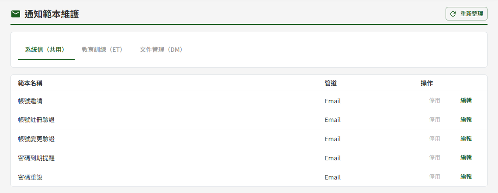
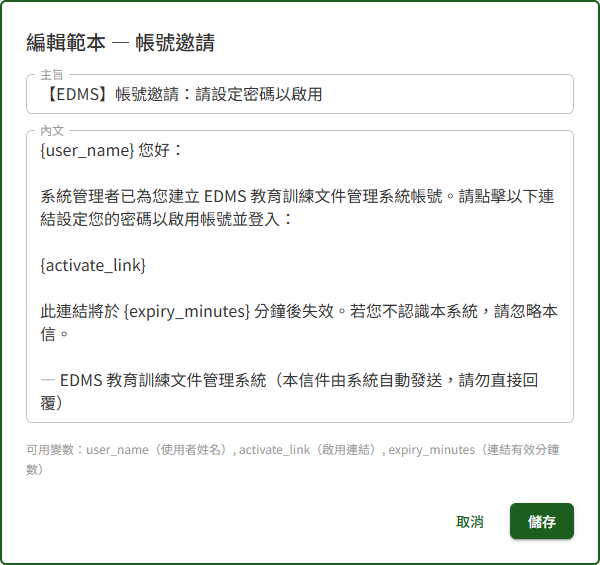

# DP04 通知範本維護

## 作業說明

### 使用情境

本作業供**各模組的管理者**維護系統寄出的 Email 內容（主旨與內文），以及各類通知是否寄出。畫面上方的分頁依身分出現：

| 分頁 | 誰看得到 | 內容 |
|---|---|---|
| 系統信（共用） | 教育訓練或文件管理的管理者 | 帳號邀請、註冊驗證、Email 變更驗證、密碼到期提醒、密碼重設等帳號安全信 |
| 教育訓練（ET） | 教育訓練的管理者 | 課程邀請、加急提醒、週報等教育訓練的通知信 |
| 文件管理（DM） | 文件管理的管理者 | 文件發布通知、閱讀 KPI 週報、未讀文件提醒 |

本作業只列出**會寄 Email** 的通知。簽核流程中的送審、退回、撤回等狀態變化，以畫面呈現（見 DM04 個人專區、DM02 簽核中心），不寄 Email，不在本作業維護。

範本的種類固定，無法新增或刪除。修改後**即時生效**，之後寄出的信即採用新內容，並記入操作記錄（見 DP05 操作記錄查詢）。

### 進入路徑

側邊選單「系統管理者後台 → DP04 通知範本維護」。

## 操作說明

### 畫面與前置設定

畫面自上而下為標題列、分頁，其下為範本清單。每列一種通知，「管道」欄為該通知的寄送方式，僅供檢視、無法修改。

### 修改主旨與內文

1. 按該範本的「編輯」，清單下方展開編輯區
2. 修改「主旨」與「內文」
3. 按「儲存」，於確認視窗按「確定儲存」

**變數**

內文與主旨中以大括號括住的字，如 `{user_name}`、`{activate_link}`，為寄出時代換成實際內容的變數。編輯區下方「可用變數」列出此範本可用的變數名稱與意義。

> 重要：變數**須與「可用變數」所列名稱完全相同**，連同大括號原樣保留；可移動位置或刪除不需要的變數。名稱多一字、少一字或拼錯，該類通知將**無法寄出**，且儲存當下不會有任何提示。修改內文後，建議實際觸發一次該通知確認信件正常送達。

**多人同時編輯**

兩位管理者同時編輯同一範本時，後儲存者會被擋下並提示「內容已被他人修改，請重新載入後再儲存」，清單隨即重新載入最新內容。關閉編輯區後重新按「編輯」，確認對方的修改後再改。

### 停用與啟用

不再需要寄出的通知，按該列的「停用」即生效，不另跳確認視窗。停用後該類信件不再寄出，觸發它的作業照常運作（例如停用「課程邀請通知」，學員仍會被加入課程，只是不會收到信）。按「啟用」即恢復寄送。

系統信（共用）分頁的五種帳號安全信**無法停用**，其「停用」呈灰色；主旨與內文仍可修改。

## 常見訊息與處置

### 被擋下（動作沒有完成）

| 訊息 | 處置 |
|---|---|
| 「內容已被他人修改，請重新載入後再儲存」 | 他人已先儲存了此範本。關閉編輯區後重新按「編輯」，確認對方的修改後再改 |
| 「請輸入主旨」、「請輸入內文」 | 主旨或內文為空白，填寫後再儲存 |
| 「無權限編輯此模組之範本」 | 不具該模組的管理者身分。該模組的分頁本就不會出現，出現此訊息通常是權限剛被調整過，重新登入即可 |

### 送出後的結果訊息

| 訊息 | 代表什麼 |
|---|---|
| 「範本已更新」 | 修改或啟停已生效，之後寄出的信即採用新設定 |

### 其他情況

| 情況 | 說明 |
|---|---|
| 修改範本後，該類通知沒有寄出 | 多半是變數名稱與「可用變數」不符。重新開啟編輯，逐一對照「可用變數」修正後再儲存 |
| 找不到送審、退回等簽核通知的範本 | 這些通知以畫面呈現、不寄 Email，不在本作業維護 |
| 只看得到「系統信（共用）」與其中一個模組的分頁 | 僅具該模組的管理者身分，屬正常 |
