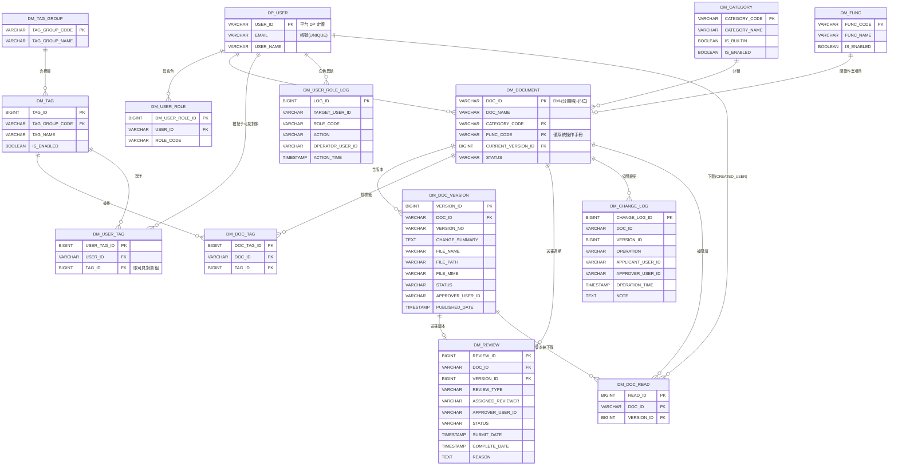

# 資料模型：文件管理模組（Document Management）

**日期**: 2026-06-24
**規格**: [spec.md](spec.md) | **計畫**: [plan.md](plan.md) | **研究**: [research.md](research.md)
**資料庫**: PostgreSQL（命名 / 型別遵循 CLAUDE.md）

---

## 概述

DM 以 `DP_USER`（由平台模組 DP 定義、非 DM 自有）為共用使用者主檔，DM 僅以 `USER_ID` 為 FK 引用；DM 自身持有文件、版本、分類 / func_name / 標籤受控資料、閱覽者可見對象授權、送審、公開變更歷程、閱讀紀錄、角色與其異動等業務表。

> **系統參數 / 通知範本 / 寄件佇列 / 排程集中於平台 DP（2026-07-08 集中化決策，見 [`_refs/09-平台模組.md`](../../_refs/09-平台模組.md) 決策紀錄）**：DM 不再自持 `DM_PARAM` / `DM_NOTIFY_TEMPLATE` / `DM_NOTIFY_QUEUE`。DM 參數改存平台 `DP_PARAM_M/D`（`PARAM_ID` 前綴 `DM_`）、通知範本改存 `DP_NOTIFY_TEMPLATE`（`MODULE=DM`）、非同步寄送改用平台 outbox `DP_EMAIL_LOG`、排程改於 `DP_SCHEDULE` 註冊由平台引擎執行；完整欄位見平台 DP data-model，DM 僅維護自己 `MODULE=DM` / `DM_` 前綴之列（維護 UI 於平台 DP 後台，按模組過濾）。

> **標準欄位之調整（見 [research.md §1](research.md)）**：各表標準欄位**對齊 EDMS 平台模組 DP**（平台無 SITE / HOSPITAL 概念、無 DP_SITE / DP_HOSPITAL），故**省略 `CREATED_SITE` / `CREATED_HOSPITAL`**（及對應 UPDATED_*），採下列集合；append-only 記錄表（`DM_CHANGE_LOG`、`DM_USER_ROLE_LOG`）不含 UPDATED_* / DELETED。

### 標準欄位（除 append-only 表外，各表皆含；以下 DD 不重列）

| 欄位 | 型別 | 必填 | 說明 |
|------|------|------|------|
| CREATED_USER | VARCHAR(20) | Y | 建立者 USER_ID |
| CREATED_DATE | TIMESTAMP | Y | 建立時間 |
| UPDATED_USER | VARCHAR(20) | N | 最後異動者 USER_ID |
| UPDATED_DATE | TIMESTAMP | N | 最後異動時間 |
| RES_ID | VARCHAR(30) | N | 來源功能 ID（DM00~DM09）|
| DELETED | INT | N | 軟刪除（0=正常, 1=已刪除）|

---

## ERD

> ER 圖省略標準欄位；各表業務欄位見下方 DD。
> **通知範本 / 寄件佇列 / 系統參數不在此 ERD**：`DM_NOTIFY_TEMPLATE` / `DM_NOTIFY_QUEUE` / `DM_PARAM` 已廢除，改由平台 DP 集中定義（`DP_NOTIFY_TEMPLATE` MODULE=DM / outbox `DP_EMAIL_LOG` / `DP_PARAM` 前綴 `DM_`），比照 `DP_USER` 為外部平台表、完整欄位見平台 DP data-model。

---

## DD — DP_USER（共用使用者主檔，由平台模組 DP 定義）

`DP_USER` 由平台模組 DP 定義（非 DM 自有），DM 僅以 `USER_ID`（VARCHAR(20)）為 FK 引用；帳號登入 / 密碼雜湊、Email 變更 PENDING / 驗證 token、密碼重設 token 等完整帳號欄位一律**見平台 DP data-model**，DM 端不重複定義。DM 各表之 `USER_ID` FK 皆指向 `DP_USER.USER_ID`。

## DD — DM_USER_ROLE（DM 使用者角色）

使用者於 DM 之角色指派；同一使用者可多列（複選、聯集）。ET 角色獨立、不在此表。

| 欄位代碼 | 欄位名稱 | 資料型別 | 必填 | 預設 | 說明 |
|----------|----------|----------|------|------|------|
| DM_USER_ROLE_ID | 角色指派 ID | BIGINT | Y | 序號 | PK |
| USER_ID | 使用者 ID | VARCHAR(20) | Y | | FK→ DP_USER.USER_ID |
| ROLE_CODE | 角色代碼 | VARCHAR(20) | Y | | DM_ADMIN / DM_EDITOR / DM_REVIEWER / DM_VIEWER |

> 含標準欄位（UPDATED_USER / UPDATED_DATE 即「最後異動」欄之來源）。唯一約束 (USER_ID, ROLE_CODE)。完整異動歷史另寫 `DM_USER_ROLE_LOG`。

## DD — DM_USER_ROLE_LOG（角色異動紀錄，append-only）

記錄每次角色勾選 / 取消之完整歷史；**append-only、永久保留、不修改不刪除**；DM 不提供查詢 UI（供 IT / 稽核由 DB 查）。

> **平台對齊（DP）**：角色異動屬資安類事件，對齊寫入平台共用稽核表 `DP_AUDIT_LOG`（DM 端不另設查詢 UI）；本表為 DM 業務層之角色指派歷史，維持不變。

| 欄位代碼 | 欄位名稱 | 資料型別 | 必填 | 預設 | 說明 |
|----------|----------|----------|------|------|------|
| LOG_ID | 紀錄 ID | BIGINT | Y | 序號 | PK |
| TARGET_USER_ID | 被異動使用者 | VARCHAR(20) | Y | | FK→ DP_USER.USER_ID |
| ROLE_CODE | 角色代碼 | VARCHAR(20) | Y | | 被異動之角色 |
| ACTION | 動作 | VARCHAR(10) | Y | | GRANT（勾選）/ REVOKE（取消）|
| OPERATOR_USER_ID | 操作者（管理者）| VARCHAR(20) | Y | | FK→ DP_USER.USER_ID |
| ACTION_TIME | 操作時間 | TIMESTAMP | Y | | |

> append-only：不含 UPDATED_* / DELETED。

## DD — DM_CATEGORY（文件分類）

4 內建 + 管理者自訂（平面）；不開放刪除、淘汰改停用。分類碼供 DOC_ID 嵌入。

| 欄位代碼 | 欄位名稱 | 資料型別 | 必填 | 預設 | 說明 |
|----------|----------|----------|------|------|------|
| CATEGORY_CODE | 分類碼 | VARCHAR(10) | Y | | PK；唯一英數、建立後鎖定（內建：SOP / MANUAL / TRAINING / OTHER）；供 DOC_ID 嵌入 |
| CATEGORY_NAME | 分類名稱 | VARCHAR(50) | Y | | 可改名 |
| IS_BUILTIN | 是否內建 | BOOLEAN | Y | false | 內建 4 類為 true（代碼鎖定）|
| IS_ENABLED | 是否啟用 | BOOLEAN | Y | true | 停用後不出現於新增 / 搜尋下拉、既有引用保留 |

> 含標準欄位。

## DD — DM_FUNC（關聯作業項目 / func_name）

系統操作手冊類文件可標記之主系統作業功能代號；受控、不可自由輸入；不刪除只停用。

| 欄位代碼 | 欄位名稱 | 資料型別 | 必填 | 預設 | 說明 |
|----------|----------|----------|------|------|------|
| FUNC_CODE | 作業項目代碼 | VARCHAR(10) | Y | | PK（如 BS04、BC01；對應主系統功能編號）|
| FUNC_NAME | 作業項目名稱 | VARCHAR(100) | Y | | 如「領血確認」|
| IS_ENABLED | 是否啟用 | BOOLEAN | Y | true | 停用後不出現於下拉、既有引用保留 |

> 含標準欄位。

## DD — DM_TAG_GROUP（標籤組）

4 內建組；受控標籤庫之分組，分**權限**（可見對象/單位）與**檢索**兩用途。

| 欄位代碼 | 欄位名稱 | 資料型別 | 必填 | 預設 | 說明 |
|----------|----------|----------|------|------|------|
| TAG_GROUP_CODE | 標籤組代碼 | VARCHAR(20) | Y | | PK（AUDIENCE / MODULE / NATURE / LEGAL；原 ROLE 移除）|
| TAG_GROUP_NAME | 標籤組名稱 | VARCHAR(50) | Y | | 可見對象/單位 / 適用模組 / 文件性質 / 法規關聯 |
| GROUP_TYPE | 用途 | VARCHAR(10) | Y | RETRIEVAL | AUDIENCE（權限，僅 `AUDIENCE` 組）/ RETRIEVAL（檢索）|
| IS_BUILTIN | 是否內建 | BOOLEAN | Y | true | 4 內建組 |

> 含標準欄位。`AUDIENCE` 組為權限依據（見〈標籤式可見性〉），文件端必填≥1、閱覽者端由 `DM_USER_TAG` 授權。

## DD — DM_TAG（標籤）

受控標籤庫；撰寫者只能挑選不可自由輸入；不刪除只停用。

| 欄位代碼 | 欄位名稱 | 資料型別 | 必填 | 預設 | 說明 |
|----------|----------|----------|------|------|------|
| TAG_ID | 標籤 ID | BIGINT | Y | 序號 | PK |
| TAG_GROUP_CODE | 所屬標籤組 | VARCHAR(20) | Y | | FK→ DM_TAG_GROUP.TAG_GROUP_CODE |
| TAG_NAME | 標籤名稱 | VARCHAR(50) | Y | | 如 全體 / 護理師 / 軍人 / 採血 / 戰時 / 衛福部 |
| IS_ENABLED | 是否啟用 | BOOLEAN | Y | true | 停用後不出現於下拉、既有引用保留；`AUDIENCE` 組之停用採 soft-retire（不收回既有可見性）|

> 含標準欄位。`AUDIENCE` 組含通用值「全體」（文件掛上即所有閱覽者可見）。

## DD — DM_DOCUMENT（文件主檔）

每份文件之識別與身份屬性。DOC_ID 對外引用基準；身份屬性（名稱 / 分類 / func_name）編輯新版本時唯讀。

| 欄位代碼 | 欄位名稱 | 資料型別 | 必填 | 預設 | 說明 |
|----------|----------|----------|------|------|------|
| DOC_ID | 文件編號 | VARCHAR(20) | Y | | PK；格式 `DM-{分類碼}-{6 位流水號}`、流水號依分類獨立、草稿建立時配號 |
| DOC_NAME | 文件名稱 | VARCHAR(200) | Y | | 可重複（非唯一）；編輯新版本時唯讀 |
| CATEGORY_CODE | 分類 | VARCHAR(10) | Y | | FK→ DM_CATEGORY；編輯新版本時唯讀 |
| FUNC_CODE | 關聯作業項目 | VARCHAR(10) | N | | FK→ DM_FUNC；僅「系統操作手冊」分類必填、單選；編輯新版本時唯讀 |
| CURRENT_VERSION_ID | 目前發布版本 | BIGINT | N | | FK→ DM_DOC_VERSION.VERSION_ID；首版發布前為 null |
| STATUS | 文件狀態 | VARCHAR(20) | Y | DRAFT | DRAFT（首版草稿）/ PENDING_REVIEW（**僅首版送審**，尚無 CURRENT_VERSION_ID）/ PUBLISHED（在架；**已發布文件之新版本送審期間維持此值**）/ PENDING_OBSOLETE（廢止待簽核、仍在架）/ OBSOLETE（已廢止下架）。REJECTED 屬版本層、不在文件層（退回後文件回 DRAFT）|

> 含標準欄位（CREATED_USER = 撰寫者）。**部分唯一索引**：`FUNC_CODE` where CATEGORY_CODE='MANUAL' AND STATUS='PUBLISHED'（同一 func_name 至多一份已發布手冊，research.md §5）。
> **單一送審週期閘門**：「同一文件不可同時兩種送審」以「該 DOC_ID 是否已存在 STATUS=PENDING 之 DM_REVIEW」判定（非看本表 STATUS）；已發布文件之新版本送審期間本表 STATUS 維持 PUBLISHED（現行版仍在架），新版本以 DM_DOC_VERSION.STATUS=PENDING_REVIEW + DM_REVIEW(PENDING) 表示。

## DD — DM_DOC_VERSION（文件版本）

文件之各版本；每版本單一檔案；所有版本永久保留（DELETED=0、不實體刪除）。

| 欄位代碼 | 欄位名稱 | 資料型別 | 必填 | 預設 | 說明 |
|----------|----------|----------|------|------|------|
| VERSION_ID | 版本 ID | BIGINT | Y | 序號 | PK |
| DOC_ID | 文件編號 | VARCHAR(20) | Y | | FK→ DM_DOCUMENT.DOC_ID |
| VERSION_NO | 版本號 | VARCHAR(20) | Y | | 撰寫者自行輸入之自由文字（如 v1.0 / 2026v1.0 / v2.0-RC1）；無系統自動建議 / 大小號；同一 DOC_ID 內不重複 |
| CHANGE_SUMMARY | 變更摘要 / 首版摘要 | TEXT | Y | | 同欄；UI label 依首版 / 新版本切換 |
| FILE_NAME | 檔名 | VARCHAR(255) | Y | | 原始檔名 |
| FILE_PATH | 檔案路徑 | VARCHAR(500) | Y | | 檔案系統 / 物件儲存路徑（不存 BLOB）|
| FILE_SIZE | 檔案大小 | BIGINT | Y | | 位元組；上限由 `DP_PARAM`（`DM_FILE_MAX_MB`）控制 |
| FILE_MIME | 檔案 MIME | VARCHAR(100) | Y | | 供預覽 / 下載判定（PDF / 圖片可預覽）|
| STATUS | 版本狀態 | VARCHAR(20) | Y | DRAFT | DRAFT / PENDING_REVIEW / PUBLISHED（目前發布版）/ SUPERSEDED（已被新版取代）/ REJECTED（送審被退回）。**文件廢止後**，廢止前最後發布版**維持 PUBLISHED**（廢止屬文件層、該版未被取代）|
| APPROVER_USER_ID | 核准者 | VARCHAR(20) | N | | FK→ DP_USER；核准發布時寫入（自 Session）|
| PUBLISHED_DATE | 發布時間 | TIMESTAMP | N | | 即核准時間 |

> 含標準欄位（CREATED_USER = 該版本撰寫者 / 作者）。唯一約束 (DOC_ID, VERSION_NO)（版本號同文件內不重複；應用層另給友善訊息 DM-MSG-DM03-009）。

## DD — DM_DOC_TAG（文件標籤關聯，明細）

文件 × 標籤多對多。含權限（可見對象）與檢索兩類標籤：**可見對象組必填至少 1 項**（應用層檢核，含通用值「全體」）；檢索組選填、多選 AND 檢索。

| 欄位代碼 | 欄位名稱 | 資料型別 | 必填 | 預設 | 說明 |
|----------|----------|----------|------|------|------|
| DOC_TAG_ID | 關聯 ID | BIGINT | Y | 序號 | PK |
| DOC_ID | 文件編號 | VARCHAR(20) | Y | | FK→ DM_DOCUMENT.DOC_ID |
| TAG_ID | 標籤 ID | BIGINT | Y | | FK→ DM_TAG.TAG_ID |

> 含標準欄位。唯一約束 (DOC_ID, TAG_ID)。應用層於送簽 / 發布檢核：該 DOC_ID 至少關聯 1 個 `AUDIENCE` 組標籤。

## DD — DM_USER_TAG（閱覽者可見對象授權，明細）

使用者 × 「可見對象/單位」標籤多對多；由管理者於平台 DP 後台「權限管理」維護（按模組過濾），決定閱覽者於文件庫之可見範圍（見〈標籤式可見性〉）。

| 欄位代碼 | 欄位名稱 | 資料型別 | 必填 | 預設 | 說明 |
|----------|----------|----------|------|------|------|
| USER_TAG_ID | 授權 ID | BIGINT | Y | 序號 | PK |
| USER_ID | 使用者 | VARCHAR(20) | Y | | FK→ DP_USER.USER_ID |
| TAG_ID | 可見對象標籤 | BIGINT | Y | | FK→ DM_TAG.TAG_ID；**限 `AUDIENCE` 組**（應用層檢核）|

> 含標準欄位（UPDATED_USER / UPDATED_DATE 即「最後異動」欄之來源）。唯一約束 (USER_ID, TAG_ID)。未授予任何列之閱覽者僅能看到掛「全體」之文件。可見性比對：閱覽者可見某文件 ⇔ 文件掛「全體」 OR（文件 `DM_DOC_TAG` 之 AUDIENCE 標籤 ∩ 該使用者 `DM_USER_TAG` ≠ 空）。

## DD — DM_REVIEW（送審紀錄）

一列代表一次送審週期（新增 / 新版本 / 廢止）；撤回重送以新列記錄，原列保留不改寫。

| 欄位代碼 | 欄位名稱 | 資料型別 | 必填 | 預設 | 說明 |
|----------|----------|----------|------|------|------|
| REVIEW_ID | 送審 ID | BIGINT | Y | 序號 | PK |
| DOC_ID | 文件編號 | VARCHAR(20) | Y | | FK→ DM_DOCUMENT.DOC_ID |
| VERSION_ID | 送審版本 | BIGINT | N | | FK→ DM_DOC_VERSION；新增 / 新版本指向該版本，廢止指向當時目前發布版 |
| REVIEW_TYPE | 送審類型 | VARCHAR(20) | Y | | NEW（新增）/ NEW_VERSION（新版本）/ OBSOLETE（廢止）|
| ASSIGNED_REVIEWER | 指定審核者 | VARCHAR(20) | Y | | FK→ DP_USER；送審時寫入（排除撰寫者本人）|
| APPROVER_USER_ID | 核准者 | VARCHAR(20) | N | | FK→ DP_USER；核准 / 退回時自 Session 取、不可覆寫 |
| STATUS | 狀態 | VARCHAR(20) | Y | PENDING | PENDING / APPROVED / REJECTED / WITHDRAWN（已撤回）|
| SUBMIT_DATE | 送審時間 | TIMESTAMP | Y | | 用於催辦停留天數計算 |
| COMPLETE_DATE | 完成時間 | TIMESTAMP | N | | 核准 / 退回 / 撤回時間 |
| REASON | 原因 | TEXT | N | | 退回原因 或 廢止原因 |
| OBSOLETE_FILE_NAME | 廢止附件檔名 | VARCHAR(255) | N | | 僅廢止類（REVIEW_TYPE=OBSOLETE）之選填單檔；原始檔名 |
| OBSOLETE_FILE_PATH | 廢止附件路徑 | VARCHAR(500) | N | | 檔案系統 / 物件儲存路徑（不存 BLOB）|
| OBSOLETE_FILE_SIZE | 廢止附件大小 | BIGINT | N | | 位元組；上限比照文件上傳（`DP_PARAM` 之 `DM_FILE_MAX_MB`）|
| OBSOLETE_FILE_MIME | 廢止附件 MIME | VARCHAR(100) | N | | 格式比照文件上傳（PDF / Office / 圖片）|

> 含標準欄位。應用層約束：同一 DOC_ID 不可同時存在兩筆 STATUS=PENDING（單一送審週期，research.md §4）。廢止附件為選填單檔，格式 / 大小比照 `DM_DOC_VERSION` 之檔案規範（沿用檔案儲存服務）；於 DM04 簽核明細與 US10 已廢止查詢可下載。

## DD — DM_CHANGE_LOG（公開變更歷程，append-only）

僅記錄對外發布版本之發布 / 廢止事件；**append-only、永久保留、不可竄改 / 刪除**；供 DM08 跨文件查詢與 CSV 匯出。

| 欄位代碼 | 欄位名稱 | 資料型別 | 必填 | 預設 | 說明 |
|----------|----------|----------|------|------|------|
| CHANGE_LOG_ID | 紀錄 ID | BIGINT | Y | 序號 | PK |
| DOC_ID | 文件編號 | VARCHAR(20) | Y | | FK→ DM_DOCUMENT.DOC_ID |
| VERSION_ID | 版本 ID | BIGINT | N | | FK→ DM_DOC_VERSION；發布事件指向該版本 |
| OPERATION | 操作 | VARCHAR(10) | Y | | PUBLISH（發布）/ OBSOLETE（廢止）|
| APPLICANT_USER_ID | 申請人 | VARCHAR(20) | Y | | 撰寫者 / 廢止發起人 |
| APPROVER_USER_ID | 核准人 | VARCHAR(20) | Y | | 指定審核者 |
| OPERATION_TIME | 操作時間 | TIMESTAMP | Y | | |
| NOTE | 備註 | TEXT | N | | 發布 = 變更摘要；廢止 = 廢止原因 |

> append-only：不含 UPDATED_* / DELETED。

## DD — DM_DOC_READ（閱讀紀錄，append-only 事件）

使用者下載「目前發布版」之閱讀事件；作為閱讀 KPI「已看」判定（US13）；預覽不記錄；獨立於公開變更歷程。

| 欄位代碼 | 欄位名稱 | 資料型別 | 必填 | 預設 | 說明 |
|----------|----------|----------|------|------|------|
| READ_ID | 閱讀 ID | BIGINT | Y | 序號 | PK |
| DOC_ID | 文件編號 | VARCHAR(20) | Y | | FK→ DM_DOCUMENT.DOC_ID |
| VERSION_ID | 版本 ID | BIGINT | Y | | FK→ DM_DOC_VERSION；下載當下之目前發布版 |

> **標準欄位即業務欄位**：本表為 append-only 閱讀事件，紀錄於「下載當下」建立，故其**下載者＝標準 `CREATED_USER`、下載時間＝標準 `CREATED_DATE`**，不另設 `USER_ID` / `READ_TIME`（避免重複，見 research §1）；為 append-only 故省 `UPDATED_*` / `DELETED`（比照 `DM_CHANGE_LOG`）。唯一約束 **(DOC_ID, VERSION_ID, CREATED_USER)**（同人同版本以一次已看計；重複下載不重複計人）。KPI 已看＝該文件目前發布版之 distinct `CREATED_USER` ∩ 應看名單；發新版本後 VERSION_ID 改變、已看自然重置。

## 引用 — 通知範本 / 寄件佇列 / 系統參數（由平台模組 DP 集中定義）

> **2026-07-08 集中化**：以下三者由平台模組 DP 定義（非 DM 自持），DM 僅維護自己 `MODULE=DM` / `DM_` 前綴之列；完整欄位表見平台 DP data-model。

- **通知範本 → `DP_NOTIFY_TEMPLATE`（`MODULE=DM`）**：DM 9 項內建事件（`DOC_SUBMIT` / `DOC_REJECT` / `DOC_PUBLISH` / `OBS_SUBMIT` / `OBS_APPROVE` / `OBS_REJECT` / `KPI_WEEKLY` / `UNREAD_REMIND` / `AUTO_REMIND`）改存 `DP_NOTIFY_TEMPLATE`，欄位含 `EVENT_NAME` / `SUBJECT` / `BODY` / `CHANNEL`（EMAIL_MSG＝Email+站內 / MSG_ONLY＝僅站內，自動催辦用 / EMAIL_ONLY＝僅 Email，文件發布通知 / KPI 週報 / 未讀提醒用）/ `IS_ENABLED` 由 DP 表提供。編輯 UI 仍在 DM09「通知範本」分頁（DM 管理者只編輯 `MODULE=DM` 的列）。`DOC_PUBLISH`（核准發布時觸發，發撰寫者 + 相符閱覽者）、`KPI_WEEKLY` / `UNREAD_REMIND`（排程 SCHDM001 觸發）皆 CHANNEL=EMAIL_ONLY、非同步批次寄送。原「文件發布(撰寫者,EMAIL_MSG)」與「發布通知閱覽者」已於 2026-06-29 合併為單一 `DOC_PUBLISH`。
- **寄件佇列 → 平台 outbox `DP_EMAIL_LOG`**：DM 之非同步寄送（`DOC_PUBLISH` / `KPI_WEEKLY` / `UNREAD_REMIND`）改呼叫平台唯一發信服務（傳 `template_code`），由平台 outbox 非同步寄送並記錄狀態 / 重試 / `CALLER_MODULE=DM`。原 worker「寄送時即時組信」（未讀提醒即時算該收件人未看清單、KPI 週報即時算統計 + CSV）之行為改由平台發信服務承載；發布通知之收件名單仍於發布當下組出（快照）。
- **系統參數 → 平台 `DP_PARAM_M/D`（`PARAM_ID` 前綴 `DM_`）**：DM 參數改存 `DP_PARAM`，平台提供唯讀查詢服務；維護介面於平台 DP 後台（DM 管理者只看 DM 參數，按模組過濾）。DM 參數 key：`DM_REMIND_THRESHOLD`（催辦門檻）、`DM_FILE_MAX_MB`、`DM_FILE_TYPES`、`DM_WEEKLY_SCHED_DAY_TIME`（KPI 週報 / 未讀提醒每週執行時間，格式 `星期,HH:MM`，如 `週一,10:00`，預設 `週一,10:00`，由管理者於平台 DP 後台通知範本設定、兩者共用）。原發信引擎調校 `DM_MAIL_MAX_RETRY` / `DM_MAIL_RATE_PER_MIN` / `DM_MAIL_FAIL_ALERT_PCT` 屬發信引擎，因發信引擎集中於平台，已改為**平台級 `MAIL` 參數組**（`RETRY_MAX` / `RATE_PER_MIN` / `RETRY_INTERVAL_MIN`，不再掛 `DM_`；失敗告警作廢——由 IT 監控負責，2026-07-09 對齊平台），凡引用處改述為「平台發信引擎參數」。

---

## 代碼表

### 文件 / 版本狀態（STATUS）

| 值 | 層級 | 說明 |
|----|------|------|
| DRAFT | 文件 / 版本 | 草稿（未送審）|
| PENDING_REVIEW | 文件 / 版本 | 版本層：新增 / 新版本送審中。**文件層僅首版送審用**（已發布文件之新版本送審期間，文件層維持 PUBLISHED）|
| PUBLISHED | 文件 / 版本 | 已發布（版本層：目前發布版；文件廢止後其最後發布版仍維持 PUBLISHED）|
| SUPERSEDED | 版本 | 已被新版取代（僅預覽不可下載）|
| REJECTED | **版本** | 送審被退回（文件層不使用；退回後文件回 DRAFT）|
| PENDING_OBSOLETE | 文件 | 廢止待簽核（仍對外有效、仍在架）|
| OBSOLETE | 文件 | 已廢止（自文件庫下架；僅 DM06 read-only 查）|

### 角色代碼（DM_USER_ROLE.ROLE_CODE）

| 值 | 說明 |
|----|------|
| DM_ADMIN | 管理者 |
| DM_EDITOR | 編輯者 |
| DM_REVIEWER | 審核者 |
| DM_VIEWER | 閱覽者（由管理者開通，無自動授予）|

### 送審類型（DM_REVIEW.REVIEW_TYPE）

| 值 | 說明 |
|----|------|
| NEW | 新增（首版）|
| NEW_VERSION | 新版本 |
| OBSOLETE | 廢止 |

### 通知事件（`DP_NOTIFY_TEMPLATE` MODULE=DM 之 TEMPLATE_CODE）

| 代碼 | 事件 | 對象 | 管道 |
|------|------|------|------|
| DOC_SUBMIT | 文件送審 | 指定審核者 | EMAIL_MSG |
| DOC_REJECT | 文件退回 | 撰寫者 | EMAIL_MSG |
| **DOC_PUBLISH** | **文件發布通知** | **撰寫者 + 相符閱覽者**（掛「全體」→ 全部）| **EMAIL_ONLY（非同步）** |
| OBS_SUBMIT | 廢止申請送審 | 指定審核者 | EMAIL_MSG |
| OBS_APPROVE | 廢止核准 | 撰寫者（廢止申請人）| EMAIL_MSG |
| OBS_REJECT | 廢止退回 | 撰寫者（廢止申請人）| EMAIL_MSG |
| **KPI_WEEKLY** | **KPI 週報** | **管理者（DM_ADMIN）** | **EMAIL_ONLY（排程，內文摘要 + CSV）** |
| **UNREAD_REMIND** | **未讀提醒** | 未看之**閱覽者** | **EMAIL_ONLY（排程，一人一信彙整；涵蓋全部已發布文件；由管理者以本範本啟用/停用統一控制）** |
| AUTO_REMIND | 自動催辦信 | 指定審核者 | MSG_ONLY |

### 內建標籤組（DM_TAG_GROUP）

| 代碼 | 名稱 | 用途 | 範例標籤 |
|------|------|------|---------|
| AUDIENCE | 可見對象/單位 | 權限 | 全體 / 護理師 / 軍人 / 醫檢師 / 行政人員 |
| MODULE | 適用模組 | 檢索 | 採血 / 成分 / 檢驗 / 供應 / 醫務 |
| NATURE | 文件性質 | 檢索 | 戰時 / 緊急 / 平時 / 訓練 |
| LEGAL | 法規關聯 | 檢索 | 衛福部 |

> 原「ROLE 適用角色」檢索組已移除（角色語意併入 AUDIENCE 可見對象/單位）。

### 排程作業（SCH）

| 代碼 | 名稱 | 週期 | 說明 |
|------|------|------|------|
| SCHDM001 | 閱讀 KPI 週報與未讀提醒 | 每週執行（星期＋時間可設定，預設週一 10:00，存於 `DP_PARAM.DM_WEEKLY_SCHED_DAY_TIME`）；於平台 `DP_SCHEDULE` 註冊、平台引擎執行、`DP_SCHEDULE_LOG` 記錄，job handler 由 DM 提供 | 計算全部已發布文件之閱讀 KPI；寄 KPI 週報予管理者（內文摘要 + CSV）、未讀提醒予未看閱覽者（一人一信彙整、涵蓋全部已發布文件；未讀提醒範本停用則不寄）；寄信經平台發信服務 + outbox `DP_EMAIL_LOG` 非同步 |

---

## 不在 DM 資料模型範圍

| 項目 | 原因 |
|------|------|
| 站點 / 院區主檔（DP_SITE / DP_HOSPITAL）| 對齊平台模組 DP，平台無站點 / 院區概念（research.md §1）|
| ET 角色與課程資料 | 屬 ET 模組；DM 僅共用平台 `DP_USER` 主檔 |
| 檔案二進位內容（BLOB）| 存檔案系統 / 物件儲存，DB 僅存 metadata（research.md §3）|
| 統計報表資料 | 已對齊交付確認書排除（spec Assumptions）|
