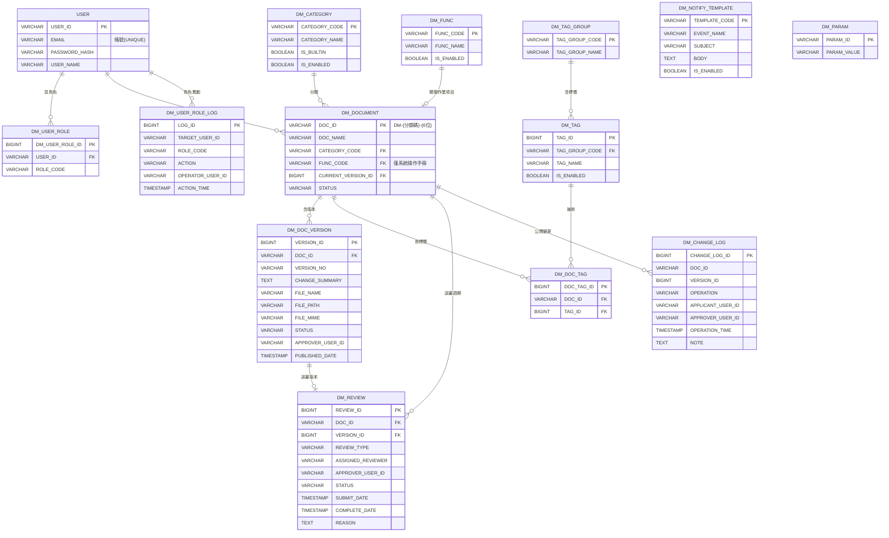

# 資料模型：文件管理模組（Document Management）

**日期**: 2026-06-24
**規格**: [spec.md](spec.md) | **計畫**: [plan.md](plan.md) | **研究**: [research.md](research.md)
**資料庫**: PostgreSQL（命名 / 型別遵循 CLAUDE.md）

---

## 概述

DM 與 ET 共用 `USER` 主檔（SSO），DM 自身持有文件、版本、分類 / func_name / 標籤受控資料、送審、公開變更歷程、角色與其異動、通知範本、系統參數等表。

> **標準欄位之調整（見 [research.md §1](research.md)）**：DM 獨立於主系統 DP（無 DP_SITE / DP_HOSPITAL），故各表標準欄位**省略 `CREATED_SITE` / `CREATED_HOSPITAL`**（及對應 UPDATED_*），採下列集合；append-only 記錄表（`DM_CHANGE_LOG`、`DM_USER_ROLE_LOG`）不含 UPDATED_* / DELETED。

### 標準欄位（除 append-only 表外，各表皆含；以下 DD 不重列）

| 欄位 | 型別 | 必填 | 說明 |
|------|------|------|------|
| CREATED_USER | VARCHAR(20) | Y | 建立者 USER_ID |
| CREATED_DATE | TIMESTAMP | Y | 建立時間 |
| UPDATED_USER | VARCHAR(20) | N | 最後異動者 USER_ID |
| UPDATED_DATE | TIMESTAMP | N | 最後異動時間 |
| RES_ID | VARCHAR(30) | N | 來源功能 ID（DM00~DM09）|
| DELETED | INT | N | 軟刪除（0=正常, 1=已刪除）|

---

## ERD

> ER 圖省略標準欄位；各表業務欄位見下方 DD。

---

## DD — USER（共用使用者主檔，與 ET 共用）

DM 與 ET 共用此表，DM 不獨佔。註冊一次即可登入兩系統；USER_ID 為穩定識別碼，帳號 / 密碼 / 姓名可變。

| 欄位代碼 | 欄位名稱 | 資料型別 | 必填 | 預設 | 說明 |
|----------|----------|----------|------|------|------|
| USER_ID | 使用者 ID | VARCHAR(20) | Y | | PK；系統內穩定識別碼、永久不變 |
| EMAIL | 帳號（Email）| VARCHAR(100) | Y | | UNIQUE；登入帳號、收件人，可變更 |
| PASSWORD_HASH | 密碼雜湊 | VARCHAR(100) | Y | | 不可逆儲存 |
| USER_NAME | 姓名 | VARCHAR(50) | Y | | UI 顯示 |
| EMAIL_PENDING_CHANGE | 待驗證新 Email | VARCHAR(100) | N | | Email 變更暫存（驗證後切換）|
| EMAIL_PENDING_TOKEN | 驗證 token | VARCHAR(100) | N | | 新 Email 驗證連結 token |
| EMAIL_PENDING_EXPIRES_AT | 驗證到期時間 | TIMESTAMP | N | | 預設提交後 30 分鐘 |

> 含標準欄位。此表與 ET 共用，欄位異動需與 ET 協調（跨模組共用）。

## DD — DM_USER_ROLE（DM 使用者角色）

使用者於 DM 之角色指派；同一使用者可多列（複選、聯集）。ET 角色獨立、不在此表。

| 欄位代碼 | 欄位名稱 | 資料型別 | 必填 | 預設 | 說明 |
|----------|----------|----------|------|------|------|
| DM_USER_ROLE_ID | 角色指派 ID | BIGINT | Y | 序號 | PK |
| USER_ID | 使用者 ID | VARCHAR(20) | Y | | FK→ USER.USER_ID |
| ROLE_CODE | 角色代碼 | VARCHAR(20) | Y | | DM_ADMIN / DM_EDITOR / DM_REVIEWER / DM_VIEWER |

> 含標準欄位（UPDATED_USER / UPDATED_DATE 即「最後異動」欄之來源）。唯一約束 (USER_ID, ROLE_CODE)。完整異動歷史另寫 `DM_USER_ROLE_LOG`。

## DD — DM_USER_ROLE_LOG（角色異動紀錄，append-only）

記錄每次角色勾選 / 取消之完整歷史；**append-only、永久保留、不修改不刪除**；DM 不提供查詢 UI（供 IT / 稽核由 DB 查）。

| 欄位代碼 | 欄位名稱 | 資料型別 | 必填 | 預設 | 說明 |
|----------|----------|----------|------|------|------|
| LOG_ID | 紀錄 ID | BIGINT | Y | 序號 | PK |
| TARGET_USER_ID | 被異動使用者 | VARCHAR(20) | Y | | FK→ USER.USER_ID |
| ROLE_CODE | 角色代碼 | VARCHAR(20) | Y | | 被異動之角色 |
| ACTION | 動作 | VARCHAR(10) | Y | | GRANT（勾選）/ REVOKE（取消）|
| OPERATOR_USER_ID | 操作者（管理者）| VARCHAR(20) | Y | | FK→ USER.USER_ID |
| ACTION_TIME | 操作時間 | TIMESTAMP | Y | | |

> append-only：不含 UPDATED_* / DELETED。

## DD — DM_CATEGORY（文件分類）

4 內建 + 管理者自訂（平面）；不開放刪除、淘汰改停用。分類碼供 DOC_ID 嵌入。

| 欄位代碼 | 欄位名稱 | 資料型別 | 必填 | 預設 | 說明 |
|----------|----------|----------|------|------|------|
| CATEGORY_CODE | 分類碼 | VARCHAR(10) | Y | | PK；唯一英數、建立後鎖定（內建：SOP / MANUAL / TRAINING / OTHER）；供 DOC_ID 嵌入 |
| CATEGORY_NAME | 分類名稱 | VARCHAR(50) | Y | | 可改名 |
| IS_BUILTIN | 是否內建 | BOOLEAN | Y | false | 內建 4 類為 true（代碼鎖定）|
| IS_ENABLED | 是否啟用 | BOOLEAN | Y | true | 停用後不出現於新增 / 搜尋下拉、既有引用保留 |

> 含標準欄位。

## DD — DM_FUNC（關聯作業項目 / func_name）

系統操作手冊類文件可標記之主系統作業功能代號；受控、不可自由輸入；不刪除只停用。

| 欄位代碼 | 欄位名稱 | 資料型別 | 必填 | 預設 | 說明 |
|----------|----------|----------|------|------|------|
| FUNC_CODE | 作業項目代碼 | VARCHAR(10) | Y | | PK（如 BS04、BC01；對應主系統功能編號）|
| FUNC_NAME | 作業項目名稱 | VARCHAR(100) | Y | | 如「領血確認」|
| IS_ENABLED | 是否啟用 | BOOLEAN | Y | true | 停用後不出現於下拉、既有引用保留 |

> 含標準欄位。

## DD — DM_TAG_GROUP（標籤組）

4 內建組；受控標籤庫之分組。

| 欄位代碼 | 欄位名稱 | 資料型別 | 必填 | 預設 | 說明 |
|----------|----------|----------|------|------|------|
| TAG_GROUP_CODE | 標籤組代碼 | VARCHAR(20) | Y | | PK（MODULE / ROLE / NATURE / LEGAL）|
| TAG_GROUP_NAME | 標籤組名稱 | VARCHAR(50) | Y | | 適用模組 / 適用角色 / 文件性質 / 法規關聯 |
| IS_BUILTIN | 是否內建 | BOOLEAN | Y | true | 4 內建組 |

> 含標準欄位。

## DD — DM_TAG（標籤）

受控標籤庫；撰寫者只能挑選不可自由輸入；不刪除只停用。

| 欄位代碼 | 欄位名稱 | 資料型別 | 必填 | 預設 | 說明 |
|----------|----------|----------|------|------|------|
| TAG_ID | 標籤 ID | BIGINT | Y | 序號 | PK |
| TAG_GROUP_CODE | 所屬標籤組 | VARCHAR(20) | Y | | FK→ DM_TAG_GROUP.TAG_GROUP_CODE |
| TAG_NAME | 標籤名稱 | VARCHAR(50) | Y | | 如 採血 / 護理師 / 戰時 / 衛福部 |
| IS_ENABLED | 是否啟用 | BOOLEAN | Y | true | 停用後不出現於下拉、既有引用保留 |

> 含標準欄位。

## DD — DM_DOCUMENT（文件主檔）

每份文件之識別與身份屬性。DOC_ID 對外引用基準；身份屬性（名稱 / 分類 / func_name）編輯新版本時唯讀。

| 欄位代碼 | 欄位名稱 | 資料型別 | 必填 | 預設 | 說明 |
|----------|----------|----------|------|------|------|
| DOC_ID | 文件編號 | VARCHAR(20) | Y | | PK；格式 `DM-{分類碼}-{6 位流水號}`、流水號依分類獨立、草稿建立時配號 |
| DOC_NAME | 文件名稱 | VARCHAR(200) | Y | | 可重複（非唯一）；編輯新版本時唯讀 |
| CATEGORY_CODE | 分類 | VARCHAR(10) | Y | | FK→ DM_CATEGORY；編輯新版本時唯讀 |
| FUNC_CODE | 關聯作業項目 | VARCHAR(10) | N | | FK→ DM_FUNC；僅「系統操作手冊」分類必填、單選；編輯新版本時唯讀 |
| CURRENT_VERSION_ID | 目前發布版本 | BIGINT | N | | FK→ DM_DOC_VERSION.VERSION_ID；首版發布前為 null |
| STATUS | 文件狀態 | VARCHAR(20) | Y | DRAFT | DRAFT（首版草稿）/ PENDING_REVIEW（**僅首版送審**，尚無 CURRENT_VERSION_ID）/ PUBLISHED（在架；**已發布文件之新版本送審期間維持此值**）/ PENDING_OBSOLETE（廢止待簽核、仍在架）/ OBSOLETE（已廢止下架）。REJECTED 屬版本層、不在文件層（退回後文件回 DRAFT）|

> 含標準欄位（CREATED_USER = 撰寫者）。**部分唯一索引**：`FUNC_CODE` where CATEGORY_CODE='MANUAL' AND STATUS='PUBLISHED'（同一 func_name 至多一份已發布手冊，research.md §5）。
> **單一送審週期閘門**：「同一文件不可同時兩種送審」以「該 DOC_ID 是否已存在 STATUS=PENDING 之 DM_REVIEW」判定（非看本表 STATUS）；已發布文件之新版本送審期間本表 STATUS 維持 PUBLISHED（現行版仍在架），新版本以 DM_DOC_VERSION.STATUS=PENDING_REVIEW + DM_REVIEW(PENDING) 表示。

## DD — DM_DOC_VERSION（文件版本）

文件之各版本；每版本單一檔案；所有版本永久保留（DELETED=0、不實體刪除）。

| 欄位代碼 | 欄位名稱 | 資料型別 | 必填 | 預設 | 說明 |
|----------|----------|----------|------|------|------|
| VERSION_ID | 版本 ID | BIGINT | Y | 序號 | PK |
| DOC_ID | 文件編號 | VARCHAR(20) | Y | | FK→ DM_DOCUMENT.DOC_ID |
| VERSION_NO | 版本號 | VARCHAR(20) | Y | | 如 v1.0 / v2.1 / v2.0-RC1（撰寫者可編輯）|
| CHANGE_SUMMARY | 變更摘要 / 首版摘要 | TEXT | Y | | 同欄；UI label 依首版 / 新版本切換 |
| FILE_NAME | 檔名 | VARCHAR(255) | Y | | 原始檔名 |
| FILE_PATH | 檔案路徑 | VARCHAR(500) | Y | | 檔案系統 / 物件儲存路徑（不存 BLOB）|
| FILE_SIZE | 檔案大小 | BIGINT | Y | | 位元組；上限由 DM_PARAM 控制 |
| FILE_MIME | 檔案 MIME | VARCHAR(100) | Y | | 供預覽 / 下載判定（PDF / 圖片可預覽）|
| STATUS | 版本狀態 | VARCHAR(20) | Y | DRAFT | DRAFT / PENDING_REVIEW / PUBLISHED（目前發布版）/ SUPERSEDED（已被新版取代）/ REJECTED（送審被退回）。**文件廢止後**，廢止前最後發布版**維持 PUBLISHED**（廢止屬文件層、該版未被取代）|
| APPROVER_USER_ID | 核准者 | VARCHAR(20) | N | | FK→ USER；核准發布時寫入（自 Session）|
| PUBLISHED_DATE | 發布時間 | TIMESTAMP | N | | 即核准時間 |

> 含標準欄位（CREATED_USER = 該版本撰寫者 / 作者）。

## DD — DM_DOC_TAG（文件標籤關聯，明細）

文件 × 標籤多對多（選填、多選 AND 檢索）。

| 欄位代碼 | 欄位名稱 | 資料型別 | 必填 | 預設 | 說明 |
|----------|----------|----------|------|------|------|
| DOC_TAG_ID | 關聯 ID | BIGINT | Y | 序號 | PK |
| DOC_ID | 文件編號 | VARCHAR(20) | Y | | FK→ DM_DOCUMENT.DOC_ID |
| TAG_ID | 標籤 ID | BIGINT | Y | | FK→ DM_TAG.TAG_ID |

> 含標準欄位。唯一約束 (DOC_ID, TAG_ID)。

## DD — DM_REVIEW（送審紀錄）

一列代表一次送審週期（新增 / 新版本 / 廢止）；撤回重送以新列記錄，原列保留不改寫。

| 欄位代碼 | 欄位名稱 | 資料型別 | 必填 | 預設 | 說明 |
|----------|----------|----------|------|------|------|
| REVIEW_ID | 送審 ID | BIGINT | Y | 序號 | PK |
| DOC_ID | 文件編號 | VARCHAR(20) | Y | | FK→ DM_DOCUMENT.DOC_ID |
| VERSION_ID | 送審版本 | BIGINT | N | | FK→ DM_DOC_VERSION；新增 / 新版本指向該版本，廢止指向當時目前發布版 |
| REVIEW_TYPE | 送審類型 | VARCHAR(20) | Y | | NEW（新增）/ NEW_VERSION（新版本）/ OBSOLETE（廢止）|
| ASSIGNED_REVIEWER | 指定審核者 | VARCHAR(20) | Y | | FK→ USER；送審時寫入（排除撰寫者本人）|
| APPROVER_USER_ID | 核准者 | VARCHAR(20) | N | | FK→ USER；核准 / 退回時自 Session 取、不可覆寫 |
| STATUS | 狀態 | VARCHAR(20) | Y | PENDING | PENDING / APPROVED / REJECTED / WITHDRAWN（已撤回）|
| SUBMIT_DATE | 送審時間 | TIMESTAMP | Y | | 用於催辦停留天數計算 |
| COMPLETE_DATE | 完成時間 | TIMESTAMP | N | | 核准 / 退回 / 撤回時間 |
| REASON | 原因 | TEXT | N | | 退回原因 或 廢止原因 |

> 含標準欄位。應用層約束：同一 DOC_ID 不可同時存在兩筆 STATUS=PENDING（單一送審週期，research.md §4）。

## DD — DM_CHANGE_LOG（公開變更歷程，append-only）

僅記錄對外發布版本之發布 / 廢止事件；**append-only、永久保留、不可竄改 / 刪除**；供 DM08 跨文件查詢與 CSV 匯出。

| 欄位代碼 | 欄位名稱 | 資料型別 | 必填 | 預設 | 說明 |
|----------|----------|----------|------|------|------|
| CHANGE_LOG_ID | 紀錄 ID | BIGINT | Y | 序號 | PK |
| DOC_ID | 文件編號 | VARCHAR(20) | Y | | FK→ DM_DOCUMENT.DOC_ID |
| VERSION_ID | 版本 ID | BIGINT | N | | FK→ DM_DOC_VERSION；發布事件指向該版本 |
| OPERATION | 操作 | VARCHAR(10) | Y | | PUBLISH（發布）/ OBSOLETE（廢止）|
| APPLICANT_USER_ID | 申請人 | VARCHAR(20) | Y | | 撰寫者 / 廢止發起人 |
| APPROVER_USER_ID | 核准人 | VARCHAR(20) | Y | | 指定審核者 |
| OPERATION_TIME | 操作時間 | TIMESTAMP | Y | | |
| NOTE | 備註 | TEXT | N | | 發布 = 變更摘要；廢止 = 廢止原因 |

> append-only：不含 UPDATED_* / DELETED。

## DD — DM_NOTIFY_TEMPLATE（通知範本）

7 項內建事件；主旨 / 內文可編輯、可啟用停用；事件固定不可新增。

| 欄位代碼 | 欄位名稱 | 資料型別 | 必填 | 預設 | 說明 |
|----------|----------|----------|------|------|------|
| TEMPLATE_CODE | 範本代碼 | VARCHAR(30) | Y | | PK（如 DOC_SUBMIT / DOC_REJECT / DOC_PUBLISH / OBS_SUBMIT / OBS_APPROVE / OBS_REJECT / AUTO_REMIND）|
| EVENT_NAME | 事件名稱 | VARCHAR(50) | Y | | 文件送審 / 退回 / 發布…|
| SUBJECT | 主旨 | VARCHAR(200) | Y | | 可含變數如 {{doc_name}} |
| BODY | 內文 | TEXT | Y | | 可含變數 |
| CHANNEL | 通知管道 | VARCHAR(20) | Y | EMAIL_MSG | EMAIL_MSG（Email + 站內）/ MSG_ONLY（僅站內，自動催辦用）|
| IS_ENABLED | 是否啟用 | BOOLEAN | Y | true | 停用後不發 Email，站內訊息仍顯示 |

> 含標準欄位。

## DD — DM_PARAM（系統參數）

DM 內部參數；PARAM_ID 前綴 `DM_`、一律大寫（CLAUDE.md）。由 IT / 管理者維護。

| 欄位代碼 | 欄位名稱 | 資料型別 | 必填 | 預設 | 說明 |
|----------|----------|----------|------|------|------|
| PARAM_ID | 參數代碼 | VARCHAR(30) | Y | | PK；前綴 DM_（如 DM_REMIND_THRESHOLD / DM_FILE_MAX_MB / DM_FILE_TYPES）|
| PARAM_VALUE | 參數值 | VARCHAR(200) | Y | | |
| PARAM_DESC | 說明 | VARCHAR(200) | N | | |

> 含標準欄位。

---

## 代碼表

### 文件 / 版本狀態（STATUS）

| 值 | 層級 | 說明 |
|----|------|------|
| DRAFT | 文件 / 版本 | 草稿（未送審）|
| PENDING_REVIEW | 文件 / 版本 | 版本層：新增 / 新版本送審中。**文件層僅首版送審用**（已發布文件之新版本送審期間，文件層維持 PUBLISHED）|
| PUBLISHED | 文件 / 版本 | 已發布（版本層：目前發布版；文件廢止後其最後發布版仍維持 PUBLISHED）|
| SUPERSEDED | 版本 | 已被新版取代（僅預覽不可下載）|
| REJECTED | **版本** | 送審被退回（文件層不使用；退回後文件回 DRAFT）|
| PENDING_OBSOLETE | 文件 | 廢止待簽核（仍對外有效、仍在架）|
| OBSOLETE | 文件 | 已廢止（自文件庫下架；僅 DM06 read-only 查）|

### 角色代碼（DM_USER_ROLE.ROLE_CODE）

| 值 | 說明 |
|----|------|
| DM_ADMIN | 管理者 |
| DM_EDITOR | 編輯者 |
| DM_REVIEWER | 審核者 |
| DM_VIEWER | 閱覽者（首次登入自動授予）|

### 送審類型（DM_REVIEW.REVIEW_TYPE）

| 值 | 說明 |
|----|------|
| NEW | 新增（首版）|
| NEW_VERSION | 新版本 |
| OBSOLETE | 廢止 |

### 內建標籤組（DM_TAG_GROUP）

| 代碼 | 名稱 | 範例標籤 |
|------|------|---------|
| MODULE | 適用模組 | 採血 / 成分 / 檢驗 / 供應 / 醫務 |
| ROLE | 適用角色 | 護理師 / 血庫人員 / 醫師 |
| NATURE | 文件性質 | 戰時 / 緊急 / 平時 / 訓練 |
| LEGAL | 法規關聯 | 衛福部 |

---

## 不在 DM 資料模型範圍

| 項目 | 原因 |
|------|------|
| 站點 / 院區主檔（DP_SITE / DP_HOSPITAL）| DM 獨立於 DP，無站點概念（research.md §1）|
| ET 角色與課程資料 | 屬 ET 模組；DM 僅共用 USER 主檔 |
| 檔案二進位內容（BLOB）| 存檔案系統 / 物件儲存，DB 僅存 metadata（research.md §3）|
| 統計報表資料 | 已對齊交付確認書排除（spec Assumptions）|
