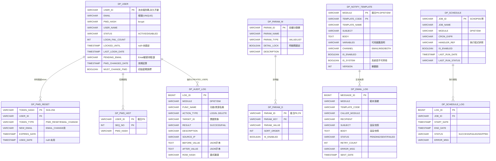

# 資料模型：平台模組（Platform）

**日期**: 2026-07-09
**規格**: [spec.md](spec.md) | **計畫**: [plan.md](plan.md) | **研究**: [research.md](research.md)
**資料庫**: PostgreSQL（命名 / 型別遵循 CLAUDE.md）

---

## 概述

DP 持有 10 張平台表：共用使用者 `DP_USER`、驗證 token `DP_PWD_RESET`、密碼歷程 `DP_PWD_HIST`、稽核 `DP_AUDIT_LOG`、參數 `DP_PARAM_M/D`、通知範本 `DP_NOTIFY_TEMPLATE`、寄件 outbox `DP_EMAIL_LOG`、排程 `DP_SCHEDULE` + `DP_SCHEDULE_LOG`。

> **關聯 / 指派資料不在 DP**（定義 vs 關聯分層）：使用者×角色（`ET_USER_ROLE` / `DM_USER_ROLE`）、使用者×標籤（`ET_USER_TAG`）、使用者×可見對象授權（DM 授權表）等留各模組業務表，引用 `DP_PARAM` 之碼；平台不設 `DP_SITE` / `DP_SESSION` / `DP_ROLE` / `DP_MENU`（見 [research.md §1](research.md)、spec Out of Scope）。

> **標準欄位**：EDMS 單一組織，省略 `CREATED_SITE` / `UPDATED_SITE`（與 ET / DM 一致，見 DM research §1）；append-only 表（`DP_PWD_HIST`、`DP_AUDIT_LOG`、`DP_SCHEDULE_LOG`）僅含 `CREATED_USER` / `CREATED_DATE`；`DP_EMAIL_LOG` 允許狀態欄更新（含 UPDATED_*）、不刪除。

### 標準欄位（除特別註記外，各表皆含；以下 DD 不重列）

| 欄位 | 型別 | 必填 | 說明 |
|------|------|------|------|
| CREATED_USER | VARCHAR(20) | Y | 建立者 USER_ID（系統作業用 `SYSTEM`）|
| CREATED_DATE | TIMESTAMP | Y | 建立時間 |
| UPDATED_USER | VARCHAR(20) | N | 最後異動者 USER_ID |
| UPDATED_DATE | TIMESTAMP | N | 最後異動時間 |
| RES_ID | VARCHAR(30) | N | 來源功能 ID（如 `DP-USERS`、`DP-PARAMS`，同訊息語意碼）|
| DELETED | INT | N | 軟刪除（0=正常, 1=已刪除）|

---

## ERD

> 標準欄位省略；僅列業務欄位。

---

## 資料字典（DD）

### DP_USER — 使用者主檔

| 欄位 | 型別 | 必填 | 預設 | 說明 |
|------|------|------|------|------|
| USER_ID | VARCHAR(20) | Y | — | PK；系統自動產生流水識別碼，永久不變；ET / DM 各表 FK 一律指向此 |
| EMAIL | VARCHAR(255) | Y | — | 帳號（UNIQUE）；一般個資、不加密儲存 |
| PWD_HASH | VARCHAR(100) | Y | — | bcrypt 雜湊（不可逆）|
| USER_NAME | VARCHAR(50) | Y | — | 姓名 |
| STATUS | VARCHAR(10) | Y | ACTIVE | ACTIVE / DISABLED（停用含閒置 90 日自動禁用）|
| LOGIN_FAIL_COUNT | INT | Y | 0 | 連續登入失敗計數；成功登入 / 解鎖歸零 |
| LOCKED_UNTIL | TIMESTAMP | N | — | 鎖定截止時間；null=未鎖定；now < 值＝鎖定中（逾時自動解鎖）；手動解鎖清空 |
| LAST_LOGIN_DATE | TIMESTAMP | N | — | 最後成功登入時間（閒置 90 日判定基準）|
| PENDING_EMAIL | VARCHAR(255) | N | — | Email 變更待驗證之新信箱（驗證後寫入 EMAIL 並清空；逾時作廢清空）|
| PWD_CHANGED_DATE | TIMESTAMP | Y | — | 最後一次密碼設定時間（效期 90 日起算）|
| MUST_CHANGE_PWD | BOOLEAN | Y | false | 首次登入強制變更旗標（管理者代建初始密碼時為 true，變更後歸 false）|

索引 / 約束：`UNIQUE(EMAIL)`；`PENDING_EMAIL` 與既有 EMAIL 之衝突由應用層檢核。

### DP_PWD_RESET — 一次性驗證 Token

| 欄位 | 型別 | 必填 | 說明 |
|------|------|------|------|
| TOKEN_HASH | VARCHAR(64) | Y | PK；token 之 SHA-256 雜湊（明文僅存在於信中連結，見 research §5）|
| USER_ID | VARCHAR(20) | Y | FK → DP_USER |
| TOKEN_TYPE | VARCHAR(20) | Y | `PWD_RESET`（忘記密碼）/ `EMAIL_CHANGE`（帳號變更驗證）|
| NEW_EMAIL | VARCHAR(255) | N | EMAIL_CHANGE 專用：待生效之新信箱 |
| EXPIRES_DATE | TIMESTAMP | Y | 逾期即失效（TTL 為平台級參數，預設 30 分鐘）|
| USED_DATE | TIMESTAMP | N | 使用時間；null=未用；同人同型重新申請時舊列標記作廢 |

索引：`(USER_ID, TOKEN_TYPE, USED_DATE)`。

### DP_PENDING_REGISTRATION — 待驗證 / 待啟用的帳號（#56 自助註冊 + US4 管理者邀請；硬刪除、無 DELETED）

帳號啟用前**不寫 `DP_USER`**，先把申請暫存於本表；點連結通過才建 `DP_USER`。兩種來源以 `KIND` 區分：
- `SELF_REGISTER`（US2 自助註冊）：註冊當下即帶密碼雜湊（`PWD_HASH` 有值），驗證通過搬入 `DP_USER`。
- `ADMIN_INVITE`（US4 管理者邀請）：建立時**不帶密碼**（`PWD_HASH` 為 NULL），使用者於啟用連結**自設密碼**才回填並建 `DP_USER`。

一 Email 一筆待驗證（EMAIL UNIQUE），重新申請 / 重寄以 Email 覆蓋；consume / 逾時後硬刪除（逾期未驗證列由排程清理）。使用者管理頁「待啟用邀請」頁籤只撈 `KIND=ADMIN_INVITE`。

| 欄位 | 型別 | 必填 | 說明 |
|------|------|------|------|
| TOKEN_HASH | VARCHAR(64) | Y | PK；驗證 token 之 SHA-256（明文僅入信中連結）|
| EMAIL | VARCHAR(255) | Y | UNIQUE；待驗證帳號 Email（驗證通過後成為 `DP_USER.EMAIL`）|
| USER_NAME | VARCHAR(50) | Y | 姓名（驗證通過搬入 `DP_USER`）|
| PWD_HASH | VARCHAR(100) | N | bcrypt 雜湊（驗證通過搬入 `DP_USER`）；`ADMIN_INVITE` 於建立時為 NULL、啟用設密碼時回填 |
| KIND | VARCHAR(20) | Y | 來源：`SELF_REGISTER` / `ADMIN_INVITE`（決定啟用流程與清單過濾）|
| EXPIRES_DATE | TIMESTAMP | Y | 驗證連結逾期即失效（TTL 平台級參數，沿用 30 分鐘）|

索引 / 約束：`PK(TOKEN_HASH)`、`UNIQUE(EMAIL)`。標準欄位含 `CREATED_* / UPDATED_* / RES_ID`（`BaseModelHardDelete`，**無 `DELETED`**）。

### DP_PWD_HIST — 密碼歷程（append-only；僅 CREATED_*）

| 欄位 | 型別 | 必填 | 說明 |
|------|------|------|------|
| USER_ID | VARCHAR(20) | Y | 複合 PK；FK → DP_USER |
| SEQ_NO | INT | Y | 複合 PK；遞增序號 |
| PWD_HASH | VARCHAR(100) | Y | 當次設定之密碼雜湊；重複性檢核取最近 N 筆（平台級參數，預設 3）比對 |

### DP_AUDIT_LOG — 操作歷程（append-only；僅 CREATED_*；操作者＝CREATED_USER）

| 欄位 | 型別 | 必填 | 說明 |
|------|------|------|------|
| LOG_ID | BIGINT | Y | PK；序列 |
| MODULE | VARCHAR(5) | Y | 事件歸屬：DP / ET / DM |
| FUNC_NAME | VARCHAR(50) | Y | 功能 / 資源名稱（如 `DP-USERS`、`ET-COURSE`）|
| ACTION_TYPE | VARCHAR(10) | Y | LOGIN / LOGOUT / CREATE / UPDATE / DELETE（代碼表見下）|
| TARGET_ID | VARCHAR(100) | N | 異動對象識別（如 USER_ID、PARAM_ID）|
| RESULT | VARCHAR(10) | Y | SUCCESS / FAIL（登入失敗、越權拒絕等記 FAIL）|
| DESCRIPTION | VARCHAR(500) | N | 執行結果 / 事件描述 |
| SOURCE_IP | VARCHAR(45) | N | 網路來源位址（IPv4 / IPv6）|
| BEFORE_VALUE | TEXT | N | 異動前值（JSON 字串；非 JSONB，見 research §6）|
| AFTER_VALUE | TEXT | N | 異動後值（JSON 字串）|
| ROW_HASH | VARCHAR(64) | Y | 鏈式完整性雜湊（本列內容 + 前列 ROW_HASH 之 SHA-256）|

索引：`(CREATED_DATE)`、`(CREATED_USER, CREATED_DATE)`、`(MODULE, ACTION_TYPE, CREATED_DATE)`。
落地：應用 DB 帳號對本表僅 GRANT INSERT / SELECT；保留至少 1 年（每日備份屬 IT 維運）。

### DP_PARAM_M — 功能參數主檔

| 欄位 | 型別 | 必填 | 預設 | 說明 |
|------|------|------|------|------|
| PARAM_ID | VARCHAR(50) | Y | — | PK；歸屬以前綴判定——無前綴＝平台級（共用）、`ET_` / `DM_`＝模組級（按模組過濾）|
| PARAM_NAME | VARCHAR(100) | Y | — | 參數 / 清單名稱 |
| PARAM_TYPE | VARCHAR(10) | Y | — | VALUE（單值參數）/ LIST（清單定義）|
| DETAIL_LOCK | BOOLEAN | Y | false | true＝明細之 PARAM_KEY 建立後不可修改碼值（如 `DM_DOC_CATEGORY` 分類碼）|
| DESCRIPTION | VARCHAR(500) | N | — | 用途說明 |

### DP_PARAM_D — 功能參數明細

| 欄位 | 型別 | 必填 | 預設 | 說明 |
|------|------|------|------|------|
| PARAM_ID | VARCHAR(50) | Y | — | 複合 PK；FK → DP_PARAM_M |
| PARAM_KEY | VARCHAR(50) | Y | — | 複合 PK；單值參數固定 `VALUE`；清單型＝清單項代碼（特殊項以慣例 key 表達，如 `ALL`＝全體）|
| PARAM_VALUE | VARCHAR(500) | N | — | 參數值 / 清單項名稱 |
| SORT_ORDER | INT | N | — | 清單顯示排序 |
| IS_ENABLED | BOOLEAN | Y | true | 清單項啟用 / 停用（不開放刪除，淘汰改停用）|

### DP_NOTIFY_TEMPLATE — 通知範本

| 欄位 | 型別 | 必填 | 預設 | 說明 |
|------|------|------|------|------|
| MODULE | VARCHAR(5) | Y | — | 複合 PK；DP / ET / DM（按模組過濾；DP＝系統信、共用項）|
| TEMPLATE_CODE | VARCHAR(30) | Y | — | 複合 PK；事件代碼，固定不可新增 / 刪除（種子建立）|
| TEMPLATE_NAME | VARCHAR(100) | Y | — | 範本名稱 |
| SUBJECT | VARCHAR(200) | Y | — | 主旨（可含變數佔位）|
| BODY | TEXT | Y | — | 內文（可含變數佔位）|
| VARIABLES | VARCHAR(500) | N | — | 可用變數說明（顯示於編輯 UI）|
| CHANNEL | VARCHAR(10) | Y | — | EMAIL / MSG / BOTH；僅作為是否寄 Email 之開關依據（站內由模組自理）|
| IS_ENABLED | BOOLEAN | Y | true | 停用後該事件不寄 Email（觸發照常）|
| IS_SYSTEM | BOOLEAN | Y | false | true（`MODULE=DP` 系統信）＝不可停用 / 刪除，僅可編輯主旨內文 |
| VERSION | INT | Y | 1 | 樂觀鎖版本 |

### DP_EMAIL_LOG — 寄件 outbox（新增 + 狀態更新，不刪除；含 UPDATED_*、無 DELETED）

| 欄位 | 型別 | 必填 | 預設 | 說明 |
|------|------|------|------|------|
| MESSAGE_ID | BIGINT | Y | — | PK；序列 |
| MODULE | VARCHAR(5) | Y | — | 範本歸屬 MODULE |
| TEMPLATE_CODE | VARCHAR(30) | Y | — | 使用之範本代碼 |
| CALLER_MODULE | VARCHAR(5) | Y | — | 呼叫方模組（DP / ET / DM）|
| RECIPIENT | VARCHAR(255) | Y | — | 收件人（一列一收件人，單筆失敗獨立重試）|
| SUBJECT | VARCHAR(200) | Y | — | 渲染後主旨快照 |
| BODY | TEXT | Y | — | 渲染後內文快照 |
| STATUS | VARCHAR(10) | Y | PENDING | PENDING / SENT / FAILED |
| RETRY_COUNT | INT | Y | 0 | 已重試次數（上限為平台級 `MAIL` 參數）|
| ERROR_MSG | VARCHAR(500) | N | — | 最後失敗原因 |
| SENT_DATE | TIMESTAMP | N | — | 寄出時間 |

索引：`(STATUS, CREATED_DATE)`（worker 輪詢）。

### DP_SCHEDULE — 排程註冊表

| 欄位 | 型別 | 必填 | 預設 | 說明 |
|------|------|------|------|------|
| JOB_ID | VARCHAR(20) | Y | — | PK；`SCH{模組}{3 碼}`（SCHDP001 / SCHET001 / SCHET002 / SCHDM001）|
| JOB_NAME | VARCHAR(100) | Y | — | 作業名稱 |
| MODULE | VARCHAR(5) | Y | — | job 所屬模組（handler 提供方）|
| CRON_EXPR | VARCHAR(50) | Y | — | cron 表達式（模組排程時間參數異動時由模組同步更新）|
| HANDLER_REF | VARCHAR(200) | Y | — | 執行程式參照（Python dotted path，引擎動態 import）|
| IS_ENABLED | BOOLEAN | Y | true | 啟停（由 DB / 部署管理，不開放 UI 操作）|
| LAST_RUN_DATE | TIMESTAMP | N | — | 上次執行時間 |
| LAST_RUN_STATUS | VARCHAR(10) | N | — | SUCCESS / FAILED / SKIPPED |

### DP_SCHEDULE_LOG — 排程執行歷程（append-only；僅 CREATED_*）

| 欄位 | 型別 | 必填 | 說明 |
|------|------|------|------|
| LOG_ID | BIGINT | Y | PK；序列 |
| JOB_ID | VARCHAR(20) | Y | FK → DP_SCHEDULE |
| START_DATE | TIMESTAMP | Y | 起 |
| END_DATE | TIMESTAMP | N | 訖（SKIPPED 可為 null）|
| STATUS | VARCHAR(10) | Y | SUCCESS / FAILED / SKIPPED |
| ERROR_MSG | VARCHAR(1000) | N | 失敗 / 跳過原因 |

索引：`(JOB_ID, START_DATE)`。

---

## 代碼表

### 使用者狀態（DP_USER.STATUS）

| 值 | 說明 |
|----|------|
| ACTIVE | 啟用 |
| DISABLED | 停用（含管理者停用與閒置 90 日自動禁用）|

### 操作類別（DP_AUDIT_LOG.ACTION_TYPE；存 `DP_PARAM.ACTION_TYPE`）

| 值 | 說明 |
|----|------|
| LOGIN / LOGOUT | 登入 / 登出（RESULT 區分成功失敗）|
| CREATE / UPDATE / DELETE | 建立 / 修改 / 刪除（含停用啟用、鎖定解鎖、密碼重置——以 FUNC_NAME + DESCRIPTION 細分）|

### Token 類型（DP_PWD_RESET.TOKEN_TYPE）

| 值 | 說明 |
|----|------|
| PWD_RESET | 忘記密碼重設 |
| EMAIL_CHANGE | 帳號（Email）變更驗證 |

### 寄送狀態（DP_EMAIL_LOG.STATUS）：PENDING / SENT / FAILED；管道（CHANNEL）：EMAIL / MSG / BOTH；排程結果（STATUS）：SUCCESS / FAILED / SKIPPED

---

## 種子資料

### 平台級參數（無前綴，兩管理者共用）

| PARAM_ID | 型態 | 明細（PARAM_KEY＝預設值）|
|----------|------|--------------------------|
| `JWT` | VALUE 組 | `ACCESS_TTL_MIN`=15（閒置逾時）、`RENEW_MAX_HOURS`=8（單日換發上限）|
| `PWD_POLICY` | VALUE 組 | `MIN_LEN`=8、`ADMIN_MIN_LEN`=12、`CHAR_TYPES`=3、`HISTORY_COUNT`=3、`EXPIRY_DAYS`=90、`EXPIRY_REMIND_DAYS`=7 |
| `LOGIN` | VALUE 組 | `FAIL_LOCK_COUNT`=5、`LOCK_MINUTES`=30、`RESET_TOKEN_TTL_MIN`=30、`EMAIL_CHANGE_TTL_MIN`=30、`IDLE_DISABLE_DAYS`=90 |
| `MAIL` | VALUE 組 | `RETRY_MAX`=5、`RATE_PER_MIN`=60、`RETRY_INTERVAL_MIN`=2（分；部署可再調校）。無失敗告警參數——失敗率由 IT 監控負責（spec 釐清第 2 輪）|
| `ACTION_TYPE` | LIST | LOGIN / LOGOUT / CREATE / UPDATE / DELETE |

> 多鍵參數組以一個 PARAM_ID 下多筆 PARAM_KEY 表達（PARAM_TYPE=VALUE 之慣例延伸）。

### 模組級參數與清單（`ET_` / `DM_` 前綴；依 [`_refs/09-平台模組.md`](../../_refs/09-平台模組.md) §5.2）

`ET_VIDEO_ALLOWED_FORMATS`、`ET_VIDEO_MAX_SIZE_MB`、`ET_WEEKLY_STAT_DAY_TIME`、`ET_URGENT_REMIND_DAYS`、`ET_TRAINING_UNIT`（LIST，含 `ALL`）；`DM_DOC_CATEGORY`（LIST，`DETAIL_LOCK`）、`DM_FUNC_NAME`（LIST）、`DM_AUDIENCE`（LIST，含 `ALL`）、`DM_TAG_MODULE` / `DM_TAG_NATURE` / `DM_TAG_LEGAL`（LIST）、`DM_REMIND_THRESHOLD`、`DM_FILE_MAX_MB` / `DM_FILE_TYPES`、`DM_WEEKLY_SCHED_DAY_TIME`。

### DP 系統信範本（`MODULE=DP`，IS_SYSTEM=true）

| TEMPLATE_CODE | 名稱 | 觸發 |
|---------------|------|------|
| `PWD_RESET` | 密碼重設 | US3 忘記密碼 |
| `EMAIL_CHANGE_VERIFY` | 帳號變更驗證 | US8 Email 變更 |
| `ACCOUNT_VERIFY` | 帳號註冊驗證 | US2 自助註冊（#56，Email 驗證後啟用）|
| `PWD_EXPIRY_REMIND` | 密碼到期提醒 | US11 `SCHDP001` |

> ET / DM 業務範本（`MODULE=ET` / `DM`）之事件清單由各模組規格定義（如 DM 9 項），種子於各模組 migration 建立。

### 排程 job 種子（DP_SCHEDULE）

| JOB_ID | MODULE | 說明 |
|--------|--------|------|
| SCHDP001 | DP | 每日：閒置帳號禁用 + 密碼到期提醒 |
| SCHET001 / SCHET002 | ET | ET 週報 / 提醒、到期關閉 + 加急提醒（handler 由 ET 提供）|
| SCHDM001 | DM | DM KPI 週報 + 未讀提醒（handler 由 DM 提供）|

---

## 業務規則對照

- **鎖定判定**：登入時 `LOCKED_UNTIL` 非空且 > now → 拒絕；≤ now → 視為已自動解鎖（清空並歸零計數後繼續驗證）
- **閒置禁用**：`SCHDP001` 每日掃 `LAST_LOGIN_DATE` 逾 `IDLE_DISABLE_DAYS` → STATUS=DISABLED + 稽核
- **密碼效期**：登入時 `PWD_CHANGED_DATE` + `EXPIRY_DAYS` < now 或 `MUST_CHANGE_PWD`=true → 導強制變更
- **模組過濾**：`DP_PARAM` 以 PARAM_ID 前綴、`DP_NOTIFY_TEMPLATE` 以 MODULE 欄，伺服器端依操作者之模組管理者身分（research §4）過濾與擋寫
- **樂觀鎖**：`DP_NOTIFY_TEMPLATE.VERSION` 儲存時比對，不符回衝突
- 各表對應之 API / service 錯誤碼於 contracts 與實作階段依 `sti-error-codes` 定義
