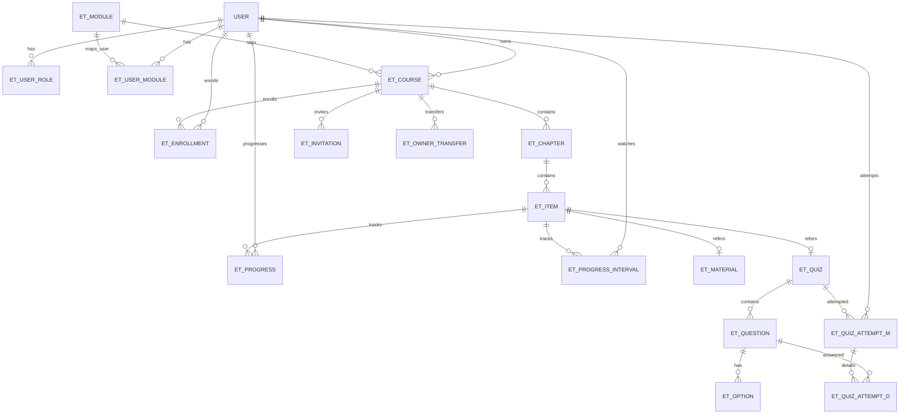

# 資料模型：教育訓練文件管理模組（Education & Training）

**日期**: 2026-06-09
**規格**: [spec.md](spec.md)
**模組代碼**: ET（教育訓練文件管理）

> **標準欄位偏差說明**：ET 與 DM 獨立於主系統部署，與主系統 TBMS 各業務模組之 `HOSPITAL_CODE` / `SITE_ID` 概念無對應；本模組各 Table 之標準欄位 `CREATED_HOSPITAL` / `UPDATED_HOSPITAL` 一律以 NULL 寫入（DB constraint 設為 NULLable）。本偏差為 ET / DM 共用設計，文件管理模組（DM）亦同。

---

## 實體清單

| 實體名稱 | Code | 檔案類別 | 對應 Key Entity | 說明 |
|---------|------|---------|----------------|------|
| 共用使用者 | USER | 主表（與 DM 共用） | 使用者主檔 | USER_ID / 帳號 / 密碼 / 姓名；共用 user table，註冊一次可登入 ET / DM 兩系統 |
| 使用者角色 | ET_USER_ROLE | 對應檔 | 角色指派 | 使用者於 ET 之角色（管理者 / 教師 / 學員，可多重指派）|
| 使用者業務模組對應 | ET_USER_MODULE | 對應檔 | 業務模組對應 | 使用者 × 業務模組多對多關聯 |
| 業務模組 lookup | ET_MODULE | Lookup | 業務模組清單 | 系統內定七類（採血 / 成分 / 檢驗 / 供應 / 醫務 / 報表與標籤 / 其他）|
| 課程主檔 | ET_COURSE | 主表 | 課程 | 教師建立之課程，含基本資料、狀態、邀請碼、擁有者 |
| 章節 | ET_CHAPTER | 主表 | 章節 | 課程下之順序容器；學員須依序解鎖 |
| 章節項目 | ET_ITEM | 主表 | 章節項目 | 章節下之教材或測驗項目（含順序、類型）|
| 教材內容 | ET_MATERIAL | 主表 | 教材內容 | 教材項目之三類媒材（影片 / DM 文件引用 / 說明文字）|
| 測驗主檔 | ET_QUIZ | 主表 | 測驗 | 章節項目為測驗時之測驗設定（及格分數、時間限制、重考次數上限）|
| 題目 | ET_QUESTION | 主表 | 題目 | 測驗下之題目（單選 / 多選、題幹、配分）|
| 選項 | ET_OPTION | 明細 | 選項 | 題目之選項（選項文字、是否正確）|
| 選課關聯 | ET_ENROLLMENT | 對應檔 | 學員 × 課程 | 學員加入課程之記錄（含來源、狀態、移除標記）|
| 學習進度 | ET_PROGRESS | 主表 | 學習進度 | 學員於各章節項目之學習進度 |
| 影片觀看區段 | ET_PROGRESS_INTERVAL | 明細 | 影片觀看區段 | 學員於影片教材之已觀看播放區段（每段一筆）|
| 測驗作答 | ET_QUIZ_ATTEMPT_M | 主表（主+明細）| 測驗作答主檔 | 學員某次測驗 attempt（含快照、得分、是否及格）|
| 作答明細 | ET_QUIZ_ATTEMPT_D | 明細 | 各題作答明細 | 學員於某次 attempt 之各題作答內容與得分 |
| 邀請紀錄 | ET_INVITATION | 主表 | Email 邀請 | Email 邀請寄送紀錄（含課程、Email、狀態）|
| 擁有者轉讓紀錄 | ET_OWNER_TRANSFER | 主表 | 擁有者轉讓 | 管理者代為轉讓課程擁有者之稽核紀錄 |
| 系統參數 | ET_PARAM | Lookup | 系統參數 | 影片格式 / 大小上限 / TTL / Email 模板等系統參數 |

---

## 業務實體

### 共用使用者（USER）

> 與 DM 共用之 user table；ET / DM 各自管理自己的角色與業務模組對應

| # | 欄位名稱 | 欄位代碼 | 資料型別 | 必填 | 說明 |
|---|---------|---------|---------|------|------|
| 1 | 使用者 ID | USER_ID | BIGINT | PK | 主鍵，BIGSERIAL |
| 2 | 帳號（Email）| EMAIL | VARCHAR(255) | Y | 唯一鍵；登入帳號 |
| 3 | 姓名 | NAME | VARCHAR(100) | Y | 顯示用姓名 |
| 4 | 密碼雜湊 | PASSWORD_HASH | VARCHAR(255) | Y | 雜湊後密碼（bcrypt / argon2，由 plan 階段選定）|
| 5 | 待變更 Email | EMAIL_PENDING_CHANGE | VARCHAR(255) | N | 變更 Email 流程之 PENDING 新值 |
| 6 | 待變更 token | EMAIL_PENDING_TOKEN | VARCHAR(64) | N | 變更 Email 驗證之 token |
| 7 | 待變更到期時間 | EMAIL_PENDING_EXPIRES_AT | TIMESTAMP | N | 驗證連結有效期；TTL 由 `ET_PARAM.PASSWORD_RESET_TTL_MIN` 控制 |
| 8 | 密碼重設 token | PASSWORD_RESET_TOKEN | VARCHAR(64) | N | 忘記密碼流程之 token |
| 9 | 密碼重設到期時間 | PASSWORD_RESET_EXPIRES_AT | TIMESTAMP | N | 同上 |
| - | 標準欄位 | — | — | — | CREATED_USER / CREATED_DATE / CREATED_HOSPITAL / UPDATED_USER / UPDATED_DATE / UPDATED_HOSPITAL / RES_ID / DELETED |

**業務規則**:
- EMAIL 為唯一鍵；註冊時檢核未存在於系統
- PASSWORD_HASH 不可逆向解出；登入時以雜湊比對
- EMAIL_PENDING_* 三欄之變更採延遲生效流程，詳見 [spec_us10.md](spec_us10.md)
- 此 table 由 ET / DM 共同使用，PK / 唯一鍵約束由兩模組共識定義

---

### 使用者角色（ET_USER_ROLE）

| # | 欄位名稱 | 欄位代碼 | 資料型別 | 必填 | 說明 |
|---|---------|---------|---------|------|------|
| 1 | 角色 ID | ROLE_ID | BIGINT | PK | 主鍵 |
| 2 | 使用者 ID | USER_ID | BIGINT | Y | FK → USER.USER_ID |
| 3 | 角色 | ROLE | VARCHAR(20) | Y | 參見 Lookup `ET_USER_ROLE_TYPE`（ADMIN / TEACHER / STUDENT）|
| 4 | 是否啟用 | IS_ACTIVE | BOOLEAN | Y | 預設 true |
| - | 標準欄位 | — | — | — | （同上）|

**業務規則**:
- (USER_ID, ROLE) 邏輯唯一（同使用者同角色不重複）
- 同一使用者可有多筆紀錄（多角色），權限取聯集
- 當前登入之管理者無法停用自己之管理者角色（自我保護）
- **不檢核「至少 1 個啟用中管理者」**（per design）

---

### 使用者業務模組對應（ET_USER_MODULE）

| # | 欄位名稱 | 欄位代碼 | 資料型別 | 必填 | 說明 |
|---|---------|---------|---------|------|------|
| 1 | 對應 ID | UM_ID | BIGINT | PK | 主鍵 |
| 2 | 使用者 ID | USER_ID | BIGINT | Y | FK → USER.USER_ID |
| 3 | 業務模組代碼 | MODULE_CODE | VARCHAR(20) | Y | FK → ET_MODULE.MODULE_CODE |
| - | 標準欄位 | — | — | — | （同上）|

**業務規則**:
- (USER_ID, MODULE_CODE) 邏輯唯一
- 新增對應時系統自動將該使用者加入過去所有該模組之已發布課程
- 移除對應時既有課程之 ET_ENROLLMENT **不變動**；之後新建之該模組課程不會自動邀請該使用者

---

### 業務模組 lookup（ET_MODULE）

| # | 欄位名稱 | 欄位代碼 | 資料型別 | 必填 | 說明 |
|---|---------|---------|---------|------|------|
| 1 | 模組代碼 | MODULE_CODE | VARCHAR(20) | PK | 主鍵；如 BC / CP / TL / BS / MA / LB / OTHER |
| 2 | 模組名稱 | MODULE_NAME | VARCHAR(50) | Y | 顯示名稱（採血 / 成分 / 檢驗 / 供應 / 醫務 / 報表與標籤 / 其他）|
| 3 | 顯示順序 | DISPLAY_ORDER | INT | Y | 列表分組顯示順序 |
| - | 標準欄位 | — | — | — | （同上）|

**業務規則**:
- 系統內定 7 筆紀錄，不開放管理者新增
- 初始值由部署時 seed 寫入

---

### 課程主檔（ET_COURSE）

| # | 欄位名稱 | 欄位代碼 | 資料型別 | 必填 | 說明 |
|---|---------|---------|---------|------|------|
| 1 | 課程 ID | COURSE_ID | BIGINT | PK | 主鍵 |
| 2 | 課程名稱 | COURSE_NAME | VARCHAR(100) | Y | 課程顯示名稱 |
| 3 | 關聯模組 | MODULE_CODE | VARCHAR(20) | Y | FK → ET_MODULE.MODULE_CODE；建立後不可變更 |
| 4 | 課程描述 | DESCRIPTION | TEXT | N | 課程描述（選填）|
| 5 | 課程狀態 | STATUS | VARCHAR(20) | Y | 參見 Lookup `ET_COURSE_STATUS`（DRAFT / PUBLISHED / PENDING_CLOSE / CLOSED）|
| 6 | 擁有者 ID | OWNER_ID | BIGINT | Y | FK → USER.USER_ID；建立當下記錄；本欄位永久不可變更（管理者代為轉讓為例外，需寫 ET_OWNER_TRANSFER）|
| 7 | 邀請碼 | INVITATION_CODE | VARCHAR(8) | Y | 8 碼純數字，唯一；課程發布時系統自動產生，永久不可變更 |
| 8 | 首次發布時間 | FIRST_PUBLISHED_AT | TIMESTAMP | N | 第一次發布之時間戳（即開課日期）|
| 9 | 停課時間 | CLOSED_AT | TIMESTAMP | N | 狀態變更為 CLOSED 之時間戳 |
| 10 | 版本號 | VERSION | INT | Y | 樂觀鎖；每次寫入 +1，預設 0 |
| - | 標準欄位 | — | — | — | （同上）|

**業務規則**:
- INVITATION_CODE 須為 8 碼純數字（regex `^\d{8}$`），全域唯一
- STATUS 流轉：DRAFT → PUBLISHED → PENDING_CLOSE → CLOSED；CLOSED 為終態不可回退
- 發布時系統檢核「至少 1 章節 + 1 教材」+ 「各測驗配分總和 = 100」+ 「無引用之廢止 DM 文件」
- 課程於 PENDING_CLOSE 狀態下：新學員無法加入、無法開新 attempt；既有 IN_PROGRESS attempt 完成後系統自動轉 CLOSED
- 樂觀鎖：寫入時檢核 VERSION 等同 DB 當下，不等則拒絕

---

### 章節（ET_CHAPTER）

| # | 欄位名稱 | 欄位代碼 | 資料型別 | 必填 | 說明 |
|---|---------|---------|---------|------|------|
| 1 | 章節 ID | CHAPTER_ID | BIGINT | PK | 主鍵 |
| 2 | 課程 ID | COURSE_ID | BIGINT | Y | FK → ET_COURSE.COURSE_ID |
| 3 | 章節名稱 | CHAPTER_NAME | VARCHAR(100) | Y | 章節顯示名稱 |
| 4 | 章節順序 | SORT_ORDER | INT | Y | 同課程下之順序，從 1 起 |
| 5 | 版本號 | VERSION | INT | Y | 樂觀鎖 |
| - | 標準欄位 | — | — | — | （同上）|

**業務規則**:
- 同 COURSE_ID 下 SORT_ORDER 不重複（拖拉調整時 batch 更新）
- 刪除章節時 DELETED=1（軟刪除）；該章節下之 ET_ITEM 連動 DELETED=1；學員於該章節之 ET_PROGRESS / ET_QUIZ_ATTEMPT_M 連帶 hard delete

---

### 章節項目（ET_ITEM）

| # | 欄位名稱 | 欄位代碼 | 資料型別 | 必填 | 說明 |
|---|---------|---------|---------|------|------|
| 1 | 項目 ID | ITEM_ID | BIGINT | PK | 主鍵 |
| 2 | 章節 ID | CHAPTER_ID | BIGINT | Y | FK → ET_CHAPTER.CHAPTER_ID |
| 3 | 項目類型 | ITEM_TYPE | VARCHAR(20) | Y | 參見 Lookup `ET_ITEM_TYPE`（MATERIAL / QUIZ）|
| 4 | 項目順序 | SORT_ORDER | INT | Y | 同章節下之順序，從 1 起 |
| 5 | 教材 ID | MATERIAL_ID | BIGINT | N | FK → ET_MATERIAL.MATERIAL_ID；ITEM_TYPE = MATERIAL 時必填 |
| 6 | 測驗 ID | QUIZ_ID | BIGINT | N | FK → ET_QUIZ.QUIZ_ID；ITEM_TYPE = QUIZ 時必填 |
| 7 | 版本號 | VERSION | INT | Y | 樂觀鎖 |
| - | 標準欄位 | — | — | — | （同上）|

**業務規則**:
- ITEM_TYPE = MATERIAL → MATERIAL_ID 必填、QUIZ_ID 為 NULL
- ITEM_TYPE = QUIZ → QUIZ_ID 必填、MATERIAL_ID 為 NULL
- 同 CHAPTER_ID 下 SORT_ORDER 不重複

---

### 教材內容（ET_MATERIAL）

| # | 欄位名稱 | 欄位代碼 | 資料型別 | 必填 | 說明 |
|---|---------|---------|---------|------|------|
| 1 | 教材 ID | MATERIAL_ID | BIGINT | PK | 主鍵 |
| 2 | 教材名稱 | MATERIAL_NAME | VARCHAR(100) | Y | 教材顯示名稱 |
| 3 | 影片檔案路徑 | VIDEO_FILE_PATH | VARCHAR(500) | N | 本地儲存路徑或 OSS 路徑（多支影片以 ET_MATERIAL_VIDEO 子表儲存，由 plan 階段決定是否拆 1:N）|
| 4 | DM 文件 ID 清單 | DM_DOC_IDS | TEXT | N | 引用之 DM 文件 ID 清單（CSV 或 JSON，由 plan 階段最終決定 1:N 子表 vs. 字串）|
| 5 | 說明文字 | DESCRIPTION_HTML | TEXT | N | WYSIWYG 編輯之 HTML 內容 |
| 6 | 版本號 | VERSION | INT | Y | 樂觀鎖 |
| - | 標準欄位 | — | — | — | （同上）|

**業務規則**:
- 三類媒材（影片 / DM 文件 / 說明文字）皆可選填且可組合（同一教材可同時含多支影片 / 多份 DM 文件 / 說明文字）
- 影片上傳時檢核格式（per `ET_PARAM.VIDEO_ALLOWED_FORMATS`）與大小（per `ET_PARAM.VIDEO_MAX_SIZE_MB`）
- DM 文件廢止狀態於發布前由系統檢核（阻擋發布）；學員端仍可閱讀廢止前最後版本
- 影片儲存策略（本地檔案系統 vs. 物件儲存）由 plan 階段決定

> **註**：欄位 3 / 4 之 1:N 細分（多支影片、多份 DM 文件）由 plan / data-model 之 phase 2 細化；目前以暫時欄位呈現概念。

---

### 測驗主檔（ET_QUIZ）

| # | 欄位名稱 | 欄位代碼 | 資料型別 | 必填 | 說明 |
|---|---------|---------|---------|------|------|
| 1 | 測驗 ID | QUIZ_ID | BIGINT | PK | 主鍵 |
| 2 | 測驗名稱 | QUIZ_NAME | VARCHAR(100) | Y | 測驗顯示名稱 |
| 3 | 及格分數 | PASS_SCORE | INT | Y | 0–100，預設 80 |
| 4 | 作答時間限制（分鐘）| TIME_LIMIT_MIN | INT | Y | ≥ 0；**0 = 不允許作答**（學員端隱藏）|
| 5 | 重考次數上限 | MAX_RETRY | INT | Y | ≥ -1；**0 = 不允許重考**；**-1 = 不限重考次數**；預設 3 |
| 6 | 版本號 | VERSION | INT | Y | 樂觀鎖 |
| - | 標準欄位 | — | — | — | （同上）|

**業務規則**:
- 該測驗下各 ET_QUESTION 之配分總和須等於 100（發布前由系統檢核）
- TIME_LIMIT_MIN = 0 之測驗於章節學習頁直接隱藏（視同無測驗、不阻擋下一章節解鎖）

---

### 題目（ET_QUESTION）

| # | 欄位名稱 | 欄位代碼 | 資料型別 | 必填 | 說明 |
|---|---------|---------|---------|------|------|
| 1 | 題目 ID | QUESTION_ID | BIGINT | PK | 主鍵 |
| 2 | 測驗 ID | QUIZ_ID | BIGINT | Y | FK → ET_QUIZ.QUIZ_ID |
| 3 | 題型 | QUESTION_TYPE | VARCHAR(20) | Y | 參見 Lookup `ET_QUESTION_TYPE`（SINGLE / MULTIPLE）|
| 4 | 題幹 | STEM | VARCHAR(500) | Y | 題目敘述（至多 500 字）|
| 5 | 配分 | POINTS | INT | Y | 該題之配分；同測驗各題總和須 = 100 |
| 6 | 題目順序 | SORT_ORDER | INT | Y | 同測驗下之順序（拖拉調整用；學員端洗牌不依此）|
| 7 | 版本號 | VERSION | INT | Y | 樂觀鎖 |
| - | 標準欄位 | — | — | — | （同上）|

**業務規則**:
- 同 QUIZ_ID 下至少 1 題；同 QUESTION_ID 下選項至少 2 個、至多 6 個
- 多選題建立時系統強制檢核「至少 1 個正確選項」
- 刪除題目時 DELETED=1（軟刪除）；學員於該題之 ET_QUIZ_ATTEMPT_D 連帶 hard delete

---

### 選項（ET_OPTION）

| # | 欄位名稱 | 欄位代碼 | 資料型別 | 必填 | 說明 |
|---|---------|---------|---------|------|------|
| 1 | 選項 ID | OPTION_ID | BIGINT | PK | 主鍵 |
| 2 | 題目 ID | QUESTION_ID | BIGINT | Y | FK → ET_QUESTION.QUESTION_ID |
| 3 | 選項文字 | OPTION_TEXT | VARCHAR(200) | Y | 選項顯示文字（至多 200 字）|
| 4 | 是否正確 | IS_CORRECT | BOOLEAN | Y | 預設 false |
| 5 | 選項順序 | SORT_ORDER | INT | Y | 同題目下之順序（拖拉調整用；學員端洗牌不依此）|
| - | 標準欄位 | — | — | — | （同上）|

**業務規則**:
- 同 QUESTION_ID 下選項數 2–6 個
- 多選題建立時至少 1 個 IS_CORRECT = true（避免評分公式分母為 0）

---

### 選課關聯（ET_ENROLLMENT）

| # | 欄位名稱 | 欄位代碼 | 資料型別 | 必填 | 說明 |
|---|---------|---------|---------|------|------|
| 1 | 選課 ID | ENROLLMENT_ID | BIGINT | PK | 主鍵 |
| 2 | 學員 USER_ID | USER_ID | BIGINT | Y | FK → USER.USER_ID |
| 3 | 課程 ID | COURSE_ID | BIGINT | Y | FK → ET_COURSE.COURSE_ID |
| 4 | 加入來源 | JOIN_SOURCE | VARCHAR(30) | Y | 參見 Lookup `ET_ENROLLMENT_SOURCE`（EMAIL_INVITE / INVITATION_CODE / MODULE_DEFAULT）|
| 5 | 加入時間 | JOINED_AT | TIMESTAMP | Y | |
| 6 | 完課狀態 | COMPLETION_STATUS | VARCHAR(20) | Y | 參見 Lookup `ET_COMPLETION_STATUS`（NOT_STARTED / IN_PROGRESS / COMPLETED），即時計算 |
| 7 | 完課時間 | COMPLETED_AT | TIMESTAMP | N | 達成完課之時間戳 |
| 8 | 是否已移除 | IS_REMOVED | BOOLEAN | Y | 預設 false |
| 9 | 移除時間 | REMOVED_AT | TIMESTAMP | N | |
| 10 | 最後活動時間 | LAST_ACTIVITY_AT | TIMESTAMP | N | 最近一次學習動作 / 測驗提交時間 |
| - | 標準欄位 | — | — | — | （同上）|

**業務規則**:
- (USER_ID, COURSE_ID) 邏輯唯一（同學員同課程不重複加入）
- IS_REMOVED = true 之紀錄前台不顯示，但學習歷史紀錄完整保留
- 移除學員後不計入完課率分母

---

### 學習進度（ET_PROGRESS）

| # | 欄位名稱 | 欄位代碼 | 資料型別 | 必填 | 說明 |
|---|---------|---------|---------|------|------|
| 1 | 進度 ID | PROGRESS_ID | BIGINT | PK | 主鍵 |
| 2 | 學員 USER_ID | USER_ID | BIGINT | Y | FK → USER.USER_ID |
| 3 | 課程 ID | COURSE_ID | BIGINT | Y | FK → ET_COURSE.COURSE_ID |
| 4 | 章節項目 ID | ITEM_ID | BIGINT | Y | FK → ET_ITEM.ITEM_ID |
| 5 | 是否完成 | IS_COMPLETED | BOOLEAN | Y | 影片教材：覆蓋率 ≥ 80%；文件 / 說明文字：開啟即 true；測驗：及格即 true |
| 6 | 上次觀看位置（秒）| LAST_POSITION_SEC | INT | N | 影片播放位置；下次開啟自動定位 |
| 7 | 影片覆蓋率（%） | COVERAGE_PCT | DECIMAL(5,2) | N | 學員於該影片教材之累計覆蓋率（百分比；由 ET_PROGRESS_INTERVAL 聚合計算）|
| - | 標準欄位 | — | — | — | （同上）|

**業務規則**:
- (USER_ID, ITEM_ID) 邏輯唯一
- COVERAGE_PCT 由 ET_PROGRESS_INTERVAL 之區段聯集去重後聚合計算（normalize 後）

---

### 影片觀看區段（ET_PROGRESS_INTERVAL）

| # | 欄位名稱 | 欄位代碼 | 資料型別 | 必填 | 說明 |
|---|---------|---------|---------|------|------|
| 1 | 區段 ID | INTERVAL_ID | BIGINT | PK | 主鍵 |
| 2 | 學員 USER_ID | USER_ID | BIGINT | Y | FK → USER.USER_ID |
| 3 | 章節項目 ID | ITEM_ID | BIGINT | Y | FK → ET_ITEM.ITEM_ID（影片教材）|
| 4 | 起始秒 | START_SEC | INT | Y | 該段播放之起始秒（≥ 0）|
| 5 | 結束秒 | END_SEC | INT | Y | 該段播放之結束秒（> START_SEC）|
| - | 標準欄位 | — | — | — | （同上）|

**業務規則**:
- 每段播放（暫停 / 結束 / 跳轉）INSERT 一筆
- 學員離開頁面時系統執行 normalize：SELECT (USER_ID, ITEM_ID) → 排序 → 合併重疊 / 鄰近區段 → DELETE → INSERT 合併後結果
- 覆蓋率 = SUM(END_SEC − START_SEC) ÷ VIDEO_DURATION（normalize 前後皆可正確計算）
- 不限區段筆數（不裁切）

---

### 測驗作答主檔（ET_QUIZ_ATTEMPT_M）

| # | 欄位名稱 | 欄位代碼 | 資料型別 | 必填 | 說明 |
|---|---------|---------|---------|------|------|
| 1 | Attempt ID | ATTEMPT_ID | BIGINT | PK | 主鍵 |
| 2 | 學員 USER_ID | USER_ID | BIGINT | Y | FK → USER.USER_ID |
| 3 | 課程 ID | COURSE_ID | BIGINT | Y | FK → ET_COURSE.COURSE_ID |
| 4 | 測驗 ID | QUIZ_ID | BIGINT | Y | FK → ET_QUIZ.QUIZ_ID |
| 5 | 開始時間 | STARTED_AT | TIMESTAMP | Y | 學員點「開始測驗」之時間 |
| 6 | 提交時間 | SUBMITTED_AT | TIMESTAMP | N | 學員點「提交」或 timeout 自動提交之時間 |
| 7 | 狀態 | STATUS | VARCHAR(20) | Y | 參見 Lookup `ET_ATTEMPT_STATUS`（IN_PROGRESS / SUBMITTED / TIMEOUT）|
| 8 | 得分 | SCORE | DECIMAL(5,2) | N | 自動閱卷後之總分（0–100）|
| 9 | 是否及格 | IS_PASS | BOOLEAN | N | 依該 attempt 之 PASS_SCORE_SNAPSHOT 判定 |
| 10 | 快照 — 題目順序 | QUESTION_ORDER | TEXT | Y | JSON 字串：題目 ID 順序陣列，如 `[12, 5, 8, ...]` |
| 11 | 快照 — 選項順序 | OPTION_ORDER | TEXT | Y | JSON 字串：每題之選項 ID 順序對應陣列 |
| 12 | 快照 — 及格分數 | PASS_SCORE_SNAPSHOT | INT | Y | 開始作答時凍結之及格分數 |
| 13 | 快照 — 作答時間限制 | TIME_LIMIT_SNAPSHOT | INT | Y | 開始作答時凍結之時間限制 |
| - | 標準欄位 | — | — | — | （同上）|

**業務規則**:
- STATUS 流轉：IN_PROGRESS → SUBMITTED / TIMEOUT；TIMEOUT 為 timeout 自動提交之終態
- 快照欄位於 STARTED_AT 時寫入並凍結，至 attempt 結束前不再變更
- 題目 / 選項本體之 VARCHAR 內容快照由 ET_QUIZ_ATTEMPT_D 各題保存（避免 ET_QUIZ_ATTEMPT_M 單筆過大）

---

### 作答明細（ET_QUIZ_ATTEMPT_D）

| # | 欄位名稱 | 欄位代碼 | 資料型別 | 必填 | 說明 |
|---|---------|---------|---------|------|------|
| 1 | 明細 ID | DETAIL_ID | BIGINT | PK | 主鍵 |
| 2 | Attempt ID | ATTEMPT_ID | BIGINT | Y | FK → ET_QUIZ_ATTEMPT_M.ATTEMPT_ID |
| 3 | 題目 ID | QUESTION_ID | BIGINT | Y | FK → ET_QUESTION.QUESTION_ID |
| 4 | 快照 — 題幹 | STEM_SNAPSHOT | VARCHAR(500) | Y | 開始作答時凍結之題幹內容 |
| 5 | 快照 — 配分 | POINTS_SNAPSHOT | INT | Y | 凍結之配分 |
| 6 | 快照 — 題型 | TYPE_SNAPSHOT | VARCHAR(20) | Y | SINGLE / MULTIPLE |
| 7 | 快照 — 選項 JSON | OPTIONS_SNAPSHOT | TEXT | Y | JSON：[{option_id, text, is_correct}, ...] |
| 8 | 學員作答 | SELECTED_OPTIONS | TEXT | N | JSON：[option_id, ...]；空陣列表示未作答 |
| 9 | 得分 | SCORE | DECIMAL(5,2) | N | 該題得分（單選：0 / POINTS_SNAPSHOT；多選：套部分計分公式）|
| - | 標準欄位 | — | — | — | （同上）|

**業務規則**:
- (ATTEMPT_ID, QUESTION_ID) 邏輯唯一
- 多選題評分公式：`SCORE = max(0, (對 − 誤) ÷ 應選 × POINTS_SNAPSHOT)`；計算依 OPTIONS_SNAPSHOT 之 is_correct
- 完全未作答之多選題視為 0 分

---

### 邀請紀錄（ET_INVITATION）

| # | 欄位名稱 | 欄位代碼 | 資料型別 | 必填 | 說明 |
|---|---------|---------|---------|------|------|
| 1 | 邀請 ID | INVITATION_ID | BIGINT | PK | 主鍵 |
| 2 | 課程 ID | COURSE_ID | BIGINT | Y | FK → ET_COURSE.COURSE_ID |
| 3 | 受邀 Email | EMAIL | VARCHAR(255) | Y | 受邀對象之 Email |
| 4 | 邀請 token | TOKEN | VARCHAR(64) | Y | 邀請連結之 token |
| 5 | 邀請狀態 | STATUS | VARCHAR(20) | Y | 參見 Lookup `ET_INVITATION_STATUS`（PENDING / JOINED / REVOKED）|
| 6 | 寄出時間 | SENT_AT | TIMESTAMP | Y | 首次寄出時間 |
| 7 | 最近寄出時間 | LAST_SENT_AT | TIMESTAMP | Y | 最近一次寄出時間（再次寄送時更新）|
| 8 | 加入時間 | JOINED_AT | TIMESTAMP | N | 學員點擊連結加入課程之時間 |
| 9 | 撤回時間 | REVOKED_AT | TIMESTAMP | N | 教師撤回邀請之時間 |
| - | 標準欄位 | — | — | — | （同上）|

**業務規則**:
- STATUS 流轉：PENDING → JOINED 或 REVOKED；JOINED / REVOKED 為終態
- 「再次寄送」更新 LAST_SENT_AT，不建新紀錄
- 「撤回」更新 STATUS = REVOKED 與 REVOKED_AT；該 token 失效

---

### 擁有者轉讓紀錄（ET_OWNER_TRANSFER）

| # | 欄位名稱 | 欄位代碼 | 資料型別 | 必填 | 說明 |
|---|---------|---------|---------|------|------|
| 1 | 轉讓 ID | TRANSFER_ID | BIGINT | PK | 主鍵 |
| 2 | 課程 ID | COURSE_ID | BIGINT | Y | FK → ET_COURSE.COURSE_ID |
| 3 | 轉讓前擁有者 | FROM_OWNER_ID | BIGINT | Y | FK → USER.USER_ID |
| 4 | 轉讓後擁有者 | TO_OWNER_ID | BIGINT | Y | FK → USER.USER_ID |
| 5 | 轉讓原因 | REASON | TEXT | Y | 管理者填寫之原因（如「原教師離職」）|
| 6 | 執行管理者 | EXECUTED_BY | BIGINT | Y | FK → USER.USER_ID；執行轉讓之管理者 |
| 7 | 執行時間 | EXECUTED_AT | TIMESTAMP | Y | |
| - | 標準欄位 | — | — | — | （同上）|

**業務規則**:
- 每筆轉讓 INSERT 一筆紀錄，不可修改 / 刪除（稽核完整性）
- 同時更新 ET_COURSE.OWNER_ID = TO_OWNER_ID

---

### 系統參數（ET_PARAM）

| # | 欄位名稱 | 欄位代碼 | 資料型別 | 必填 | 說明 |
|---|---------|---------|---------|------|------|
| 1 | 參數鍵 | PARAM_KEY | VARCHAR(50) | PK | 參數識別代碼（如 VIDEO_MAX_SIZE_MB）|
| 2 | 參數值 | PARAM_VALUE | TEXT | Y | 參數值（依參數類型解析；如數字 / CSV / 字串）|
| 3 | 參數說明 | DESCRIPTION | TEXT | N | 說明用途 |
| - | 標準欄位 | — | — | — | （同上）|

**初始參數**（部署時 seed）：

| PARAM_KEY | PARAM_VALUE | 說明 |
|-----------|-------------|------|
| `VIDEO_ALLOWED_FORMATS` | `mp4,webm` | 教材影片允許之上傳格式 |
| `VIDEO_MAX_SIZE_MB` | `500` | 教材影片單檔大小上限 |
| `PASSWORD_RESET_TTL_MIN` | `30` | 密碼重設連結 / Email 變更驗證連結有效時間（分鐘）|
| `INVITATION_CODE_LENGTH` | `8` | 邀請碼長度（純數字）|
| `EMAIL_NOTIFY_NEW_CHAPTER` | `ET_NEW_CHAPTER` | 新增章節通知信模板代碼 |
| `EMAIL_NOTIFY_INVITATION` | `ET_INVITATION` | 課程邀請信模板代碼 |
| `EMAIL_NOTIFY_PASSWORD_RESET` | `ET_PASSWORD_RESET` | 密碼重設信模板代碼 |
| `EMAIL_NOTIFY_EMAIL_CHANGE` | `ET_EMAIL_CHANGE` | 帳號變更驗證信模板代碼 |

---

## Lookup 表

### ET_USER_ROLE_TYPE

| 代碼 | 顯示名稱 | 說明 |
|------|---------|------|
| ADMIN | 管理者 | 權限管理 |
| TEACHER | 教師 | 課程安排 |
| STUDENT | 學員 | 加入課程、學習 |

### ET_COURSE_STATUS

| 代碼 | 顯示名稱 | 說明 |
|------|---------|------|
| DRAFT | 草稿 | 教師建立中，學員端不顯示 |
| PUBLISHED | 已發布 | 學員可加入學習 |
| PENDING_CLOSE | 停課中 | 過渡狀態：等待學員作答中 attempt 完成；新學員無法加入 |
| CLOSED | 已停課 | 終態，不可逆 |

### ET_ENROLLMENT_SOURCE

| 代碼 | 顯示名稱 | 說明 |
|------|---------|------|
| EMAIL_INVITE | Email 邀請 | 透過 ET_INVITATION 邀請連結加入 |
| INVITATION_CODE | 邀請碼 | 透過 ET04 輸入邀請碼加入 |
| MODULE_DEFAULT | 模組預設 | 業務模組對應自動帶入 |

### ET_INVITATION_STATUS

| 代碼 | 顯示名稱 | 說明 |
|------|---------|------|
| PENDING | 待加入 | 已寄出邀請信，學員尚未加入 |
| JOINED | 已加入 | 學員點擊連結加入課程 |
| REVOKED | 已撤回 | 教師撤回邀請，連結失效 |

### ET_ATTEMPT_STATUS

| 代碼 | 顯示名稱 | 說明 |
|------|---------|------|
| IN_PROGRESS | 作答中 | 學員開始但未提交 |
| SUBMITTED | 已提交 | 學員主動提交 |
| TIMEOUT | 逾時自動提交 | 倒數計時歸零自動提交 |

### ET_QUESTION_TYPE

| 代碼 | 顯示名稱 | 說明 |
|------|---------|------|
| SINGLE | 單選題 | 一個正確答案 |
| MULTIPLE | 多選題 | 多個正確答案，採部分計分 |

### ET_ITEM_TYPE

| 代碼 | 顯示名稱 | 說明 |
|------|---------|------|
| MATERIAL | 教材 | 影片 / DM 文件 / 說明文字 |
| QUIZ | 測驗 | 線上測驗（含題目與選項）|

### ET_COMPLETION_STATUS

| 代碼 | 顯示名稱 | 說明 |
|------|---------|------|
| NOT_STARTED | 未開始 | 學員加入但未開始學習 |
| IN_PROGRESS | 進行中 | 學員學習中或未全部完課 |
| COMPLETED | 已完成 | 所有章節含測驗皆通過 |

---

## ERD（Mermaid）

---

## 業務規則摘要

| 規則名 | 描述 |
|--------|------|
| 軟刪除分流 | 章節 / 題目本體軟刪除（DELETED=1）；學員紀錄與成績連同 hard delete |
| 樂觀鎖 | ET_COURSE / ET_CHAPTER / ET_ITEM / ET_QUIZ / ET_QUESTION 每寫入時 VERSION + 1 |
| Attempt Snapshot | ET_QUIZ_ATTEMPT_M 與 _D 於 STARTED_AT 時凍結題目 + 選項 + 配分 + 順序 + PASS_SCORE + TIME_LIMIT |
| 多選題部分計分 | `SCORE = max(0, (對 − 誤) ÷ 應選 × POINTS)`；建立時強制至少 1 正確選項 |
| 影片 80% 累計覆蓋 | 由 ET_PROGRESS_INTERVAL 聚合計算；學員離開頁面時 normalize |
| Graceful Termination | ET_COURSE.STATUS = PENDING_CLOSE 過渡狀態；新作答不可、既有 attempt 完成後自動 CLOSED |
| 帳號變更雙信箱共存 | USER.EMAIL_PENDING_* 三欄；舊 Email 變更期間仍可登入；30 分鐘 TTL；未驗證視為作廢 |
| 完課率計算 | 已完課 ÷ 已加入（不含已移除）；100% 章節含測驗皆通過 |
| 平均成績計算 | 已作答測驗之最高分平均；未作答測驗排除（不視為 0）|

---

## 與 DM 共用範圍

- USER 主檔：USER_ID / EMAIL / NAME / PASSWORD_HASH 為 ET / DM 共同使用之欄位
- USER.EMAIL_PENDING_* 三欄、USER.PASSWORD_RESET_* 兩欄之 PK / 唯一鍵 / 索引約束由 ET / DM 共識定義
- 此 table 之 DDL 建議由 ET 或 DM 任一方主導 schema 定義；另一方僅 reference

---

## 與外部模組無依賴

- 本模組**不引用**主系統 TBMS 之任何 table（BC_DONOR / CP_PRODUCT / DP_SITE 等）
- 本模組**不寫入** TBMS 任何 table
- ET_MODULE.MODULE_CODE 之值（採血 / 成分 / 檢驗 / 供應 / 醫務 / 報表與標籤 / 其他）為 ET 自定，**不對應**主系統各業務模組之實際 table；僅供 ET 內部分組與業務模組對應使用
