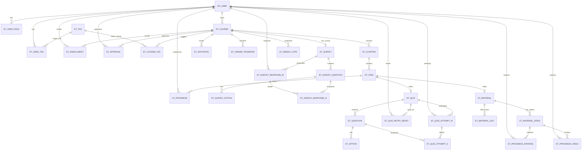

# 資料模型：教育訓練文件管理模組（Education & Training）

**日期**: 2026-06-09（2026-07-02 依客戶 6 項需求變更更新）
**規格**: [spec.md](spec.md)
**模組代碼**: ET（教育訓練文件管理）

> **2026-07-02 變更摘要**：移除 ET_MODULE / ET_USER_MODULE 與 ET_COURSE.MODULE_CODE，新增 ET_TAG / ET_USER_TAG / ET_COURSE_TAG（受訓單位標籤）；ET_COURSE 新增起訖時間、狀態機改可逆（移除 PENDING_CLOSE）；新增課後問卷五表（ET_SURVEY*）、週統計快照（ET_WEEKLY_STAT）。

> **2026-07-17 變更摘要（線下核可）**：ET_COURSE 新增 `REQUIRE_APPROVAL`（是否需線下核可）；新增 `ET_APPROVAL`（線下核可紀錄，學員×課程 0～1 筆，通過 / 不通過二態、可撤銷需填原因）；新增 Lookup `ET_APPROVAL_RESULT`；通知範本 `MODULE=ET` 由 6 類增為 **7 類**（新增 `APPROVAL_PASSED` 核可通過通知）。核可為獨立維度，不影響完課率 / 問卷 / 週報。

> **2026-07-08 集中化變更摘要**：系統參數、通知範本、發信、排程集中於平台模組 DP（見 `../../requirements/RQDP.md`、`../../_refs/09-平台模組.md`）。ET 不再自持 `ET_PARAM` / `ET_NOTIFY_TEMPLATE`：ET 參數改存平台 `DP_PARAM`（`PARAM_ID` 前綴 `ET_`）、ET 6 類通知範本改存平台 `DP_NOTIFY_TEMPLATE`（`MODULE=ET`）、寄信改走平台唯一發信服務（經 `DP_EMAIL_LOG` outbox）、排程改於 `DP_SCHEDULE` 註冊由平台引擎執行（`DP_SCHEDULE_LOG` 記錄）。維護介面於平台 DP 後台（按模組過濾）；`ET_WEEKLY_STAT`（業務快照）不受影響。

> **2026-08-19 變更摘要（交付前自檢補正）**：(1) `ET_MATERIAL` 之多支影片 / 多份 DM 文件由暫時欄位**正式拆為 1:N 子表** `ET_MATERIAL_VIDEO` / `ET_MATERIAL_DOC`（原 S4 待補項結案）；(2) 影片長度 `DURATION_SEC` 補入 `ET_MATERIAL_VIDEO`——覆蓋率公式之分母原無欄位可存；(3) 影片進度改為**逐支影片**計算：新增 `ET_PROGRESS_VIDEO`、`ET_PROGRESS_INTERVAL` 改掛 `VIDEO_ID`（原掛 `ITEM_ID`，多支影片時無法分別判定 80%）；(4) 新增 `ET_QUIZ_RETRY_RESET`（append-only）並於 `ET_QUIZ_ATTEMPT_M` 補 `ATTEMPT_NO`——原「重置重考次數歸 0」與「歷次 attempt 永久可回看」無法並存。ET 業務表 25 → **29** 張。

> **標準稽核欄位**：本模組各 Table 之標準欄位為 `CREATED_USER` / `CREATED_DATE` / `UPDATED_USER` / `UPDATED_DATE` / `DELETED`（無 SITE / HOSPITAL 概念，亦不含 `RES_ID`，對齊平台模組 DP，見 #158）。

---

## 實體清單

| 實體名稱 | Code | 檔案類別 | 對應 Key Entity | 說明 |
|---------|------|---------|----------------|------|
| 共用使用者 | DP_USER | 平台主表（DP 定義） | 使用者主檔 | 由平台模組 DP 定義（帳號 / 密碼 / 姓名 / 狀態等）；ET 僅以 USER_ID（VARCHAR20）為 FK 引用，註冊一次可登入 ET / DM 兩系統 |
| 使用者角色 | ET_USER_ROLE | 對應檔 | 角色指派 | 使用者於 ET 之角色（管理者 / 教師 / 學員，可多重指派）|
| 受訓單位標籤 | ET_TAG | 主表 | 受訓單位標籤 | 標籤庫；管理者維護（新增 / 修改 / 停用 / 啟用）；內建種子：全體 / 護理師 / 行政人員 / 軍人 / 醫檢師 |
| 使用者標籤 | ET_USER_TAG | 對應檔 | 使用者標籤 | 使用者 × 受訓單位標籤多對多關聯 |
| 課程標籤 | ET_COURSE_TAG | 對應檔 | 課程標籤 | 課程 × 受訓單位標籤多對多關聯；發布前至少 1 筆 |
| 課程主檔 | ET_COURSE | 主表 | 課程 | 教師建立之課程，含基本資料、狀態、邀請碼、擁有者 |
| 章節 | ET_CHAPTER | 主表 | 章節 | 課程下之順序容器；學員須依序解鎖 |
| 章節項目 | ET_ITEM | 主表 | 章節項目 | 章節下之教材或測驗項目（含順序、類型）|
| 教材內容 | ET_MATERIAL | 主表 | 教材內容 | 教材項目之媒材容器（說明文字本體 + 影片 / DM 文件子表）|
| 教材影片 | ET_MATERIAL_VIDEO | 明細 | 教材內容 | 教材下之影片（1:N；含檔案路徑、**影片長度**、順序）（2026-08-19 新增）|
| 教材引用文件 | ET_MATERIAL_DOC | 明細 | 教材內容 | 教材下引用之 DM 文件（1:N；存 `DOC_ID` VARCHAR(20)、順序）（2026-08-19 新增）|
| 測驗主檔 | ET_QUIZ | 主表 | 測驗 | 章節項目為測驗時之測驗設定（及格分數、時間限制、重考次數上限）|
| 題目 | ET_QUESTION | 主表 | 題目 | 測驗下之題目（單選 / 多選、題幹、配分）|
| 選項 | ET_OPTION | 明細 | 選項 | 題目之選項（選項文字、是否正確）|
| 選課關聯 | ET_ENROLLMENT | 對應檔 | 學員 × 課程 | 學員加入課程之記錄（含來源、狀態、移除標記）|
| 線下核可紀錄 | ET_APPROVAL | 主表 | 線下核可紀錄 | 學員 × 課程之線下考核核可（0～1 筆）；通過 / 不通過、可撤銷需填原因；以線上完課為前提；獨立於完課 |
| 學習進度 | ET_PROGRESS | 主表 | 學習進度 | 學員於各章節項目之學習進度（項目層完成判定）|
| 影片進度 | ET_PROGRESS_VIDEO | 明細 | 學習進度 | 學員於**單支影片**之覆蓋率與上次觀看位置（2026-08-19 新增）|
| 影片觀看區段 | ET_PROGRESS_INTERVAL | 明細 | 影片觀看區段 | 學員於影片教材之已觀看播放區段（每段一筆）|
| 測驗作答 | ET_QUIZ_ATTEMPT_M | 主表（主+明細）| 測驗作答主檔 | 學員某次測驗 attempt（含次數、快照、得分、是否及格）|
| 重考次數重置 | ET_QUIZ_RETRY_RESET | 明細 | 測驗作答主檔 | 教師重置某學員某測驗重考次數之紀錄（append-only，作為已用次數之計算基準）（2026-08-19 新增）|
| 作答明細 | ET_QUIZ_ATTEMPT_D | 明細 | 各題作答明細 | 學員於某次 attempt 之各題作答內容與得分 |
| 邀請紀錄 | ET_INVITATION | 主表 | Email 邀請 | Email 邀請寄送紀錄（含課程、Email、狀態）|
| 擁有者轉讓紀錄 | ET_OWNER_TRANSFER | 主表 | 擁有者轉讓 | 管理者代為轉讓課程擁有者之稽核紀錄 |
| 課後問卷 | ET_SURVEY | 主表 | 課後問卷 | 課程之課後回饋問卷（0～1 份 / 課程）；有人填答後題目凍結 |
| 問卷題目 | ET_SURVEY_QUESTION | 主表 | 問卷題目 | 問卷下之單選題（題幹、順序）|
| 問卷選項 | ET_SURVEY_OPTION | 明細 | 問卷選項 | 問卷題目之選項（如 滿意 / 普通 / 不滿意），教師自訂 |
| 問卷填答主檔 | ET_SURVEY_RESPONSE_M | 主表（主+明細）| 問卷填答 | 學員（具名）對某問卷之一次填答；一人一次 |
| 問卷填答明細 | ET_SURVEY_RESPONSE_D | 明細 | 填答明細 | 該次填答之各題選擇 |
| 週統計快照 | ET_WEEKLY_STAT | 主表 | 週統計快照 | 每週排程之課程統計快照（課程×週次），供週報比較與歷史回查 |
| 通知信範本 | DP_NOTIFY_TEMPLATE | 平台主表（DP 定義）| 通知信範本 | 由平台模組 DP 定義；ET 7 類通知範本存 `MODULE=ET`（2026-07-17 增列核可通過通知）；完整欄位見平台 DP data-model；`MODULE=ET` 之列由 ET 管理者於平台 DP 後台「通知範本」維護（按模組過濾）|
| 系統參數 | DP_PARAM | 平台主表（DP 定義）| 系統參數 | 由平台模組 DP 定義；ET 參數以 `PARAM_ID` 前綴 `ET_` 存放（影片格式 / 大小上限 / 排程時間等）；完整欄位見平台 DP data-model；前綴 `ET_` 之列由 ET 管理者於平台 DP 後台維護（按模組過濾）|

---

## 業務實體

### 共用使用者（DP_USER）

> **DP_USER 由平台模組 DP 定義**（帳號 Email / 密碼雜湊 / 姓名 / 狀態 / 鎖定 / Email 變更 PENDING 等帳號安全欄位），ET 僅以 `USER_ID`（VARCHAR20）為 FK 引用；完整欄位見平台 DP data-model。

| # | 欄位名稱 | 欄位代碼 | 資料型別 | 必填 | 說明 |
|---|---------|---------|---------|------|------|
| 1 | 使用者 ID | USER_ID | VARCHAR(20) | PK | 平台 DP 定義之主鍵；ET 各表以此為 FK 引用 |

**業務規則**:
- 帳號 / 密碼 / 姓名 / 狀態 / Email 變更 PENDING 等欄位與其約束（唯一鍵、雜湊、延遲生效流程等）**一律由平台模組 DP 定義與維護**，ET 不重複定義
- ET 端登入 / 註冊 / 忘記密碼 / 個人資料維護之認證能力由平台 DP 統一提供（詳見 [spec_us2.md](spec_us2.md)、[spec_us10.md](spec_us10.md)）；ET 僅以 `USER_ID` 引用

---

### 使用者角色（ET_USER_ROLE）

| # | 欄位名稱 | 欄位代碼 | 資料型別 | 必填 | 說明 |
|---|---------|---------|---------|------|------|
| 1 | 角色 ID | ROLE_ID | BIGINT | PK | 主鍵 |
| 2 | 使用者 ID | USER_ID | VARCHAR(20) | Y | FK → DP_USER.USER_ID |
| 3 | 角色 | ROLE | VARCHAR(20) | Y | 參見 Lookup `ET_USER_ROLE_TYPE`（ADMIN / TEACHER / STUDENT）|
| 4 | 是否啟用 | IS_ACTIVE | BOOLEAN | Y | 預設 true |
| - | 標準欄位 | — | — | — | （同上）|

**業務規則**:
- (USER_ID, ROLE) 邏輯唯一（同使用者同角色不重複）
- 同一使用者可有多筆紀錄（多角色），權限取聯集
- 當前登入之管理者無法停用自己之管理者角色（自我保護）
- **不檢核「至少 1 個啟用中管理者」**（per design）

---

### 受訓單位標籤（ET_TAG）（2026-07-02 新增）

| # | 欄位名稱 | 欄位代碼 | 資料型別 | 必填 | 說明 |
|---|---------|---------|---------|------|------|
| 1 | 標籤 ID | TAG_ID | BIGINT | PK | 主鍵 |
| 2 | 標籤名稱 | TAG_NAME | VARCHAR(50) | Y | 顯示名稱（全體 / 護理師 / 行政人員 / 軍人 / 醫檢師…）；唯一 |
| 3 | 是否啟用 | IS_ACTIVE | BOOLEAN | Y | 預設 true；停用後不可掛新課程，既有課程不受影響 |
| 4 | 是否全體標籤 | IS_ALL | BOOLEAN | Y | 預設 false；true = 特殊標籤「全體」（所有具學員角色者），全系統僅 1 筆 |
| 5 | 是否內建 | IS_BUILTIN | BOOLEAN | Y | 預設 false；內建種子標籤 |
| 6 | 顯示順序 | DISPLAY_ORDER | INT | Y | 下拉 / 篩選顯示順序 |
| - | 標準欄位 | — | — | — | （同上）|

**業務規則**:
- 管理者於 US1 維護（新增 / 修改 / 停用 / 啟用）；TAG_NAME 唯一
- 部署時 seed 5 筆：全體（IS_ALL=true, IS_BUILTIN=true）/ 護理師 / 行政人員 / 軍人 / 醫檢師（IS_BUILTIN=true）
- 「全體」標籤不可停用、不可刪除（應用層檢核）
- 標籤不與 DM「可見對象/單位」（DM_TAG）共用；ET 自持（per 2026-07-02 設計決策）

---

### 使用者標籤（ET_USER_TAG）（2026-07-02 新增，取代 ET_USER_MODULE）

| # | 欄位名稱 | 欄位代碼 | 資料型別 | 必填 | 說明 |
|---|---------|---------|---------|------|------|
| 1 | 對應 ID | USER_TAG_ID | BIGINT | PK | 主鍵 |
| 2 | 使用者 ID | USER_ID | VARCHAR(20) | Y | FK → DP_USER.USER_ID |
| 3 | 標籤 ID | TAG_ID | BIGINT | Y | FK → ET_TAG.TAG_ID |
| - | 標準欄位 | — | — | — | （同上）|

**業務規則**:
- (USER_ID, TAG_ID) 邏輯唯一；一人可屬多個標籤
- 「全體」標籤不需逐人建立對應（IS_ALL 於查詢時展開為全部具學員角色者）
- **新增**對應時系統自動將該使用者補加入該標籤所有「已發布且未關閉」課程，並寄彙整一封通知信
- **移除**對應時既有課程之 ET_ENROLLMENT **不變動**；之後新發布之該標籤課程不會自動邀請該使用者

---

### 課程標籤（ET_COURSE_TAG）（2026-07-02 新增）

| # | 欄位名稱 | 欄位代碼 | 資料型別 | 必填 | 說明 |
|---|---------|---------|---------|------|------|
| 1 | 對應 ID | COURSE_TAG_ID | BIGINT | PK | 主鍵 |
| 2 | 課程 ID | COURSE_ID | BIGINT | Y | FK → ET_COURSE.COURSE_ID |
| 3 | 標籤 ID | TAG_ID | BIGINT | Y | FK → ET_TAG.TAG_ID |
| - | 標準欄位 | — | — | — | （同上）|

**業務規則**:
- (COURSE_ID, TAG_ID) 邏輯唯一；一課程可掛多個標籤
- 發布檢核：課程發布前至少 1 筆（應用層檢核）
- 已發布課程可**新增**標籤（觸發該標籤人員補邀請＋寄信）、**不可移除**既有標籤；草稿可自由增刪
- 僅可掛 IS_ACTIVE=true 之標籤（既有已掛之停用標籤保留）

---

### 課程主檔（ET_COURSE）

| # | 欄位名稱 | 欄位代碼 | 資料型別 | 必填 | 說明 |
|---|---------|---------|---------|------|------|
| 1 | 課程 ID | COURSE_ID | BIGINT | PK | 主鍵 |
| 2 | 課程名稱 | COURSE_NAME | VARCHAR(100) | Y | 課程顯示名稱 |
| 3 | 課程描述 | DESCRIPTION | TEXT | N | 課程描述（選填）|
| 4 | 課程狀態 | STATUS | VARCHAR(20) | Y | 參見 Lookup `ET_COURSE_STATUS`（DRAFT / PUBLISHED / CLOSED；PUBLISHED ⇄ CLOSED 可逆）|
| 5 | 開放起始時間 | OPEN_START_AT | TIMESTAMP | N | 閱課期間起；發布時必填（應用層檢核）；起始前學員不可見 |
| 6 | 開放訖止時間 | OPEN_END_AT | TIMESTAMP | N | 閱課期間迄；發布時必填；到期系統自動轉 CLOSED；再開課時重設 |
| 7 | 擁有者 ID | OWNER_ID | VARCHAR(20) | Y | FK → DP_USER.USER_ID；建立當下記錄；本欄位永久不可變更（管理者代為轉讓為例外，需寫 ET_OWNER_TRANSFER）|
| 8 | 邀請碼 | INVITATION_CODE | VARCHAR(8) | N | 8 碼純數字，唯一；**草稿無碼、課程發布時系統自動產生**（發布後永久不可變更）；DB 設 NULLable，發布後之非空由應用層保證；課程關閉期間失效 |
| 9 | 首次發布時間 | FIRST_PUBLISHED_AT | TIMESTAMP | N | 第一次發布之時間戳；**僅供稽核、不顯示於 UI**（開課日期語意已移交 OPEN_START_AT；歷經再開課不變）|
| 10 | 最近關閉時間 | CLOSED_AT | TIMESTAMP | N | 最近一次狀態變更為 CLOSED 之時間戳（再開課後保留供追溯）|
| 11 | 加急提醒已寄 | URGENT_REMIND_SENT | BOOLEAN | Y | 預設 false；訖止前 3 天加急提醒寄出後為 true；再開課重設起訖時歸 false |
| 12 | 版本號 | VERSION | INT | Y | 樂觀鎖；每次寫入 +1，預設 0 |
| 13 | 是否需線下核可 | REQUIRE_APPROVAL | BOOLEAN | Y | 預設 false；true = 本課程於線上完課後需教師 / 管理者手動核可（US16）|
| - | 標準欄位 | — | — | — | （同上）|

**業務規則**:
- INVITATION_CODE 須為 8 碼純數字（regex `^\d{8}$`），全域唯一
- REQUIRE_APPROVAL = true 時，學員於本課程之綜合結業狀態需再經 ET_APPROVAL 核可（見 ET_APPROVAL）；= false 時無核可流程；此旗標**不影響完課判定**（完課仍為線上學習完成）
- STATUS 流轉：DRAFT → PUBLISHED ⇄ CLOSED（2026-07-02 變更：關閉可逆，原 PENDING_CLOSE 過渡狀態移除）
- 關閉觸發：到達 OPEN_END_AT 系統自動轉 CLOSED（SCHET002 每日檢查＋應用層存取時即時判定）；或教師手動關閉
- 關閉後唯讀：學員可回看已學內容，不能累積進度 / 作答 / 解鎖 / 填問卷；關閉當下作答中 attempt 允許完成並計分
- 再開課：教師重設一組新 OPEN_START_AT / OPEN_END_AT → STATUS 回 PUBLISHED；URGENT_REMIND_SENT 歸 false；學員進度接續保留；可重複多次
- 發布時系統檢核「至少 1 章節 + 1 教材」+「至少 1 筆 ET_COURSE_TAG」+「OPEN_START_AT / OPEN_END_AT 已填」+「各測驗配分總和 = 100」+「無引用之廢止 DM 文件」
- 發布時觸發標籤自動邀請＋寄通知信（詳見 ET_ENROLLMENT / spec_us8）
- 學員可見性：STATUS = PUBLISHED 且 now ≥ OPEN_START_AT 方於學員端顯示；now > OPEN_END_AT 視同關閉
- 樂觀鎖：寫入時檢核 VERSION 等同 DB 當下，不等則拒絕

---

### 章節（ET_CHAPTER）

| # | 欄位名稱 | 欄位代碼 | 資料型別 | 必填 | 說明 |
|---|---------|---------|---------|------|------|
| 1 | 章節 ID | CHAPTER_ID | BIGINT | PK | 主鍵 |
| 2 | 課程 ID | COURSE_ID | BIGINT | Y | FK → ET_COURSE.COURSE_ID |
| 3 | 章節名稱 | CHAPTER_NAME | VARCHAR(100) | Y | 章節顯示名稱 |
| 4 | 章節順序 | SORT_ORDER | INT | Y | 同課程下之順序，從 1 起 |
| 5 | 版本號 | VERSION | INT | Y | 樂觀鎖 |
| - | 標準欄位 | — | — | — | （同上）|

**業務規則**:
- 同 COURSE_ID 下 SORT_ORDER 不重複（拖拉調整時 batch 更新）
- 刪除章節時 DELETED=1（軟刪除）；該章節下之 ET_ITEM 連動 DELETED=1；學員於該章節之 ET_PROGRESS / ET_QUIZ_ATTEMPT_M 連帶 hard delete

---

### 章節項目（ET_ITEM）

| # | 欄位名稱 | 欄位代碼 | 資料型別 | 必填 | 說明 |
|---|---------|---------|---------|------|------|
| 1 | 項目 ID | ITEM_ID | BIGINT | PK | 主鍵 |
| 2 | 章節 ID | CHAPTER_ID | BIGINT | Y | FK → ET_CHAPTER.CHAPTER_ID |
| 3 | 項目類型 | ITEM_TYPE | VARCHAR(20) | Y | 參見 Lookup `ET_ITEM_TYPE`（MATERIAL / QUIZ）|
| 4 | 項目順序 | SORT_ORDER | INT | Y | 同章節下之順序，從 1 起 |
| 5 | 教材 ID | MATERIAL_ID | BIGINT | N | FK → ET_MATERIAL.MATERIAL_ID；ITEM_TYPE = MATERIAL 時必填 |
| 6 | 測驗 ID | QUIZ_ID | BIGINT | N | FK → ET_QUIZ.QUIZ_ID；ITEM_TYPE = QUIZ 時必填 |
| 7 | 版本號 | VERSION | INT | Y | 樂觀鎖 |
| - | 標準欄位 | — | — | — | （同上）|

**業務規則**:
- ITEM_TYPE = MATERIAL → MATERIAL_ID 必填、QUIZ_ID 為 NULL
- ITEM_TYPE = QUIZ → QUIZ_ID 必填、MATERIAL_ID 為 NULL
- 同 CHAPTER_ID 下 SORT_ORDER 不重複

---

### 教材內容（ET_MATERIAL）

| # | 欄位名稱 | 欄位代碼 | 資料型別 | 必填 | 說明 |
|---|---------|---------|---------|------|------|
| 1 | 教材 ID | MATERIAL_ID | BIGINT | PK | 主鍵 |
| 2 | 教材名稱 | MATERIAL_NAME | VARCHAR(100) | Y | 教材顯示名稱 |
| 3 | 說明文字 | DESCRIPTION_HTML | TEXT | N | WYSIWYG 編輯之 HTML 內容 |
| 4 | 版本號 | VERSION | INT | Y | 樂觀鎖 |
| - | 標準欄位 | — | — | — | （同上）|

> **2026-08-19 拆表**：原欄位 `VIDEO_FILE_PATH`（單一路徑）與 `DM_DOC_IDS`（CSV / JSON 字串）**已移除**，改為 1:N 子表 `ET_MATERIAL_VIDEO` / `ET_MATERIAL_DOC`。原設計以暫時欄位表達「同一教材可含多支影片 / 多份 DM 文件」，但單一路徑欄位存不下多支影片、CSV 字串亦無法承載逐支影片之長度與順序（覆蓋率判定必需），故於本次交付前自檢正式拆表（原 S4 待補項結案）。

**業務規則**:
- 三類媒材（影片 / DM 文件 / 說明文字）皆可選填且可組合：影片見 `ET_MATERIAL_VIDEO`（0..N）、DM 文件見 `ET_MATERIAL_DOC`（0..N）、說明文字為本表 `DESCRIPTION_HTML`
- 三者**至少擇一有值**方為有效教材（應用層檢核；空教材不得存檔）

---

### 教材影片（ET_MATERIAL_VIDEO）（2026-08-19 新增）

| # | 欄位名稱 | 欄位代碼 | 資料型別 | 必填 | 說明 |
|---|---------|---------|---------|------|------|
| 1 | 影片 ID | VIDEO_ID | BIGINT | PK | 主鍵 |
| 2 | 教材 ID | MATERIAL_ID | BIGINT | Y | FK → ET_MATERIAL.MATERIAL_ID |
| 3 | 影片檔案路徑 | FILE_PATH | VARCHAR(500) | Y | 本地儲存路徑或物件儲存路徑 |
| 4 | 原始檔名 | FILE_NAME | VARCHAR(200) | Y | 上傳時之原始檔名（供顯示 / 下載）|
| 5 | **影片長度（秒）** | **DURATION_SEC** | **INT** | **Y** | **影片總長；為覆蓋率公式之分母**（覆蓋率 = 已觀看區段聯集秒數 ÷ DURATION_SEC）；上傳時由系統自檔案 metadata 取得並寫入 |
| 6 | 檔案大小（位元組）| FILE_SIZE_BYTES | BIGINT | Y | 供上限檢核與顯示 |
| 7 | 影片順序 | SORT_ORDER | INT | Y | 同教材下之播放順序，從 1 起 |
| - | 標準欄位 | — | — | — | （同上）|

**業務規則**:
- 同 MATERIAL_ID 下 SORT_ORDER 不重複
- 上傳時檢核格式（per `DP_PARAM.ET_VIDEO_ALLOWED_FORMATS`）與單檔大小（per `DP_PARAM.ET_VIDEO_MAX_SIZE_MB`）
- **DURATION_SEC 取得失敗（無法解析 metadata）時不得存檔**，並提示教師改用其他格式——否則該影片之覆蓋率無法計算、章節永遠無法解鎖
- 影片儲存策略（本地檔案系統 vs. 物件儲存）由 plan 階段決定
- 刪除影片時 DELETED=1（軟刪除）；學員於該影片之 ET_PROGRESS_VIDEO / ET_PROGRESS_INTERVAL 連帶 hard delete（比照章節 / 題目之軟刪除分流）

---

### 教材引用文件（ET_MATERIAL_DOC）（2026-08-19 新增）

| # | 欄位名稱 | 欄位代碼 | 資料型別 | 必填 | 說明 |
|---|---------|---------|---------|------|------|
| 1 | 引用 ID | MAT_DOC_ID | BIGINT | PK | 主鍵 |
| 2 | 教材 ID | MATERIAL_ID | BIGINT | Y | FK → ET_MATERIAL.MATERIAL_ID |
| 3 | DM 文件編號 | DOC_ID | **VARCHAR(20)** | Y | DM 文件編號，格式 `DM-{分類碼}-{6位流水號}`（如 `DM-TRAINING-000007`）；**非數值型、非 DB 外鍵**（跨模組，經 SRVDM001 查詢，per sti-backend-boundaries）|
| 4 | 顯示順序 | SORT_ORDER | INT | Y | 同教材下之顯示順序，從 1 起 |
| - | 標準欄位 | — | — | — | （同上）|

**業務規則**:
- (MATERIAL_ID, DOC_ID) 邏輯唯一（同一教材不重複引用同一文件）
- DOC_ID 僅存編號、不存文件內容與版本號——恆以 SRVDM001 取當前發布版（DM 發布新版 ET 自動取得最新版，無快取延遲）
- 課程發布前由系統檢核所引用文件之廢止狀態（阻擋發布）；學員端仍可閱讀廢止前最後版本——判定依 SRVDM001 回傳之 `obsolete` / `status`（`PENDING_OBSOLETE` 廢止待簽核期間仍屬有效、不阻擋）

---

### 測驗主檔（ET_QUIZ）

| # | 欄位名稱 | 欄位代碼 | 資料型別 | 必填 | 說明 |
|---|---------|---------|---------|------|------|
| 1 | 測驗 ID | QUIZ_ID | BIGINT | PK | 主鍵 |
| 2 | 測驗名稱 | QUIZ_NAME | VARCHAR(100) | Y | 測驗顯示名稱 |
| 3 | 及格分數 | PASS_SCORE | INT | Y | 0–100，預設 80 |
| 4 | 作答時間限制（分鐘）| TIME_LIMIT_MIN | INT | N | **空白（NULL）= 不限時**；**≥ 1 = 限時 N 分鐘**（倒數歸零自動提交）；預設空白 |
| 5 | 重考次數上限 | MAX_RETRY | INT | Y | 0–999；**0 = 不允許重考**（僅可作答 1 次）；預設 3 |
| 6 | 版本號 | VERSION | INT | Y | 樂觀鎖 |
| - | 標準欄位 | — | — | — | （同上）|

**業務規則**:
- 該測驗下各 ET_QUESTION 之配分總和須等於 100（發布前由系統檢核）
- 作答時間限制為兩態：空白（NULL）= 不限時、≥ 1 = 限時 N 分鐘；停用測驗請刪除該測驗項目（不以時間限制表達）

---

### 題目（ET_QUESTION）

| # | 欄位名稱 | 欄位代碼 | 資料型別 | 必填 | 說明 |
|---|---------|---------|---------|------|------|
| 1 | 題目 ID | QUESTION_ID | BIGINT | PK | 主鍵 |
| 2 | 測驗 ID | QUIZ_ID | BIGINT | Y | FK → ET_QUIZ.QUIZ_ID |
| 3 | 題型 | QUESTION_TYPE | VARCHAR(20) | Y | 參見 Lookup `ET_QUESTION_TYPE`（SINGLE / MULTIPLE）|
| 4 | 題幹 | STEM | VARCHAR(500) | Y | 題目敘述（至多 500 字）|
| 5 | 配分 | POINTS | INT | Y | 該題之配分；同測驗各題總和須 = 100 |
| 6 | 題目順序 | SORT_ORDER | INT | Y | 同測驗下之順序（拖拉調整用；學員端洗牌不依此）|
| 7 | 版本號 | VERSION | INT | Y | 樂觀鎖 |
| - | 標準欄位 | — | — | — | （同上）|

**業務規則**:
- 同 QUIZ_ID 下至少 1 題；同 QUESTION_ID 下選項至少 2 個、至多 6 個
- 多選題建立時系統強制檢核「至少 1 個正確選項」
- 刪除題目時 DELETED=1（軟刪除）；學員於該題之 ET_QUIZ_ATTEMPT_D 連帶 hard delete

---

### 選項（ET_OPTION）

| # | 欄位名稱 | 欄位代碼 | 資料型別 | 必填 | 說明 |
|---|---------|---------|---------|------|------|
| 1 | 選項 ID | OPTION_ID | BIGINT | PK | 主鍵 |
| 2 | 題目 ID | QUESTION_ID | BIGINT | Y | FK → ET_QUESTION.QUESTION_ID |
| 3 | 選項文字 | OPTION_TEXT | VARCHAR(200) | Y | 選項顯示文字（至多 200 字）|
| 4 | 是否正確 | IS_CORRECT | BOOLEAN | Y | 預設 false |
| 5 | 選項順序 | SORT_ORDER | INT | Y | 同題目下之順序（拖拉調整用；學員端洗牌不依此）|
| - | 標準欄位 | — | — | — | （同上）|

**業務規則**:
- 同 QUESTION_ID 下選項數 2–6 個
- 多選題建立時至少 1 個 IS_CORRECT = true（避免評分公式分母為 0）

---

### 選課關聯（ET_ENROLLMENT）

| # | 欄位名稱 | 欄位代碼 | 資料型別 | 必填 | 說明 |
|---|---------|---------|---------|------|------|
| 1 | 選課 ID | ENROLLMENT_ID | BIGINT | PK | 主鍵 |
| 2 | 學員 USER_ID | USER_ID | VARCHAR(20) | Y | FK → DP_USER.USER_ID |
| 3 | 課程 ID | COURSE_ID | BIGINT | Y | FK → ET_COURSE.COURSE_ID |
| 4 | 加入來源 | JOIN_SOURCE | VARCHAR(30) | Y | 參見 Lookup `ET_ENROLLMENT_SOURCE`（EMAIL_INVITE / INVITATION_CODE / TAG_DEFAULT）|
| 5 | 加入時間 | JOINED_AT | TIMESTAMP | Y | |
| 6 | 完課狀態 | COMPLETION_STATUS | VARCHAR(20) | Y | 參見 Lookup `ET_COMPLETION_STATUS`（NOT_STARTED / IN_PROGRESS / COMPLETED），即時計算 |
| 7 | 完課時間 | COMPLETED_AT | TIMESTAMP | N | 達成完課之時間戳 |
| 8 | 是否已移除 | IS_REMOVED | BOOLEAN | Y | 預設 false |
| 9 | 移除時間 | REMOVED_AT | TIMESTAMP | N | |
| 10 | 最後活動時間 | LAST_ACTIVITY_AT | TIMESTAMP | N | 最近一次學習動作 / 測驗提交時間 |
| - | 標準欄位 | — | — | — | （同上）|

**業務規則**:
- (USER_ID, COURSE_ID) 邏輯唯一（同學員同課程不重複加入）
- IS_REMOVED = true 之紀錄前台不顯示，但學習歷史紀錄完整保留
- 移除學員後不計入完課率分母
- 標籤自動邀請（2026-07-02）：課程發布時依 ET_COURSE_TAG × ET_USER_TAG 取聯集去重（限具學員角色者；「全體」展開為全部學員角色者）批次 INSERT（JOIN_SOURCE = TAG_DEFAULT），每人寄一封通知信；事後貼標補加入寄彙整一封

---

### 線下核可紀錄（ET_APPROVAL）（2026-07-17 新增）

| # | 欄位名稱 | 欄位代碼 | 資料型別 | 必填 | 說明 |
|---|---------|---------|---------|------|------|
| 1 | 核可 ID | APPROVAL_ID | BIGINT | PK | 主鍵 |
| 2 | 課程 ID | COURSE_ID | BIGINT | Y | FK → ET_COURSE.COURSE_ID |
| 3 | 學員 USER_ID | USER_ID | VARCHAR(20) | Y | FK → DP_USER.USER_ID |
| 4 | 核可結果 | RESULT | VARCHAR(20) | Y | 參見 Lookup `ET_APPROVAL_RESULT`（PASS 通過 / FAIL 不通過）|
| 5 | 核可備註 | RESULT_NOTE | TEXT | N | 選填（如不通過原因、考核情形）|
| 6 | 是否已撤銷 | IS_REVOKED | BOOLEAN | Y | 預設 false；true = 此核可已撤銷（學員回到「待核可」）|
| 7 | 撤銷原因 | REVOKE_REASON | TEXT | N | IS_REVOKED = true 時**必填**（應用層檢核）|
| 8 | 核可執行者 | APPROVED_BY | VARCHAR(20) | Y | FK → DP_USER.USER_ID；執行核可之教師（owner）或管理者 |
| 9 | 核可時間 | APPROVED_AT | TIMESTAMP | Y | 最近一次核可（含撤銷後重核）之時間 |
| 10 | 撤銷執行者 | REVOKED_BY | VARCHAR(20) | N | FK → DP_USER.USER_ID |
| 11 | 撤銷時間 | REVOKED_AT | TIMESTAMP | N | |
| 12 | 版本號 | VERSION | INT | Y | 樂觀鎖 |
| - | 標準欄位 | — | — | — | （同上）|

**業務規則**:
- (COURSE_ID, USER_ID) **邏輯唯一**：一位學員於一門課程 0～1 筆核可紀錄
- **前提檢核**：僅當該學員 ET_ENROLLMENT.COMPLETION_STATUS = COMPLETED（線上完課）且 ET_COURSE.REQUIRE_APPROVAL = true 時可寫入核可
- **結果二態**：RESULT ∈ {PASS, FAIL}；不記考核分數；FAIL（不通過）亦留紀錄
- **撤銷**：IS_REVOKED = true 時 REVOKE_REASON 必填、寫入 REVOKED_BY / REVOKED_AT；撤銷後學員綜合狀態回到「待核可」，可重新核可（重核時 update 本筆：IS_REVOKED 回 false、更新 RESULT / APPROVED_BY / APPROVED_AT、清 REVOKE_* 欄位）
- **通知**：RESULT = PASS 且非撤銷狀態時，寄「核可通過通知」（`DP_NOTIFY_TEMPLATE`，`MODULE=ET`，`APPROVAL_PASSED`）；FAIL 與撤銷不寄信
- **獨立於完課**：本表不影響 ET_ENROLLMENT.COMPLETION_STATUS、完課率、平均成績、課後問卷開放與週報統計；教師新增章節致完課回退時，本核可紀錄**不失效**（比照課後問卷）
- **課程關閉**：CLOSED 期間不可新增核可 / 撤銷（唯讀閱覽）；再開課後恢復
- **綜合狀態為衍生值**（未達核可資格 / 待核可 / 已通過 / 未通過），由 COMPLETION_STATUS + 本表即時判定，不另存欄位
- 稽核完整性：核可 / 撤銷之執行者與時間均記錄於本表；**完整歷程（含撤銷後重核所覆寫之前次結果）另寫入平台 `DP_AUDIT_LOG`（`FUNC_NAME=ET-APPROVAL`）**——本表因 (COURSE_ID, USER_ID) 唯一而以 update 覆寫，歷程僅存於稽核 log（2026-08-19 明確落點）

---

### 學習進度（ET_PROGRESS）

| # | 欄位名稱 | 欄位代碼 | 資料型別 | 必填 | 說明 |
|---|---------|---------|---------|------|------|
| 1 | 進度 ID | PROGRESS_ID | BIGINT | PK | 主鍵 |
| 2 | 學員 USER_ID | USER_ID | VARCHAR(20) | Y | FK → DP_USER.USER_ID |
| 3 | 課程 ID | COURSE_ID | BIGINT | Y | FK → ET_COURSE.COURSE_ID |
| 4 | 章節項目 ID | ITEM_ID | BIGINT | Y | FK → ET_ITEM.ITEM_ID |
| 5 | 是否完成 | IS_COMPLETED | BOOLEAN | Y | **項目層**完成判定：含影片之教材＝該教材**所有影片**覆蓋率皆 ≥ 80%；僅文件 / 說明文字＝開啟即 true；測驗＝及格即 true |
| - | 標準欄位 | — | — | — | （同上）|

**業務規則**:
- (USER_ID, ITEM_ID) 邏輯唯一
- **本表為項目層**：逐支影片之覆蓋率與觀看位置存於 `ET_PROGRESS_VIDEO`（2026-08-19 變更）
- 含影片之教材，`IS_COMPLETED` = 該 MATERIAL 下**所有未刪除影片**之 `ET_PROGRESS_VIDEO.COVERAGE_PCT` 皆 ≥ 80%（缺任一支影片之進度紀錄視為 0%）

> **2026-08-19 變更**：原 `LAST_POSITION_SEC` / `COVERAGE_PCT` 掛於本表（項目層），在「同一教材含多支影片」時無法分別記錄各支影片之覆蓋率與續看位置，導致 [FR-ET-US5-05](spec_us5.md)「**所有影片**累計覆蓋率 ≥ 80%」無法判定。兩欄已移至 `ET_PROGRESS_VIDEO`。

---

### 影片進度（ET_PROGRESS_VIDEO）（2026-08-19 新增）

| # | 欄位名稱 | 欄位代碼 | 資料型別 | 必填 | 說明 |
|---|---------|---------|---------|------|------|
| 1 | 影片進度 ID | PROGRESS_VIDEO_ID | BIGINT | PK | 主鍵 |
| 2 | 學員 USER_ID | USER_ID | VARCHAR(20) | Y | FK → DP_USER.USER_ID |
| 3 | 影片 ID | VIDEO_ID | BIGINT | Y | FK → ET_MATERIAL_VIDEO.VIDEO_ID |
| 4 | 影片覆蓋率（%）| COVERAGE_PCT | DECIMAL(5,2) | Y | 該支影片之累計覆蓋率；預設 0；由 ET_PROGRESS_INTERVAL 區段聯集去重後聚合 ÷ `ET_MATERIAL_VIDEO.DURATION_SEC` |
| 5 | 上次觀看位置（秒）| LAST_POSITION_SEC | INT | N | 該支影片之播放位置；下次開啟自動定位（跨 session 保留）|
| - | 標準欄位 | — | — | — | （同上）|

**業務規則**:
- (USER_ID, VIDEO_ID) 邏輯唯一
- COVERAGE_PCT 於學員離開頁面 normalize 後重算並寫回（快取值，供清單 / 統計快速讀取；權威來源仍為 ET_PROGRESS_INTERVAL）
- 覆蓋率上限 100%（重複觀看不加成，區段聯集去重）
- 影片軟刪除時本表連帶 hard delete（學員紀錄孤兒化無意義，per 軟刪除分流）

---

### 影片觀看區段（ET_PROGRESS_INTERVAL）

| # | 欄位名稱 | 欄位代碼 | 資料型別 | 必填 | 說明 |
|---|---------|---------|---------|------|------|
| 1 | 區段 ID | INTERVAL_ID | BIGINT | PK | 主鍵 |
| 2 | 學員 USER_ID | USER_ID | VARCHAR(20) | Y | FK → DP_USER.USER_ID |
| 3 | 影片 ID | VIDEO_ID | BIGINT | Y | FK → ET_MATERIAL_VIDEO.VIDEO_ID（2026-08-19 變更：原掛 ET_ITEM.ITEM_ID，多支影片時無法區辨）|
| 4 | 起始秒 | START_SEC | INT | Y | 該段播放之起始秒（≥ 0）|
| 5 | 結束秒 | END_SEC | INT | Y | 該段播放之結束秒（> START_SEC）|
| - | 標準欄位 | — | — | — | （同上）|

**業務規則**:
- 每段播放（暫停 / 結束 / 跳轉）INSERT 一筆；索引 (USER_ID, VIDEO_ID)
- 學員離開頁面時系統執行 normalize：SELECT (USER_ID, VIDEO_ID) → 排序 → 合併重疊 / 鄰近區段 → DELETE → INSERT 合併後結果，並回寫 `ET_PROGRESS_VIDEO.COVERAGE_PCT`
- 覆蓋率 = SUM(END_SEC − START_SEC) ÷ **`ET_MATERIAL_VIDEO.DURATION_SEC`**（normalize 前後皆可正確計算）
- END_SEC 不得超過該影片之 DURATION_SEC（應用層裁切，避免覆蓋率 > 100%）
- 不限區段筆數（不裁切）

---

### 測驗作答主檔（ET_QUIZ_ATTEMPT_M）

| # | 欄位名稱 | 欄位代碼 | 資料型別 | 必填 | 說明 |
|---|---------|---------|---------|------|------|
| 1 | Attempt ID | ATTEMPT_ID | BIGINT | PK | 主鍵 |
| 2 | 學員 USER_ID | USER_ID | VARCHAR(20) | Y | FK → DP_USER.USER_ID |
| 3 | 課程 ID | COURSE_ID | BIGINT | Y | FK → ET_COURSE.COURSE_ID |
| 4 | 測驗 ID | QUIZ_ID | BIGINT | Y | FK → ET_QUIZ.QUIZ_ID |
| 5 | 作答次序 | ATTEMPT_NO | INT | Y | 該學員於該測驗之第幾次作答（從 1 起，含首次）；**不因重置重考次數而歸零**（歷次 attempt 永久保留可回看，per [FR-ET-US9-05](spec_us9.md)）|
| 6 | 開始時間 | STARTED_AT | TIMESTAMP | Y | 學員點「開始測驗」之時間 |
| 7 | 提交時間 | SUBMITTED_AT | TIMESTAMP | N | 學員點「提交」或 timeout 自動提交之時間 |
| 8 | 狀態 | STATUS | VARCHAR(20) | Y | 參見 Lookup `ET_ATTEMPT_STATUS`（IN_PROGRESS / SUBMITTED / TIMEOUT）|
| 9 | 得分 | SCORE | DECIMAL(5,2) | N | 自動閱卷後之總分（0–100）|
| 10 | 是否及格 | IS_PASS | BOOLEAN | N | 依該 attempt 之 PASS_SCORE_SNAPSHOT 判定 |
| 11 | 快照 — 題目順序 | QUESTION_ORDER | TEXT | Y | JSON 字串：題目 ID 順序陣列，如 `[12, 5, 8, ...]` |
| 12 | 快照 — 選項順序 | OPTION_ORDER | TEXT | Y | JSON 字串：每題之選項 ID 順序對應陣列 |
| 13 | 快照 — 及格分數 | PASS_SCORE_SNAPSHOT | INT | Y | 開始作答時凍結之及格分數 |
| 14 | 快照 — 作答時間限制 | TIME_LIMIT_SNAPSHOT | INT | **N** | 開始作答時凍結之時間限制；**可為 NULL＝不限時**（對應 `ET_QUIZ.TIME_LIMIT_MIN` 之 NULL 語意——不限時的測驗無值可凍結，故本欄不可為必填）（2026-08-20 #185 實作時更正，原標必填）|
| - | 標準欄位 | — | — | — | （同上）|

**業務規則**:
- (USER_ID, QUIZ_ID, ATTEMPT_NO) 邏輯唯一；ATTEMPT_NO 由該學員於該測驗之現有 attempt 數 + 1 產生
- STATUS 流轉：IN_PROGRESS → SUBMITTED / TIMEOUT；TIMEOUT 為 timeout 自動提交之終態
- 快照欄位於 STARTED_AT 時寫入並凍結，至 attempt 結束前不再變更
- 題目 / 選項本體之 VARCHAR 內容快照由 ET_QUIZ_ATTEMPT_D 各題保存（避免 ET_QUIZ_ATTEMPT_M 單筆過大）
- **本表 append-only，不因重置重考次數而刪除**（重置語意見 `ET_QUIZ_RETRY_RESET`）

---

### 重考次數重置紀錄（ET_QUIZ_RETRY_RESET）（2026-08-19 新增）

| # | 欄位名稱 | 欄位代碼 | 資料型別 | 必填 | 說明 |
|---|---------|---------|---------|------|------|
| 1 | 重置 ID | RESET_ID | BIGINT | PK | 主鍵 |
| 2 | 學員 USER_ID | USER_ID | VARCHAR(20) | Y | FK → DP_USER.USER_ID |
| 3 | 測驗 ID | QUIZ_ID | BIGINT | Y | FK → ET_QUIZ.QUIZ_ID |
| 4 | 課程 ID | COURSE_ID | BIGINT | Y | FK → ET_COURSE.COURSE_ID（查詢便利，避免多層 join）|
| 5 | 重置時作答次數 | ATTEMPT_COUNT_AT_RESET | INT | Y | 重置當下該學員於該測驗之既有 attempt 總數；**作為已用次數之計算基準** |
| 6 | 執行者 | EXECUTED_BY | VARCHAR(20) | Y | FK → DP_USER.USER_ID；執行重置之教師（owner）或管理者 |
| 7 | 執行時間 | EXECUTED_AT | TIMESTAMP | Y | |
| - | 標準欄位 | — | — | — | （同上）|

**業務規則**:
- **append-only**：每次重置 INSERT 一筆，不可修改 / 刪除（稽核完整性，比照 `ET_OWNER_TRANSFER`）；同一學員同一測驗可重置多次
- **已用重考次數之計算**（取代原「歸 0」之刪除語意）：
  - 總作答次數 `total` = COUNT(該學員該測驗之 ET_QUIZ_ATTEMPT_M)
  - 基準 `base` = MAX(ATTEMPT_COUNT_AT_RESET)（無重置紀錄時為 0）
  - **本輪已用作答次數** = `total − base`；**已用重考次數** = max(0, `total − base − 1`)（首次作答不計入重考，per `ET_QUIZ.MAX_RETRY` = 0 代表僅可作答 1 次）
  - 學員可否再作答 = 本輪已用作答次數 ≤ `MAX_RETRY`
- **可重置之條件**（per [FR-ET-US9-06](spec_us9.md)）：已用重考次數 = `MAX_RETRY` **且**該學員於該測驗尚未及格；已及格 / 未作答 / 次數未用盡時不可重置
- 課程 CLOSED 期間不可重置（再開課後恢復）
- 重置**不刪除任何 attempt**——歷次作答明細於 US6 / US9 永久可回看

---

### 作答明細（ET_QUIZ_ATTEMPT_D）

| # | 欄位名稱 | 欄位代碼 | 資料型別 | 必填 | 說明 |
|---|---------|---------|---------|------|------|
| 1 | 明細 ID | DETAIL_ID | BIGINT | PK | 主鍵 |
| 2 | Attempt ID | ATTEMPT_ID | BIGINT | Y | FK → ET_QUIZ_ATTEMPT_M.ATTEMPT_ID |
| 3 | 題目 ID | QUESTION_ID | BIGINT | Y | FK → ET_QUESTION.QUESTION_ID |
| 4 | 快照 — 題幹 | STEM_SNAPSHOT | VARCHAR(500) | Y | 開始作答時凍結之題幹內容 |
| 5 | 快照 — 配分 | POINTS_SNAPSHOT | INT | Y | 凍結之配分 |
| 6 | 快照 — 題型 | TYPE_SNAPSHOT | VARCHAR(20) | Y | SINGLE / MULTIPLE |
| 7 | 快照 — 選項 JSON | OPTIONS_SNAPSHOT | TEXT | Y | JSON：[{option_id, text, is_correct}, ...] |
| 8 | 學員作答 | SELECTED_OPTIONS | TEXT | N | JSON：[option_id, ...]；空陣列表示未作答 |
| 9 | 得分 | SCORE | DECIMAL(5,2) | N | 該題得分（單選：0 / POINTS_SNAPSHOT；多選：套部分計分公式）|
| - | 標準欄位 | — | — | — | （同上）|

**業務規則**:
- (ATTEMPT_ID, QUESTION_ID) 邏輯唯一
- 多選題評分公式：`SCORE = max(0, (對 − 誤) ÷ 應選 × POINTS_SNAPSHOT)`；計算依 OPTIONS_SNAPSHOT 之 is_correct
- 完全未作答之多選題視為 0 分

---

### 邀請紀錄（ET_INVITATION）

| # | 欄位名稱 | 欄位代碼 | 資料型別 | 必填 | 說明 |
|---|---------|---------|---------|------|------|
| 1 | 邀請 ID | INVITATION_ID | BIGINT | PK | 主鍵 |
| 2 | 課程 ID | COURSE_ID | BIGINT | Y | FK → ET_COURSE.COURSE_ID |
| 3 | 受邀 Email | EMAIL | VARCHAR(255) | Y | 受邀對象之 Email |
| 4 | 邀請 token | TOKEN | VARCHAR(64) | Y | 邀請連結之 token |
| 5 | 邀請狀態 | STATUS | VARCHAR(20) | Y | 參見 Lookup `ET_INVITATION_STATUS`（PENDING / JOINED / REVOKED）|
| 6 | 寄出時間 | SENT_AT | TIMESTAMP | Y | 首次寄出時間 |
| 7 | 最近寄出時間 | LAST_SENT_AT | TIMESTAMP | Y | 最近一次寄出時間（再次寄送時更新）|
| 8 | 加入時間 | JOINED_AT | TIMESTAMP | N | 學員點擊連結加入課程之時間 |
| 9 | 撤回時間 | REVOKED_AT | TIMESTAMP | N | 教師撤回邀請之時間 |
| 10 | 寄送結果碼 | SEND_STATUS_CODE | VARCHAR(20) | N | 最近一次寄信結果（成功 / 失敗原因碼）；寄送失敗時記錄，供 US12 待加入清單顯示與重寄判斷 |
| - | 標準欄位 | — | — | — | （同上）|

**業務規則**:
- STATUS 流轉：PENDING → JOINED 或 REVOKED；JOINED / REVOKED 為終態
- 「再次寄送」更新 LAST_SENT_AT，不建新紀錄
- 「撤回」更新 STATUS = REVOKED 與 REVOKED_AT；該 token 失效
- 每次寄送（含首次與再次寄送）更新 SEND_STATUS_CODE；寄送失敗時 STATUS 維持 PENDING（列於 US12 待加入清單、可重寄），不因寄信失敗回滾邀請

---

### 擁有者轉讓紀錄（ET_OWNER_TRANSFER）

| # | 欄位名稱 | 欄位代碼 | 資料型別 | 必填 | 說明 |
|---|---------|---------|---------|------|------|
| 1 | 轉讓 ID | TRANSFER_ID | BIGINT | PK | 主鍵 |
| 2 | 課程 ID | COURSE_ID | BIGINT | Y | FK → ET_COURSE.COURSE_ID |
| 3 | 轉讓前擁有者 | FROM_OWNER_ID | VARCHAR(20) | Y | FK → DP_USER.USER_ID |
| 4 | 轉讓後擁有者 | TO_OWNER_ID | VARCHAR(20) | Y | FK → DP_USER.USER_ID |
| 5 | 轉讓原因 | REASON | TEXT | Y | 管理者填寫之原因（如「原教師離職」）|
| 6 | 執行管理者 | EXECUTED_BY | VARCHAR(20) | Y | FK → DP_USER.USER_ID；執行轉讓之管理者 |
| 7 | 執行時間 | EXECUTED_AT | TIMESTAMP | Y | |
| - | 標準欄位 | — | — | — | （同上）|

**業務規則**:
- 每筆轉讓 INSERT 一筆紀錄，不可修改 / 刪除（稽核完整性）
- 同時更新 ET_COURSE.OWNER_ID = TO_OWNER_ID

---

### 課後問卷（ET_SURVEY）（2026-07-02 新增）

| # | 欄位名稱 | 欄位代碼 | 資料型別 | 必填 | 說明 |
|---|---------|---------|---------|------|------|
| 1 | 問卷 ID | SURVEY_ID | BIGINT | PK | 主鍵 |
| 2 | 課程 ID | COURSE_ID | BIGINT | Y | FK → ET_COURSE.COURSE_ID；每課程至多 1 筆（唯一約束）|
| 3 | 問卷名稱 | SURVEY_NAME | VARCHAR(100) | Y | 顯示名稱（如「課後滿意度問卷」）|
| 4 | 是否啟用 | IS_ACTIVE | BOOLEAN | Y | 預設 true；停用後學員端不顯示入口（已填資料保留）|
| 5 | 版本號 | VERSION | INT | Y | 樂觀鎖 |
| - | 標準欄位 | — | — | — | （同上）|

**業務規則**:
- (COURSE_ID) 唯一：一門課程 0～1 份問卷
- **題目凍結**：該問卷已有任何 ET_SURVEY_RESPONSE_M 時，題目與選項不可再修改（應用層檢核）；僅可停用
- 學員完課後方可填寫；課程 CLOSED 期間不可填寫（已填內容可回看）
- 填寫問卷不是完課條件、不計入學習進度

---

### 問卷題目（ET_SURVEY_QUESTION）（2026-07-02 新增）

| # | 欄位名稱 | 欄位代碼 | 資料型別 | 必填 | 說明 |
|---|---------|---------|---------|------|------|
| 1 | 題目 ID | SQ_ID | BIGINT | PK | 主鍵 |
| 2 | 問卷 ID | SURVEY_ID | BIGINT | Y | FK → ET_SURVEY.SURVEY_ID |
| 3 | 題幹 | STEM | VARCHAR(500) | Y | 題目敘述（至多 500 字）|
| 4 | 題目順序 | SORT_ORDER | INT | Y | 同問卷下之順序，從 1 起 |
| 5 | 版本號 | VERSION | INT | Y | 樂觀鎖 |
| - | 標準欄位 | — | — | — | （同上）|

**業務規則**:
- 題型一律**單選**（不設題型欄位）
- 同 SURVEY_ID 下至少 1 題方可對學員開放

---

### 問卷選項（ET_SURVEY_OPTION）（2026-07-02 新增）

| # | 欄位名稱 | 欄位代碼 | 資料型別 | 必填 | 說明 |
|---|---------|---------|---------|------|------|
| 1 | 選項 ID | SO_ID | BIGINT | PK | 主鍵 |
| 2 | 題目 ID | SQ_ID | BIGINT | Y | FK → ET_SURVEY_QUESTION.SQ_ID |
| 3 | 選項文字 | OPTION_TEXT | VARCHAR(200) | Y | 如 滿意 / 普通 / 不滿意；教師自訂 |
| 4 | 選項順序 | SORT_ORDER | INT | Y | 同題目下之順序 |
| - | 標準欄位 | — | — | — | （同上）|

**業務規則**:
- 同 SQ_ID 下至少 2 個選項
- 教師可自行新增 / 編輯 / 刪除（受 ET_SURVEY 題目凍結規則限制）

---

### 問卷填答主檔（ET_SURVEY_RESPONSE_M）（2026-07-02 新增）

| # | 欄位名稱 | 欄位代碼 | 資料型別 | 必填 | 說明 |
|---|---------|---------|---------|------|------|
| 1 | 填答 ID | RESPONSE_ID | BIGINT | PK | 主鍵 |
| 2 | 問卷 ID | SURVEY_ID | BIGINT | Y | FK → ET_SURVEY.SURVEY_ID |
| 3 | 學員 USER_ID | USER_ID | VARCHAR(20) | Y | FK → DP_USER.USER_ID（**具名**）|
| 4 | 送出時間 | SUBMITTED_AT | TIMESTAMP | Y | |
| - | 標準欄位 | — | — | — | （同上）|

**業務規則**:
- (SURVEY_ID, USER_ID) 唯一：一人一次
- 送出後不可修改 / 刪除；學員可回看自己填答內容

---

### 問卷填答明細（ET_SURVEY_RESPONSE_D）（2026-07-02 新增）

| # | 欄位名稱 | 欄位代碼 | 資料型別 | 必填 | 說明 |
|---|---------|---------|---------|------|------|
| 1 | 明細 ID | RD_ID | BIGINT | PK | 主鍵 |
| 2 | 填答 ID | RESPONSE_ID | BIGINT | Y | FK → ET_SURVEY_RESPONSE_M.RESPONSE_ID |
| 3 | 題目 ID | SQ_ID | BIGINT | Y | FK → ET_SURVEY_QUESTION.SQ_ID |
| 4 | 選擇選項 ID | SO_ID | BIGINT | Y | FK → ET_SURVEY_OPTION.SO_ID |
| - | 標準欄位 | — | — | — | （同上）|

**業務規則**:
- (RESPONSE_ID, SQ_ID) 唯一：每題一個選擇（單選）
- 統計檢視以 SQ_ID × SO_ID 聚合（各選項人數與百分比）

---

### 週統計快照（ET_WEEKLY_STAT）（2026-07-02 新增）

| # | 欄位名稱 | 欄位代碼 | 資料型別 | 必填 | 說明 |
|---|---------|---------|---------|------|------|
| 1 | 快照 ID | STAT_ID | BIGINT | PK | 主鍵 |
| 2 | 課程 ID | COURSE_ID | BIGINT | Y | FK → ET_COURSE.COURSE_ID |
| 3 | 統計日期 | STAT_DATE | DATE | Y | 排程執行日（週次識別）|
| 4 | 平均看課進度 | AVG_PROGRESS_PCT | DECIMAL(5,2) | Y | 全班學員進度平均（%）|
| 5 | 未開始人數 | CNT_NOT_STARTED | INT | Y | 進度 0% 學員數 |
| 6 | 進行中人數 | CNT_IN_PROGRESS | INT | Y | |
| 7 | 已完課人數 | CNT_COMPLETED | INT | Y | |
| 8 | 完課率 | COMPLETION_RATE | DECIMAL(5,2) | Y | 已完課 ÷ 已加入（不含已移除）（%）|
| 9 | 已加入人數 | CNT_ENROLLED | INT | Y | 不含已移除 |
| - | 標準欄位 | — | — | — | （同上）|

**業務規則**:
- (COURSE_ID, STAT_DATE) 唯一
- 由 SCHET001 每週寫入；僅統計開放中課程；append-only（不回頭修改）
- 週報「與上週比較」= 本次快照 − 前一次快照

---

### 通知信範本（DP_NOTIFY_TEMPLATE，`MODULE=ET`）

> **由平台模組 DP 定義**（`DP_NOTIFY_TEMPLATE`；含 `MODULE` / `TEMPLATE_CODE` / `SUBJECT` / `BODY` / `IS_ACTIVE` / `VERSION` 等）；ET 不自持通知範本表。ET 7 類通知範本以 `MODULE=ET` 存於平台集中表（2026-07-17 增列核可通過通知）；完整欄位見平台 DP data-model。**編輯 UI 仍在 ET09 系統設定「通知範本」分頁**（ET 管理者只編輯 `MODULE=ET` 的列）；密碼重設 / 帳號變更驗證驗證信為平台系統信（`MODULE=DP`），不在 ET 清單內、由平台管理員維護（2026-07-08 集中化）。

**ET 內建範本**（部署時由平台 seed，`MODULE=ET`；管理者於 US15 維護內容，不可新增 / 刪除範本代碼）——共 **7 類**：

| TEMPLATE_CODE | 名稱 | 觸發 |
|---------------|------|------|
| COURSE_INVITE | 課程邀請通知 | 發布標籤自動邀請 / Email 邀請 |
| COURSE_INVITE_DIGEST | 課程邀請彙整通知 | 事後貼標補加入（一人一信列多課程）|
| COURSE_UPDATE | 課程內容更新通知 | 已發布課程新增章節 |
| WEEKLY_REMIND | 每週未看提醒 | SCHET001（一人一信彙整）|
| URGENT_REMIND | 截止前加急提醒 | SCHET002（訖止前 3 天）|
| WEEKLY_REPORT | 週報 | SCHET001（教師 / 管理者）|
| APPROVAL_PASSED | 核可通過通知 | US16 核可「通過」時（不通過 / 撤銷不寄）|

**業務規則**:
- 教師不可逐課修改信件內容；寄出一律採平台 `DP_NOTIFY_TEMPLATE`（`MODULE=ET`）範本
- 範本代碼固定（seed），管理者僅能編輯 SUBJECT / BODY 與切換 IS_ACTIVE（啟用 / 停用）；僅可維護 `MODULE=ET` 的列
- **停用（IS_ACTIVE=false）之範本，其對應信件不寄送**（如停用「課程邀請通知」則發布仍自動加入學員但不寄邀請信；停用「每週未看提醒」則 SCHET001 不寄該提醒但仍照常統計 / 寄週報）——各範本獨立
- ET 寄信一律呼叫平台唯一發信服務（傳 `template_code`），經平台 outbox `DP_EMAIL_LOG` 寄送；ET 不自建寄件佇列
- **密碼重設（US2）與帳號變更驗證（US10）之信件不納入 `MODULE=ET` 清單**，此二者屬帳號類固定信件，為平台系統信（`MODULE=DP`）**由平台模組 DP 提供與維護，ET 不另維護**（ET 管理者不可於 UI 編輯、不可停用）——內容固定以確保一致與防偽

---

### 系統參數（DP_PARAM，前綴 `ET_`）

> **由平台模組 DP 定義**（`DP_PARAM_M` / `DP_PARAM_D`；`PARAM_ID` / `PARAM_VALUE` / 說明 / 稽核歷程等）；ET 不自持參數表。ET 參數以 `PARAM_ID` 前綴 `ET_` 集中存於平台表，平台提供唯讀查詢服務供 ET 讀取；完整欄位見平台 DP data-model。**維護介面於平台 DP 後台**（系統參數與清單，ET 管理者只看 / 編輯前綴 `ET_` 的參數，按模組過濾）（2026-07-08 集中化）。

**ET 參數**（部署時由平台 seed，前綴 `ET_`）：

| PARAM_ID | PARAM_VALUE | 說明 |
|-----------|-------------|------|
| `ET_VIDEO_ALLOWED_FORMATS` | `mp4,webm` | 教材影片允許之上傳格式 |
| `ET_VIDEO_MAX_SIZE_MB` | `500` | 教材影片單檔大小上限 |
| `ET_VIDEO_PLAYBACK_MAX_RATE` | `2` | 影片播放倍速上限（播放器提供 0.75 / 1 / 1.25 / 1.5 / 2）；**只能往下限縮、不能往上新增選項**——選項清單為前端寫死（2026-08-19 #181；對應 DP #171 判為 `READONLY`）|
| `ET_INVITATION_CODE_LENGTH` | `8` | 邀請碼長度（純數字）|
| `ET_WEEKLY_STAT_DAY_TIME` | `MON 10:00` | SCHET001 每週統計與週報執行時間 |
| `ET_URGENT_REMIND_DAYS` | `3` | SCHET002 截止前加急提醒天數（訖止前 N 天）|

> **密碼重設 / Email 變更驗證連結有效時間**改為**平台級 `DP_` 參數**（認證 TTL 由平台 DP 提供，見 [spec_us2.md](spec_us2.md)、[spec_us10.md](spec_us10.md)），不再掛 ET 參數。
> 通知範本改存 `DP_NOTIFY_TEMPLATE`（`MODULE=ET`）；原 `EMAIL_NOTIFY_*` 參數廢除。

---

## Lookup 代碼定義（**應用層常數，不建表**）

> **2026-08-20 定案**：下列 9 類代碼**不建立資料表、不 seed 任何資料**，僅為**文件層之代碼定義**，實作時落為**應用層常數**。
>
> **理由**：本專案無 Lookup 代碼表機制——DM 之狀態欄位（`DM_DOCUMENT.STATUS` 等）為 `String(20)`，無 lookup 表、無 CHECK constraint、無 Enum，代碼以模組層常數表達（如 `app/dm/detail/repository.py` 之 `_OBSOLETE = "OBSOLETE"`、`_BROWSABLE_STATUSES`）。ET 若照原 T021 建 8~9 張 lookup 表，將與 DM / DP 之既有做法分歧、平白多出 9 張表與其維護成本。
>
> **落地方式**（比照 DM，細節由 SD 決定）：各代碼於使用它的功能模組內以常數表達；跨多個功能模組共用者（如 `ET_COURSE_STATUS`）可集中於 ET 模組層。DB 欄位維持 `VARCHAR`，值域由應用層把關。
>
> 各表欄位說明中的「參見 Lookup `XXX`」即指本節之代碼定義，**非指某張資料表**。

### ET_USER_ROLE_TYPE

| 代碼 | 顯示名稱 | 說明 |
|------|---------|------|
| ADMIN | 管理者 | 權限管理 |
| TEACHER | 教師 | 課程安排 |
| STUDENT | 學員 | 加入課程、學習 |

### ET_COURSE_STATUS

| 代碼 | 顯示名稱 | 說明 |
|------|---------|------|
| DRAFT | 草稿 | 教師建立中，學員端不顯示 |
| PUBLISHED | 已發布 | 起訖期間內學員可加入學習；起始前學員不可見 |
| CLOSED | 已關閉 | 唯讀（學員可回看已學內容）；**可再開課回到 PUBLISHED**（2026-07-02 變更：原 PENDING_CLOSE 移除、CLOSED 不再是終態）|

### ET_ENROLLMENT_SOURCE

| 代碼 | 顯示名稱 | 說明 |
|------|---------|------|
| EMAIL_INVITE | Email 邀請 | 透過 ET_INVITATION 邀請連結加入 |
| INVITATION_CODE | 邀請碼 | 透過 ET04 輸入邀請碼加入 |
| TAG_DEFAULT | 標籤帶入 | 受訓單位標籤自動邀請帶入（2026-07-02 變更，原 MODULE_DEFAULT）|

### ET_INVITATION_STATUS

| 代碼 | 顯示名稱 | 說明 |
|------|---------|------|
| PENDING | 待加入 | 已寄出邀請信，學員尚未加入 |
| JOINED | 已加入 | 學員點擊連結加入課程 |
| REVOKED | 已撤回 | 教師撤回邀請，連結失效 |

### ET_ATTEMPT_STATUS

| 代碼 | 顯示名稱 | 說明 |
|------|---------|------|
| IN_PROGRESS | 作答中 | 學員開始但未提交 |
| SUBMITTED | 已提交 | 學員主動提交 |
| TIMEOUT | 逾時自動提交 | 倒數計時歸零自動提交 |

### ET_QUESTION_TYPE

| 代碼 | 顯示名稱 | 說明 |
|------|---------|------|
| SINGLE | 單選題 | 一個正確答案 |
| MULTIPLE | 多選題 | 多個正確答案，採部分計分 |

### ET_ITEM_TYPE

| 代碼 | 顯示名稱 | 說明 |
|------|---------|------|
| MATERIAL | 教材 | 影片 / DM 文件 / 說明文字 |
| QUIZ | 測驗 | 線上測驗（含題目與選項）|

### ET_COMPLETION_STATUS

| 代碼 | 顯示名稱 | 說明 |
|------|---------|------|
| NOT_STARTED | 未開始 | 學員加入但未開始學習 |
| IN_PROGRESS | 進行中 | 學員學習中或未全部完課 |
| COMPLETED | 已完成 | 所有章節含測驗皆通過 |

### ET_APPROVAL_RESULT（2026-07-17 新增）

| 代碼 | 顯示名稱 | 說明 |
|------|---------|------|
| PASS | 通過 | 線下考核核可通過（寄核可通過通知）|
| FAIL | 不通過 | 線下考核核可不通過（留紀錄、不寄信）|

> 學員於需核可課程之**綜合狀態**（未達核可資格 / 待核可 / 已通過 / 未通過）為衍生值，非 Lookup、不另存欄位（見 ET_APPROVAL 業務規則）。

---

## ERD（Mermaid）

```mermaid
erDiagram
    DP_USER ||--o{ ET_USER_ROLE : has
    DP_USER ||--o{ ET_USER_TAG : has
    DP_USER ||--o{ ET_ENROLLMENT : enrolls
    DP_USER ||--o{ ET_PROGRESS : progresses
    DP_USER ||--o{ ET_QUIZ_ATTEMPT_M : attempts
    DP_USER ||--o{ ET_PROGRESS_VIDEO : watches
    DP_USER ||--o{ ET_PROGRESS_INTERVAL : watches
    DP_USER ||--o{ ET_QUIZ_RETRY_RESET : resets
    DP_USER ||--o{ ET_SURVEY_RESPONSE_M : responds
    DP_USER ||--o{ ET_COURSE : owns
    DP_USER ||--o{ ET_APPROVAL : approved

    ET_TAG ||--o{ ET_USER_TAG : maps_user
    ET_TAG ||--o{ ET_COURSE_TAG : maps_course

    ET_COURSE ||--o{ ET_COURSE_TAG : tagged
    ET_COURSE ||--o{ ET_CHAPTER : contains
    ET_COURSE ||--o{ ET_ENROLLMENT : enrolls
    ET_COURSE ||--o{ ET_INVITATION : invites
    ET_COURSE ||--o{ ET_OWNER_TRANSFER : transfers
    ET_COURSE ||--o| ET_SURVEY : has_survey
    ET_COURSE ||--o{ ET_WEEKLY_STAT : snapshots
    ET_COURSE ||--o{ ET_APPROVAL : approves

    ET_SURVEY ||--o{ ET_SURVEY_QUESTION : contains
    ET_SURVEY_QUESTION ||--o{ ET_SURVEY_OPTION : has
    ET_SURVEY ||--o{ ET_SURVEY_RESPONSE_M : responded
    ET_SURVEY_RESPONSE_M ||--o{ ET_SURVEY_RESPONSE_D : details
    ET_SURVEY_QUESTION ||--o{ ET_SURVEY_RESPONSE_D : answered

    ET_CHAPTER ||--o{ ET_ITEM : contains
    ET_ITEM ||--o| ET_MATERIAL : refers
    ET_ITEM ||--o| ET_QUIZ : refers
    ET_ITEM ||--o{ ET_PROGRESS : tracks

    ET_MATERIAL ||--o{ ET_MATERIAL_VIDEO : has_videos
    ET_MATERIAL ||--o{ ET_MATERIAL_DOC : refers_docs
    ET_MATERIAL_VIDEO ||--o{ ET_PROGRESS_VIDEO : tracked
    ET_MATERIAL_VIDEO ||--o{ ET_PROGRESS_INTERVAL : watched

    ET_QUIZ ||--o{ ET_QUESTION : contains
    ET_QUIZ ||--o{ ET_QUIZ_ATTEMPT_M : attempted
    ET_QUIZ ||--o{ ET_QUIZ_RETRY_RESET : reset_for

    ET_QUESTION ||--o{ ET_OPTION : has
    ET_QUESTION ||--o{ ET_QUIZ_ATTEMPT_D : answered

    ET_QUIZ_ATTEMPT_M ||--o{ ET_QUIZ_ATTEMPT_D : details
```

---

## 業務規則摘要

| 規則名 | 描述 |
|--------|------|
| 軟刪除分流 | 章節 / 題目 / **教材影片**本體軟刪除（DELETED=1）；學員紀錄與成績連同 hard delete |
| 樂觀鎖 | ET_COURSE / ET_CHAPTER / ET_ITEM / ET_QUIZ / ET_QUESTION / ET_SURVEY* / ET_APPROVAL 每寫入時 VERSION + 1（通知範本之樂觀鎖由平台 `DP_NOTIFY_TEMPLATE` 提供）|
| Attempt Snapshot | ET_QUIZ_ATTEMPT_M 與 _D 於 STARTED_AT 時凍結題目 + 選項 + 配分 + 順序 + PASS_SCORE + TIME_LIMIT |
| 重考次數與重置 | attempt **永不刪除**（append-only、ATTEMPT_NO 標次序）；「重置重考次數」改以 ET_QUIZ_RETRY_RESET 記下當下 attempt 數為基準，已用重考次數 = max(0, COUNT(attempt) − MAX(基準) − 1)（2026-08-19 新增：原「歸 0」語意與歷次明細永久可回看互斥）|
| 教材媒材 1:N | 教材之影片 / DM 文件拆為 ET_MATERIAL_VIDEO / ET_MATERIAL_DOC 子表；影片必含 DURATION_SEC（覆蓋率分母）、DM 文件僅存 DOC_ID（VARCHAR(20)，非 DB 外鍵）（2026-08-19 拆表，原 S4 結案）|
| 多選題部分計分 | `SCORE = max(0, (對 − 誤) ÷ 應選 × POINTS)`；建立時強制至少 1 正確選項 |
| 影片 80% 累計覆蓋 | **逐支影片**計算：ET_PROGRESS_INTERVAL（掛 VIDEO_ID）聚合 ÷ `ET_MATERIAL_VIDEO.DURATION_SEC`，結果快取於 ET_PROGRESS_VIDEO；學員離開頁面時 normalize；倍速（上限 2x）照算、拉到底不算（無播放區段）。教材項目之 `ET_PROGRESS.IS_COMPLETED` = 該教材**所有影片**皆 ≥ 80%（2026-08-19 拆表）|
| 課程狀態可逆 | DRAFT → PUBLISHED ⇄ CLOSED；到期自動關閉（SCHET002＋應用層即時判定）；再開課重設起訖；關閉當下作答中 attempt 允許完成 |
| 標籤自動邀請 | 發布時 ET_COURSE_TAG × ET_USER_TAG 聯集去重（限學員角色）批次加入＋每人寄通知信；貼標追溯補加入寄彙整信 |
| 問卷題目凍結 | ET_SURVEY 有任何填答後題目 / 選項不可修改；一人一次（(SURVEY_ID, USER_ID) 唯一）；具名 |
| 週統計快照 | SCHET001 每週寫入 ET_WEEKLY_STAT（課程×週次）；append-only；週報比較用 |
| 帳號變更雙信箱共存 | 由平台模組 DP 提供（DP_USER 帳號安全欄位）；舊 Email 變更期間仍可登入；30 分鐘 TTL；未驗證視為作廢；ET 僅以 USER_ID 引用 |
| 完課率計算 | 已完課 ÷ 已加入（不含已移除）；100% 章節含測驗皆通過（問卷不是完課條件）|
| 平均成績計算 | 已作答測驗之最高分平均；未作答測驗排除（不視為 0）|
| 線下核可 | ET_APPROVAL（(COURSE_ID, USER_ID) 唯一）；以線上完課為前提、REQUIRE_APPROVAL=true 之課程；通過 / 不通過二態、可撤銷需填原因；通過寄信；獨立於完課、不隨完課回退失效；綜合狀態為衍生值 |

---

## 共用使用者主檔（平台 DP）

- `DP_USER` 主檔由**平台模組 DP 定義與維護**（USER_ID / EMAIL / NAME / PASSWORD_HASH / 帳號安全欄位等）；ET 與 DM 皆為使用者，僅以 `USER_ID`（VARCHAR20）為 FK 引用
- 帳號 Email / 密碼 / Email 變更 PENDING 等欄位之 schema、約束、DDL 一律由平台 DP 定義；ET 不重複定義、不主導 schema
- 完整欄位定義見平台 DP data-model

---

## 與外部模組無依賴

- 本模組**不引用**主系統 TBMS 之任何 table（BC_DONOR / CP_PRODUCT / DP_SITE 等）
- 本模組**不寫入** TBMS 任何 table
- ET_TAG（受訓單位標籤）為 ET 自持，**不對應**主系統任何 table、亦**不與 DM_TAG 共用**（兩系統使用者群相交而不相同；per 2026-07-02 設計決策）
